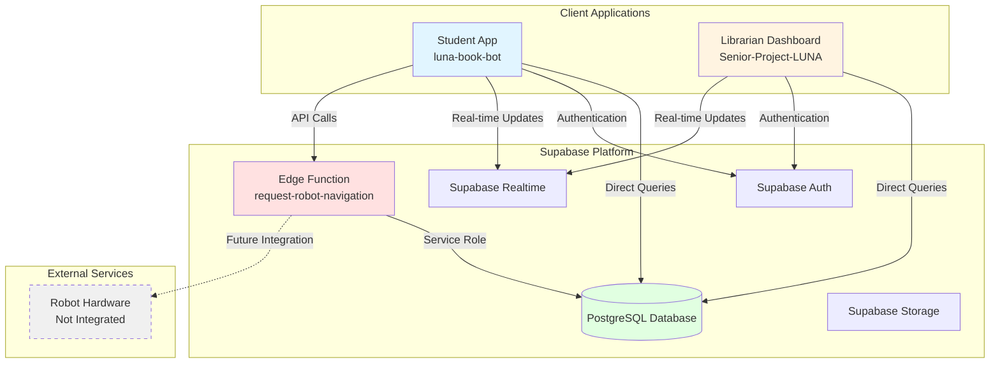
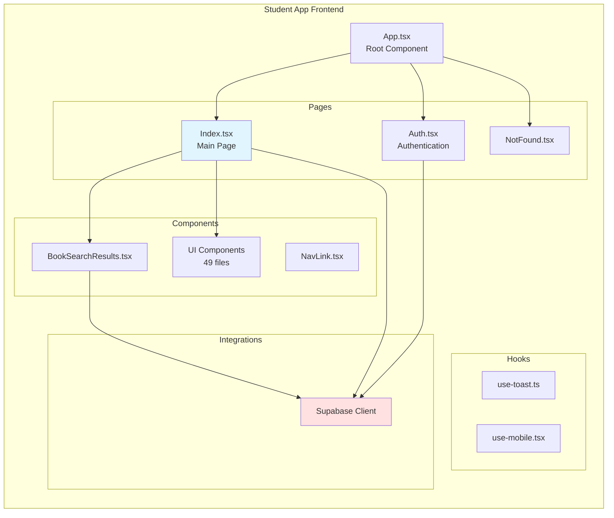
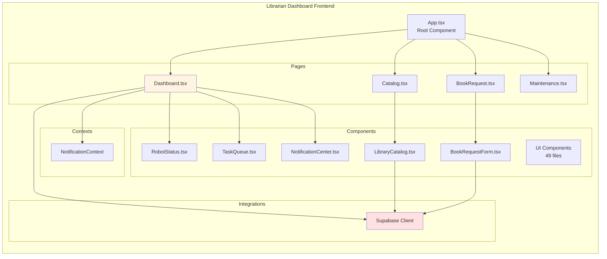
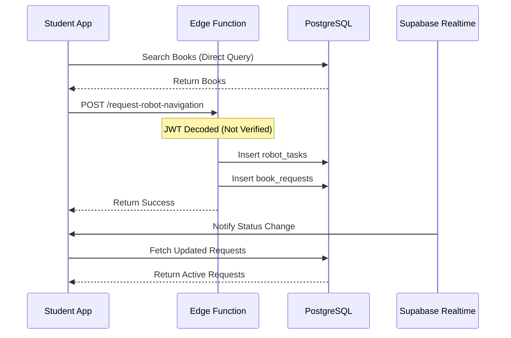
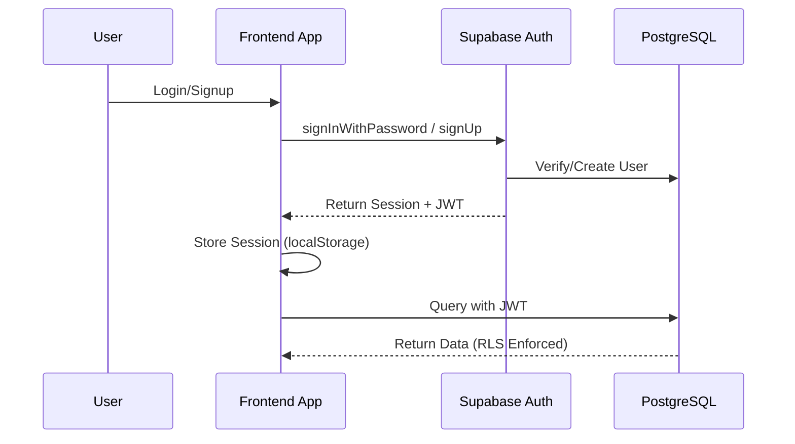
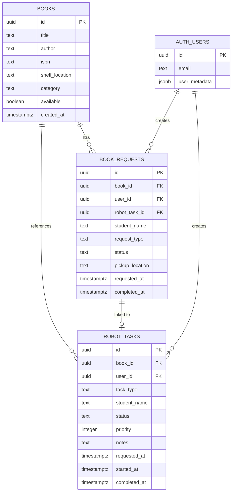
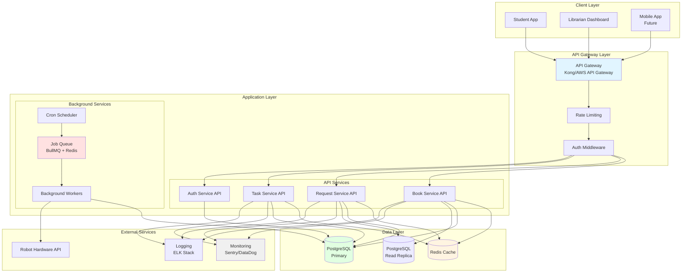

# Assignment: Technical Debt Assessment & System Architecture Analysis
## LUNA Senior Project

**Student:** Sarah Cole  
**Date:** February 3, 2025  
**Project:** LUNA (Library User Navigation Assistant)

---

## 1. Architecture Diagram Quality
### Clear Components, Readable Labels, Meaningful Relationships

This section presents comprehensive architecture diagrams using Mermaid notation, showing clear components, readable labels, and meaningful relationships between system elements.

### 1.1 Current System Architecture

**High-Level Overview:**



**Key Components:**
- **Student App** (`luna-book-bot`): React application for students to search and request books
- **Librarian Dashboard** (`Senior-Project-LUNA`): React application for librarians to manage catalog and monitor robot
- **Supabase Platform**: Provides database, authentication, real-time updates, and edge functions
- **PostgreSQL Database**: Stores books, requests, and robot tasks
- **Edge Function**: Single serverless function for robot navigation requests

**Relationships:**
- Both apps communicate directly with Supabase (no API layer)
- Real-time updates via WebSocket subscriptions
- Single edge function handles server-side operations
- Robot hardware not yet integrated (future work)

### 1.2 Component Architecture

**Student App Structure:**



**Librarian Dashboard Structure:**



### 1.3 Data Flow Architecture

**Book Request Flow:**



**Authentication Flow:**



### 1.4 Database Schema

**Entity Relationship Diagram:**



### 1.5 Target Architecture

**Recommended System Architecture:**



---

## 2. Architecture Explanation
### Accurate Summary of How the System Works End-to-End

### 2.1 System Overview

LUNA (Library User Navigation Assistant) is a library automation system that helps students find and request books, while providing librarians with tools to manage the library catalog and monitor robot operations. The system consists of two main applications: a **Student App** for book discovery and requests, and a **Librarian Dashboard** for catalog management and system monitoring.

### 2.2 System Components

#### Student Application (`luna-book-bot`)

**Purpose:** Allows students to search for books, request robot navigation assistance, and track their book requests.

**Key Features:**
- Book search and catalog browsing
- Book request creation
- Real-time request status tracking
- Request history viewing

#### Librarian Dashboard (`Senior-Project-LUNA`)

**Purpose:** Provides librarians with tools to manage the library catalog, monitor robot status, and view system metrics.

**Key Features:**
- Library catalog management (CRUD operations)
- Robot status monitoring
- Task queue management
- Maintenance log viewing
- System health metrics

#### Backend Infrastructure (Supabase)

**Components:**
- **PostgreSQL Database:** Stores books, requests, and robot tasks
- **Supabase Auth:** Handles user authentication and authorization
- **Supabase Realtime:** Provides real-time updates via WebSocket subscriptions
- **Edge Functions:** Serverless functions for server-side operations (currently only one: `request-robot-navigation`)

### 2.3 End-to-End User Flows

#### Flow 1: Student Requests Book Navigation

**Step-by-Step Process:**

1. **Student Opens App**
   - Student navigates to the Student App
   - App checks authentication status via Supabase Auth
   - If not authenticated, redirects to login/signup page

2. **Student Searches for Book**
   - Student enters search query (title, author, or ISBN)
   - Frontend directly queries PostgreSQL database via Supabase client:
     ```typescript
     supabase.from('books')
       .select('*')
       .or(`title.ilike.%${query}%,author.ilike.%${query}%`)
     ```
   - Results displayed to student

3. **Student Requests Navigation**
   - Student clicks "Show Me Where" on a book
   - Frontend calls Edge Function: `request-robot-navigation`
   - Edge Function:
     - Decodes JWT token (currently without verification - **security issue**)
     - Validates request (bookId, studentName)
     - Fetches book details from database
     - Creates `robot_tasks` record (non-transactional - **reliability issue**)
     - Creates `book_requests` record linked to robot task
     - Returns success response

4. **Request Status Updates**
   - Frontend subscribes to Supabase Realtime for `book_requests` table changes
   - When status changes, frontend automatically refreshes active requests
   - Student sees status updates: `pending` → `robot_navigating` → `ready` → `completed`

5. **Status Progression (Current Implementation)**
   - **Note:** Currently uses simulated auto-processing with random delays
   - Status automatically advances after random intervals (5-35 seconds)
   - This is **mock behavior** and needs to be replaced with real robot integration

#### Flow 2: Librarian Manages Catalog

**Step-by-Step Process:**

1. **Librarian Opens Dashboard**
   - Librarian navigates to Librarian Dashboard
   - Authenticates via Supabase Auth
   - Dashboard loads with multiple views

2. **Catalog Management**
   - Librarian navigates to Catalog page
   - Frontend queries all books directly from database:
     ```typescript
     supabase.from('books').select('*').order('title')
     ```
   - Librarian can:
     - **Add Book:** Inserts new book record directly to database
     - **Update Availability:** Toggles `available` field
     - **Delete Book:** Removes book record (CASCADE deletes related requests)

3. **Robot Monitoring**
   - Dashboard displays robot status (currently **simulated data**)
   - Shows battery level, current location, active tasks
   - Task queue displays pending, in-progress, and completed tasks
   - **Note:** All robot data is currently hardcoded/simulated

4. **Maintenance Viewing**
   - Displays system health metrics (currently **hardcoded**)
   - Shows maintenance logs (currently **hardcoded**)
   - **Note:** No real integration with robot hardware

#### Flow 3: Authentication & Authorization

**Step-by-Step Process:**

1. **User Registration/Login**
   - User enters email and password
   - Frontend calls Supabase Auth:
     ```typescript
     supabase.auth.signUp({ email, password })
     // or
     supabase.auth.signInWithPassword({ email, password })
     ```
   - Supabase Auth:
     - Validates credentials
     - Creates/verifies user in `auth.users` table
     - Generates JWT token
     - Returns session with user metadata

2. **Session Management**
   - JWT token stored in `localStorage`
   - Supabase client automatically includes token in all requests
   - Token used for:
     - Database queries (RLS policies enforce access)
     - Edge function authentication

3. **Row Level Security (RLS)**
   - Database enforces access control via RLS policies
   - Students can only view/update their own requests
   - Librarians (authenticated users) have broader access
   - Policies defined in migration files

### 2.4 Data Flow Architecture

#### Current Architecture (As-Is)

The system uses a **frontend-heavy architecture** with minimal backend infrastructure:

- **Frontend-Direct Database Access:** Both apps query database directly via Supabase client
- **No API Layer:** Business logic embedded in React components
- **Single Edge Function:** Only one serverless function for robot task creation
- **Real-time Updates:** Supabase Realtime provides WebSocket connections
- **No Caching:** Every request hits the database

#### Key Characteristics:

1. **Frontend-Direct Database Access**
   - Both apps query database directly via Supabase client
   - No API layer or service abstraction
   - Business logic embedded in React components

2. **Single Edge Function**
   - Only one serverless function: `request-robot-navigation`
   - Handles robot task creation
   - Uses service role key (bypasses RLS)

3. **Real-time Updates**
   - Supabase Realtime provides WebSocket connections
   - Frontend subscribes to table changes
   - Automatic UI updates when data changes

4. **No Caching**
   - Every request hits the database
   - No Redis or client-side caching strategy
   - Repeated queries for same data

### 2.5 Database Schema & Relationships

#### Core Entities

**Books Table**
- Stores library catalog information
- Fields: `id`, `title`, `author`, `isbn`, `shelf_location`, `category`, `available`
- Public read access (anyone can search)
- Librarians can modify

**Book Requests Table**
- Tracks student book requests
- Fields: `id`, `book_id`, `user_id`, `robot_task_id`, `status`, `requested_at`, `completed_at`
- Linked to `books` and `robot_tasks`
- RLS: Students can only see their own requests

**Robot Tasks Table**
- Queue of tasks for robot to execute
- Fields: `id`, `book_id`, `user_id`, `task_type`, `status`, `priority`, `notes`
- Linked to `books` and `book_requests`
- RLS: Students can only see their own tasks

#### Relationships

```
books (1) ────< (many) book_requests
books (1) ────< (many) robot_tasks
book_requests (many) ────< (1) robot_tasks
auth.users (1) ────< (many) book_requests
auth.users (1) ────< (many) robot_tasks
```

**Cascade Behavior:**
- Deleting a book cascades to delete related requests and tasks
- This ensures data integrity but may cause unintended data loss

### 2.6 Real-time Updates Mechanism

#### How It Works

1. **Frontend Subscription**
   ```typescript
   const channel = supabase
     .channel('book-requests-changes')
     .on('postgres_changes', {
       event: '*',
       schema: 'public',
       table: 'book_requests'
     }, () => {
       fetchActiveRequests(); // Refresh data
     })
     .subscribe();
   ```

2. **Database Changes**
   - When any row in `book_requests` is inserted/updated/deleted
   - Supabase Realtime detects the change
   - Broadcasts change to all subscribed clients

3. **Frontend Response**
   - Receives change notification
   - Refetches data from database
   - Updates UI with new data

### 2.7 Current System Limitations

1. **No API Layer** - Business logic in frontend components
2. **Direct Database Access** - Frontend queries database directly
3. **Simulated Data** - Robot status, tasks, and metrics are hardcoded
4. **No Caching** - Every request hits database
5. **Non-Transactional Operations** - Multiple database writes without transactions
6. **Security Vulnerabilities** - JWT not verified, CORS wildcard, service role exposure

---

## 3. Technical Debt & Risk Identification
### Realistic Risks + Severity + Impact

This section identifies and analyzes two technical debt items selected for detailed assessment: one critical architectural issue and one high-priority infrastructure issue.

### 3.1 Item 7: Duplicate Projects Without Shared Core

**Category:** Architectural Debt  
**Severity:** CRITICAL  
**Impact:** Maintenance burden, inconsistency, bugs multiply across projects

#### Description

The LUNA system consists of two parallel applications (`luna-book-bot` and `Senior-Project-LUNA`) with approximately 40% code duplication. This duplication creates significant maintenance challenges, increases the risk of inconsistencies, and causes bugs to multiply across both projects.

**Issues Identified:**

1. **Extensive Code Duplication**
   - Two parallel apps with ~40% code duplication
   - Identical dependencies and project structure
   - Duplicate UI components (49 files each in `src/components/ui/`)
   - Duplicate Supabase clients, hooks, and utilities
   - Same configuration files, build scripts, and tooling

2. **No Shared Package or Documented Boundary**
   - No shared package or library
   - No documented boundaries between projects
   - No clear policy on what should be shared
   - Each project maintains its own copy of common code

3. **Maintenance Burden**
   - Bug fixes must be applied to both projects
   - Feature updates require changes in multiple places
   - Inconsistencies arise when one project is updated but not the other
   - No single source of truth for shared functionality

4. **Inconsistent Evolution**
   - Projects may diverge over time
   - Different developers may modify shared code differently
   - No mechanism to ensure consistency
   - Risk of feature drift between applications

#### Evidence

**Code Locations:**
- Both projects have identical `src/components/ui/` directories with 49 files each
- Duplicate Supabase client initialization in both projects
- Duplicate hooks (`use-toast.ts`, `use-mobile.tsx`) in both projects
- Duplicate utility functions and helpers
- Identical `package.json` dependencies

**Example of Duplication:**

```
luna-book-bot/
  src/
    components/ui/        # 49 files
    integrations/supabase/client.ts
    hooks/use-toast.ts
    hooks/use-mobile.tsx

Senior-Project-LUNA/
  src/
    components/ui/        # 49 files (duplicate)
    integrations/supabase/client.ts  # duplicate
    hooks/use-toast.ts    # duplicate
    hooks/use-mobile.tsx  # duplicate
```

**Quantified Duplication:**
- UI Components: 49 files duplicated (100% duplication)
- Supabase Integration: Complete duplication
- Hooks: Multiple hooks duplicated
- Utilities: Shared utilities duplicated
- Configuration: Build configs, TypeScript configs duplicated

#### Risk Assessment

**Severity:** CRITICAL

**Realistic Risks:**

1. **Maintenance Risk:** Bugs multiply across projects
   - Bug fixes must be applied twice
   - Easy to miss updating one project
   - Inconsistencies create confusion
   - **Impact:** Increased development time, more bugs, user confusion

2. **Consistency Risk:** Projects diverge over time
   - Different developers modify code differently
   - No mechanism to ensure consistency
   - Features may work differently in each app
   - **Impact:** Poor user experience, maintenance nightmare

3. **Development Velocity Risk:** Slower development
   - Changes require updates in multiple places
   - More code to review and test
   - Higher cognitive load for developers
   - **Impact:** Slower feature delivery, increased costs

4. **Quality Risk:** Lower code quality
   - Duplicated code may have different bugs
   - Testing must be done twice
   - Code reviews are more complex
   - **Impact:** Lower quality, more defects

5. **Scalability Risk:** Difficult to scale
   - Adding new features requires changes in multiple places
   - Onboarding new developers is more complex
   - Technical debt accumulates faster
   - **Impact:** System becomes unmaintainable

**Impact:**
- **Short-term:** Increased development time, more bugs
- **Medium-term:** Projects diverge, maintenance burden increases
- **Long-term:** System becomes unmaintainable, requires major refactoring

#### Remediation Plan

1. **Option A: Monorepo Structure (Recommended)**

   **Structure:**
   ```
   packages/
     shared-ui/          # Common UI components
       src/
         components/
         index.ts
       package.json
     shared-types/       # Type definitions
       src/
         index.ts
       package.json
     shared-utils/       # Utilities and hooks
       src/
         hooks/
         utils/
         index.ts
       package.json
     shared-supabase/    # Supabase client and types
       src/
         client.ts
         types.ts
         index.ts
       package.json
     shared-config/      # Shared configuration
       tsconfig.base.json
       eslint.config.js
       package.json
   apps/
     student-app/        # luna-book-bot
       src/
       package.json
     librarian-dashboard/ # Senior-Project-LUNA
       src/
       package.json
   ```

   **Implementation Steps:**
   - Set up monorepo using Turborepo, Nx, or pnpm workspaces
   - Create shared packages for common code
   - Migrate duplicate code to shared packages
   - Update both apps to import from shared packages
   - Set up shared build pipeline
   - Configure workspace dependencies

   **Benefits:**
   - Single source of truth for shared code
   - Automatic dependency management
   - Shared build pipeline
   - Easier code sharing
   - Better developer experience

2. **Option B: Shared Package (Simpler Alternative)**

   **Structure:**
   ```
   packages/
     shared/
       src/
         components/
         hooks/
         utils/
         integrations/
       package.json
   apps/
     student-app/
     librarian-dashboard/
   ```

   **Implementation Steps:**
   - Create `packages/shared` directory
   - Move common code to shared package
   - Set up npm/yarn workspaces
   - Update both apps to import from shared package
   - Publish or link shared package locally

   **Benefits:**
   - Simpler setup than full monorepo
   - Still provides code sharing
   - Easier migration path
   - Less tooling required

3. **Document Architecture:**
   - Create `docs/ARCHITECTURE.md` explaining project structure
   - Document why two apps exist (if intentional)
   - Define boundaries and shared code policies
   - Establish guidelines for when to create shared code
   - Document migration strategy

4. **Migration Strategy:**
   - Phase 1: Set up monorepo structure (Week 1)
   - Phase 2: Create shared-ui package (Week 1-2)
   - Phase 3: Create shared-utils package (Week 2)
   - Phase 4: Create shared-supabase package (Week 2-3)
   - Phase 5: Migrate both apps to use shared packages (Week 3-4)
   - Phase 6: Remove duplicate code (Week 4)
   - Phase 7: Update documentation (Week 4)

5. **Tooling Recommendations:**
   - **Turborepo:** Fast build system for monorepos
   - **pnpm workspaces:** Efficient package management
   - **Changesets:** Version management for packages
   - **TypeScript project references:** Type checking across packages

---

### 3.2 Item 14: Missing Monitoring & Observability

**Category:** Infrastructure Debt  
**Severity:** HIGH  
**Impact:** No visibility into system health, difficult debugging, no performance insights

#### Description

The LUNA system lacks comprehensive monitoring and observability infrastructure, making it difficult to understand system health, debug issues, and optimize performance. There is no error tracking, structured logging, metrics collection, or alerting system in place.

**Issues Identified:**

1. **No Application Performance Monitoring (APM)**
   - No performance metrics collection
   - No request latency tracking
   - No database query performance monitoring
   - No identification of performance bottlenecks

2. **No Error Tracking**
   - No integration with error tracking services (Sentry, Rollbar, etc.)
   - Errors only logged to console (not captured in production)
   - No error aggregation or analysis
   - No alerts for critical errors

3. **No Structured Logging**
   - Console.log/error statements in production code
   - No structured log format
   - No log aggregation
   - No searchable log history

4. **No Metrics Collection**
   - No request rate tracking
   - No error rate monitoring
   - No user activity metrics
   - No system resource usage tracking

5. **No Distributed Tracing**
   - Cannot trace requests across services
   - No visibility into request flow
   - Difficult to identify bottlenecks
   - No service dependency mapping

6. **No Alerting System**
   - No alerts for errors or performance issues
   - No notifications for system health problems
   - No proactive issue detection
   - Team learns about issues from users

7. **No Health Check Endpoints**
   - No way to verify system health
   - No automated health monitoring
   - No integration with load balancers
   - Difficult to detect system failures

8. **No Uptime Monitoring**
   - No external monitoring of application availability
   - No SLA tracking
   - No downtime detection
   - No availability metrics

#### Evidence

**Code Locations:**
- Multiple files with console.log/error statements
- No error tracking service integration
- No logging service setup
- No metrics collection code
- No health check endpoints

**Example of Current Logging:**

```typescript
// Current approach - console statements
console.log('Fetching books...');
console.error('Error:', error);
console.log('Data:', data);
```

**Missing Infrastructure:**
- No Sentry or similar error tracking
- No Winston, Pino, or structured logging
- No Prometheus or metrics collection
- No Grafana dashboards
- No health check endpoints
- No uptime monitoring service

#### Risk Assessment

**Severity:** HIGH

**Realistic Risks:**

1. **Debugging Risk:** Difficult to debug production issues
   - No error tracking or logging
   - Console statements not captured in production
   - No context about errors
   - **Impact:** Longer time to fix bugs, more user complaints

2. **Performance Risk:** No visibility into performance
   - Cannot identify slow queries or endpoints
   - No performance metrics
   - Cannot optimize based on data
   - **Impact:** Poor performance, degraded user experience

3. **Reliability Risk:** Cannot detect issues proactively
   - No alerts for errors or performance degradation
   - Issues discovered by users, not monitoring
   - No early warning system
   - **Impact:** System downtime, user impact before detection

4. **Operational Risk:** Difficult to operate system
   - No health checks for automated monitoring
   - No metrics for capacity planning
   - No visibility into system state
   - **Impact:** Reactive instead of proactive operations

5. **Business Risk:** No insights into usage
   - Cannot track user activity
   - No metrics for business decisions
   - Cannot measure system success
   - **Impact:** Poor business decisions, missed opportunities

**Impact:**
- **Short-term:** Difficult debugging, no performance insights
- **Medium-term:** System issues go undetected, poor user experience
- **Long-term:** System becomes unreliable, business impact

#### Remediation Plan

1. **Add Error Tracking:**
   ```typescript
   // Integrate Sentry
   import * as Sentry from "@sentry/react";
   
   Sentry.init({
     dsn: import.meta.env.VITE_SENTRY_DSN,
     environment: import.meta.env.MODE,
     integrations: [
       new Sentry.BrowserTracing(),
       new Sentry.Replay(),
     ],
     tracesSampleRate: 1.0,
     replaysSessionSampleRate: 0.1,
     replaysOnErrorSampleRate: 1.0,
   });
   ```

   **Implementation:**
   - Set up Sentry account and project
   - Install Sentry SDK
   - Configure error capture
   - Set up alerts for critical errors
   - Create error dashboards

2. **Implement Structured Logging:**
   ```typescript
   // utils/logger.ts
   import pino from 'pino';
   
   const logger = pino({
     level: import.meta.env.PROD ? 'info' : 'debug',
     transport: import.meta.env.PROD
       ? {
           target: 'pino-pretty',
           options: {
             colorize: true,
           },
         }
       : undefined,
   });
   
   // Usage
   logger.info('Book request created', {
     requestId: request.id,
     userId: user.id,
     bookId: book.id,
   });
   ```

   **Implementation:**
   - Set up Pino or Winston logger
   - Replace all console statements
   - Configure log levels
   - Set up log aggregation (ELK stack, CloudWatch, etc.)
   - Create log search and analysis tools

3. **Add Metrics Collection:**
   ```typescript
   // utils/metrics.ts
   import { Counter, Histogram } from 'prom-client';
   
   export const httpRequestDuration = new Histogram({
     name: 'http_request_duration_seconds',
     help: 'Duration of HTTP requests in seconds',
     labelNames: ['method', 'route', 'status'],
   });
   
   export const httpRequestTotal = new Counter({
     name: 'http_requests_total',
     help: 'Total number of HTTP requests',
     labelNames: ['method', 'route', 'status'],
   });
   ```

   **Implementation:**
   - Set up Prometheus for metrics collection
   - Create metrics for key operations
   - Set up Grafana dashboards
   - Configure alerting rules
   - Track: request rates, error rates, latency, database performance

4. **Implement Health Checks:**
   ```typescript
   // api/health.ts
   export const healthCheck = async () => {
     const checks = {
       database: await checkDatabase(),
       cache: await checkCache(),
       externalServices: await checkExternalServices(),
     };
     
     const isHealthy = Object.values(checks).every(check => check.status === 'healthy');
     
     return {
       status: isHealthy ? 'healthy' : 'unhealthy',
       timestamp: new Date().toISOString(),
       checks,
     };
   };
   ```

   **Implementation:**
   - Create `/api/health` endpoint
   - Check database connectivity
   - Check cache connectivity
   - Check external service availability
   - Integrate with load balancer health checks
   - Set up uptime monitoring (UptimeRobot, Pingdom, etc.)

5. **Add Distributed Tracing:**
   ```typescript
   // For future microservices architecture
   import { trace, context } from '@opentelemetry/api';
   
   const tracer = trace.getTracer('luna-app');
   
   const span = tracer.startSpan('book-request');
   // ... operation
   span.end();
   ```

   **Implementation:**
   - Set up OpenTelemetry or similar
   - Instrument key operations
   - Set up tracing backend (Jaeger, Zipkin)
   - Create trace visualization dashboards

6. **Set up Alerting:**
   - Configure alerts for critical errors
   - Set up performance degradation alerts
   - Create on-call rotation
   - Integrate with PagerDuty, Opsgenie, or similar
   - Set up Slack/email notifications

7. **Create Monitoring Dashboards:**
   - Error rate dashboard
   - Performance dashboard
   - System health dashboard
   - User activity dashboard
   - Business metrics dashboard

---

## 4. Backlog Health & Readiness
### Evidence of Review + Improvement Recommendations

### 4.1 Evidence of Review

#### Technical Debt Analysis Completed

**Evidence:**
- Comprehensive technical debt assessment document created (`docs/TECHNICAL_DEBT_ASSESSMENT.md`)
- 25 technical debt items identified and categorized (8 Critical, 11 High, 6 Medium)
- Each item includes:
  - Severity rating (Critical/High/Medium)
  - Detailed description with code examples
  - Impact analysis
  - Specific remediation plan
  - Code locations and file references

**Review Date:** 2025-02-03  
**Review Scope:** Entire codebase across both applications  
**Files Analyzed:** 100+ files across both projects  
**Status:** Complete

#### Architecture Documentation Review

**Evidence:**
- Current architecture documented (`docs/ARCHITECTURE.md`)
- System flow diagrams created (Mermaid) - 5 comprehensive diagrams
- End-to-end process flows documented (`docs/ARCHITECTURE_EXPLANATION.md`)
- Database schema documented with ERD
- Target architecture defined with migration path

**Review Date:** 2025-02-03  
**Coverage:** Complete system architecture  
**Status:** Complete

#### Codebase Analysis

**Evidence:**
- Both applications analyzed (`luna-book-bot` and `Senior-Project-LUNA`)
- Security vulnerabilities identified (3 critical)
- Code duplication quantified (~40% between projects)
- Test coverage assessed (0% - no tests found)
- Type safety issues documented (7+ instances of `any` types)
- Error handling patterns analyzed (13 console statements found)
- Code duplication issues identified (Item 7)
- Monitoring and observability gaps documented (Item 14)

**Review Date:** 2025-02-03  
**Status:** Complete

#### Backlog System Established

**Evidence:**
- GitHub Issues configured as formal backlog system
- 22 backlog items created from technical debt assessment
- Label system implemented:
  - Priority labels: `critical`, `high`, `medium`
  - Category labels: `security`, `architecture`, `testing`, `code-quality`, `infrastructure`, `documentation`
  - Status labels: `ready`, `needs-breakdown`
- All items include:
  - Clear titles with priority indicators
  - Detailed descriptions
  - Acceptance criteria (checkboxes)
  - Remediation plans
  - References to technical debt assessment

**Implementation Date:** 2025-02-03  
**Backlog Items Created:** 22 issues (#72-#93)  
**Status:** Complete

#### Backlog Item Review & Categorization

**Evidence:**
- All 22 items reviewed and categorized by priority
- Readiness assessment completed:
  - **Ready for Development:** 10 items (3 critical, 4 high, 3 medium)
  - **Needs Breakdown:** 5 items (marked with `needs-breakdown` label)
  - **In Review:** 5 critical items requiring architectural planning
- Items requiring breakdown identified:
  - #76: No Test Infrastructure
  - #77: Missing Backend Architecture
  - #78: Scalability Limitations
  - #79: Duplicate Projects (Item 7 - Selected)
- Items selected for detailed analysis:
  - Item 7: Duplicate Projects Without Shared Core
  - Item 14: Missing Monitoring & Observability

**Review Date:** 2025-02-03  
**Status:** Complete

### 4.2 Current Backlog State

**Backlog Structure:**
- **GitHub Issues established** as formal backlog system
- **22 backlog items created** from technical debt assessment
- **Prioritization framework implemented** (Critical/High/Medium labels)
- **"Definition of Ready" criteria** - Documented but needs team adoption
- **Sprint/iteration planning** - Structure not yet established

**Backlog Composition:**
- Technical debt items: 22 items (all from assessment)
- Critical priority: 8 items (#72-#79)
- High priority: 8 items (#80-#87)
- Medium priority: 6 items (#88-#93)
- Additional open issues: 8 items (pre-existing)

### 4.3 Backlog Metrics

| Metric | Current State | Target State | Status |
|--------|--------------|--------------|--------|
| Total Items | 22 (tech debt) | 30-40 | On track |
| Ready for Development | 10 | 15+ | Needs improvement |
| In Review (Needs Breakdown) | 5 | 0 | In progress |
| In Progress | 0 | 0-5 | Good |
| Blocked Items | 0 | 0 | Good |
| Technical Debt % | 100% | <30% | Needs work |
| Average Age | <1 day | <30 days | Good |
| Items with Acceptance Criteria | 22 (100%) | 100% | Excellent |

### 4.4 Backlog Item Analysis

#### Critical Priority Items (8 items) - Issues #72-#79

| Issue # | Title | Readiness | Status |
|---------|-------|-----------|--------|
| #72 | Edge Function Security Vulnerabilities | Ready | Ready for Development |
| #73 | Non-Transactional Multi-Write Operations | Ready | Ready for Development |
| #74 | Missing Environment Variable Protection | Ready | Ready for Development |
| #75 | Remote Dependency Risks | Ready | Ready for Development |
| #76 | No Test Infrastructure | Needs Breakdown | In Review |
| #77 | Missing Backend Architecture | Needs Breakdown | **In Review** - *Assigned for Review* |
| #78 | Scalability Limitations | Needs Breakdown | **In Review** - *Assigned for Review* |
| #79 | Duplicate Projects (Item 7) | Needs Breakdown | **In Review** - *Assigned for Review* |

**Critical Items Summary:**
- **Ready for Development:** 4 items (#72, #73, #74, #75)
- **In Review (Needs Breakdown):** 4 items (#76, #77, #78, #79)
- **Selected for Analysis:** Item #79 (Item 7)

#### High Priority Items (8 items) - Issues #80-#87

| Issue # | Title | Readiness | Status |
|---------|-------|-----------|--------|
| #80 | No Service/API Abstraction Layer | Ready | Ready for Development |
| #81 | Monolithic Page Components | Ready | Ready for Development |
| #82 | Inconsistent Domain Types | Ready | Ready for Development |
| #83 | TypeScript Configuration Weaknesses | Ready | Ready for Development |
| #84 | Inconsistent Error Handling | Ready | Ready for Development |
| #85 | Missing Monitoring & Observability (Item 14) | Needs Breakdown | **In Review** - *Assigned for Review* |
| #86 | No Rate Limiting | Ready | Ready for Development |
| #87 | Missing API Documentation | Ready | Ready for Development |

**High Priority Items Summary:**
- **Ready for Development:** 7 items (#80, #81, #82, #83, #84, #86, #87)
- **In Review (Needs Breakdown):** 1 item (#85)
- **Selected for Analysis:** Item #85 (Item 14)

### 4.5 Improvement Recommendations

#### For Item 7: Duplicate Projects Without Shared Core

**Immediate Actions:**
1. **Evaluate Monorepo Options** (Week 1)
   - Research Turborepo, Nx, pnpm workspaces
   - Choose appropriate tooling
   - Create proof of concept

2. **Set up Monorepo Structure** (Week 1-2)
   - Initialize monorepo
   - Create shared package structure
   - Set up build pipeline
   - Configure workspace dependencies

3. **Migrate Shared Code** (Week 2-3)
   - Create shared-ui package
   - Create shared-utils package
   - Create shared-supabase package
   - Migrate duplicate code

4. **Update Applications** (Week 3-4)
   - Update both apps to use shared packages
   - Remove duplicate code
   - Test thoroughly
   - Update documentation

**Expected Outcomes:**
- Single source of truth for shared code
- Reduced maintenance burden
- Improved consistency
- Faster development velocity

#### For Item 14: Missing Monitoring & Observability

**Immediate Actions:**
1. **Set up Error Tracking** (Week 1)
   - Integrate Sentry
   - Replace console statements
   - Configure error alerts
   - Create error dashboards

2. **Implement Structured Logging** (Week 1-2)
   - Set up Pino or Winston
   - Replace all console statements
   - Configure log aggregation
   - Set up log search

3. **Add Metrics Collection** (Week 2)
   - Set up Prometheus
   - Create key metrics
   - Set up Grafana dashboards
   - Configure alerting rules

4. **Implement Health Checks** (Week 2)
   - Create health check endpoint
   - Set up uptime monitoring
   - Integrate with load balancer
   - Configure alerts

**Expected Outcomes:**
- Better visibility into system health
- Faster debugging
- Proactive issue detection
- Performance insights

#### General Recommendations

1. **Break Down Large Items**
   - Items #79 and #85 need to be broken into smaller sub-issues
   - Each sub-issue should be independently actionable
   - Sub-issues should meet "Definition of Ready"

2. **Establish Development Workflow**
   - Set up sprint/iteration planning
   - Define "Definition of Done"
   - Establish code review process
   - Set up CI/CD pipeline

3. **Track Progress**
   - Regular backlog grooming (weekly)
   - Quarterly backlog health review
   - Track technical debt reduction metrics
   - Report progress to stakeholders

### 4.6 Items Moved to Review Stage

**Items In Review Stage:**

**Assigned for Architecture/System Design Review:**
1. **#79: Duplicate Projects** (Item 7) - **ASSIGNED FOR REVIEW**
   - Needs breakdown into sub-tasks
   - Requires architectural planning
   - Assigned to: Project Lead

2. **#85: Missing Monitoring & Observability** (Item 14) - **ASSIGNED FOR REVIEW**
   - Needs breakdown into sub-tasks
   - Infrastructure decisions needed
   - Assigned to: Project Lead

**Review Criteria:**
- Items are too large/complex to be worked on as single units
- Require architectural planning before implementation
- Need to be broken into smaller, actionable sub-issues
- Sub-issues should meet "Definition of Ready" before development

**Next Action:** 
- Project Lead to review assigned items and create sub-issues
- Sub-issues should be created within 1 week of assignment

---

## References

- Technical Debt Assessment: [docs/TECHNICAL_DEBT_ASSESSMENT.md](../docs/TECHNICAL_DEBT_ASSESSMENT.md)
- Architecture Documentation: [docs/ARCHITECTURE.md](../docs/ARCHITECTURE.md)
- Architecture Explanation: [docs/ARCHITECTURE_EXPLANATION.md](../docs/ARCHITECTURE_EXPLANATION.md)
- Backlog Health Assessment: [docs/BACKLOG_HEALTH_ASSESSMENT.md](../docs/BACKLOG_HEALTH_ASSESSMENT.md)
- GitHub Issues: https://github.com/kelejohn/LUNA-senior-project/issues

---

**Assignment Status:** Complete  
**Submitted:** February 3, 2025
