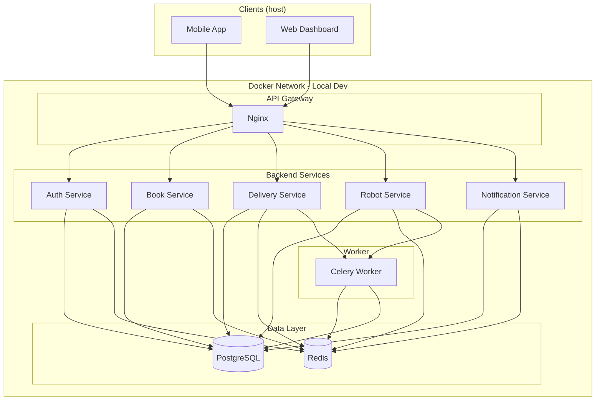
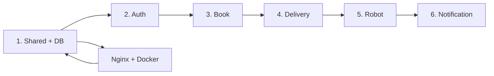

# Backend Design Implementation
## LUNA Senior Project

This document describes the **implementation plan** for the LUNA backend. It is an outline only and is scoped to **local development** (Docker Compose). It derives from and must stay aligned with the [System Design Document](SYSTEM_DESIGN.md), specifically:

- **Section 4: Component Design** (services, interfaces, technology choices)
- **Section 5: Data Design** (database schema, data models, storage patterns)
- **Section 6: API Design** (endpoints, request/response formats, authentication, versioning)

---

## Table of Contents

1. [Scope & Conventions](#1-scope--conventions)
2. [Repository & Project Layout](#2-repository--project-layout)
3. [Local Development Topology](#3-local-development-topology)
4. [Implementation Order](#4-implementation-order)
5. [Service Implementation Outline](#5-service-implementation-outline)
6. [Data Layer Implementation](#6-data-layer-implementation)
7. [API Layer Implementation](#7-api-layer-implementation)
8. [Message Queue & Celery](#8-message-queue--celery)
9. [Real-Time (WebSocket)](#9-real-time-websocket)
10. [API Gateway (Nginx)](#10-api-gateway-nginx)
11. [Security Implementation](#11-security-implementation)
12. [Testing Strategy](#12-testing-strategy)
13. [Configuration & Environment](#13-configuration--environment)
14. [Docker Compose (Local)](#14-docker-compose-local)

---

## 1. Scope & Conventions

| Item | Decision |
|------|----------|
| **Scope** | Backend only; local development focus |
| **Repo** | Monorepo; backend lives under `backend/` |
| **Tech stack** | Python, FastAPI, PostgreSQL, Redis, Celery, Nginx (per System Design Section 4.3) |
| **Message queue** | Redis as broker + Celery for async tasks and events |
| **API Gateway** | Nginx (routing, auth forwarding, rate limiting) |
| **Document depth** | Outline/plan only; no low-level code specs |

Naming and contracts (API base paths, request/response shapes, roles, error codes) follow [SYSTEM_DESIGN.md](SYSTEM_DESIGN.md) Sections 5 and 6.

---

## 2. Repository & Project Layout

Backend code lives in a single `backend/` directory. Services can be separate runnable apps or modules within one app; the outline assumes **one FastAPI application per service** for clear boundaries and independent scaling later.

**Planned layout (outline):**

```
backend/
  auth/           # Authentication Service
  book/           # Book Service
  delivery/       # Delivery Service
  robot/          # Robot Service
  notification/   # Notification Service
  shared/         # Shared code (DB, Redis, JWT, RBAC, Pydantic schemas)
  nginx/          # Nginx config for local dev
  docker/         # Dockerfiles, docker-compose
```

Each service directory contains (at minimum): API routes, business logic, and its own dependencies on `shared/`. Database migrations and schema are defined once (e.g. under `shared/` or a dedicated `migrations/` folder) and applied to the single PostgreSQL database used by all services.

**Alignment:** Service names and responsibilities match System Design Section 4.1 (Authentication, Book, Delivery, Robot, Notification).

---

## 3. Local Development Topology

One `docker compose up` brings up all containers. The following diagram matches the architecture in System Design Section 3.1.4, with implementation choices (Nginx, Redis, Celery) applied.



**Container count:** 9

| Container | Role |
|-----------|------|
| nginx | API Gateway (route `/api/v1/*` to services, optional rate limit) |
| auth-service | Authentication API (Section 6.1.1) |
| book-service | Book/catalog API (Section 6.1.2) |
| delivery-service | Requests, returns, deliveries API (Section 6.1.3) |
| robot-service | Robot status, commands, waypoints API (Section 6.1.4) |
| notification-service | Notifications API + WebSocket (Section 6.1.5) |
| postgres | Single PostgreSQL instance (Section 5) |
| redis | Cache, sessions, Celery broker |
| celery-worker | Async tasks and event consumers |

---

## 4. Implementation Order

Recommended order so that dependencies (Auth, Book, shared DB) are in place before workflows that use them.



| Phase | Focus | Notes |
|-------|--------|--------|
| 1 | Shared layer + PostgreSQL schema | Migrations, base config, DB connection; align with Section 5 |
| 2 | Auth Service | JWT, RBAC, endpoints in Section 6.1.1; Redis for refresh/session if needed |
| 3 | Book Service | Catalog CRUD, search, availability; Section 6.1.2 and 5.1 |
| 4 | Delivery Service | Requests, returns, delivery tasks; state machine; Section 6.1.3; integrate Celery |
| 5 | Robot Service | Status, commands, waypoints; Section 6.1.4; robot integration interface |
| 6 | Notification Service | Notifications API + WebSocket; Section 6.1.5 |
| 0 (parallel) | Nginx + Docker Compose | Define all 9 containers and wire routing |

---

## 5. Service Implementation Outline

Each service implements the endpoints and behaviors defined in System Design Section 6.1 and the data ownership in Section 4.1.

### 5.1 Authentication Service

- **Base path:** `/api/v1/auth` (Section 6.1.1).
- **Responsibilities:** Register, login, logout, refresh, forgot-password, reset-password, `/me`, change-password.
- **Implementation:** JWT access + refresh tokens; refresh token invalidation (e.g. in Redis); RBAC checks via shared middleware or decorators.
- **Data:** Users, roles; session/refresh state in Redis as needed.
- **Dependencies:** PostgreSQL (users), Redis (tokens/session).

### 5.2 Book Service

- **Base path:** `/api/v1/books` (Section 6.1.2).
- **Responsibilities:** CRUD, search/list, availability; bulk-import (Librarian).
- **Implementation:** Full-text search (PostgreSQL or shared search layer); availability derived from catalog and delivery state.
- **Data:** Books table and related indexes (Section 5.1).
- **Dependencies:** PostgreSQL, Redis (optional cache for catalog).

### 5.3 Delivery Service

- **Base path:** `/api/v1/requests`, `/api/v1/returns`, `/api/v1/deliveries` (Section 6.1.3).
- **Responsibilities:** Student requests/returns; librarian delivery management (inter-staff, workstation, transfer); task lifecycle; “book placed” / complete / cancel.
- **Implementation:** Workflow/state machine for task status; publish events to Celery for robot and notifications.
- **Data:** Book requests, book returns, delivery tasks, task status history (Section 5.1).
- **Dependencies:** PostgreSQL, Redis, Celery; may call Book Service for availability.

### 5.4 Robot Service

- **Base path:** `/api/v1/robot` (Section 6.1.4).
- **Responsibilities:** Robot status, task queue, emergency-stop, waypoints CRUD.
- **Implementation:** Command/status interface to robot (e.g. HTTP or bridge to ROS); waypoints and task queue stored in DB; consume delivery task events from Celery as needed.
- **Data:** Robots, waypoints, robot status logs (Section 5.1).
- **Dependencies:** PostgreSQL, Redis, Celery; robot integration layer (interface only in this doc).

### 5.5 Notification Service

- **Base path:** `/api/v1/notifications` (Section 6.1.5).
- **Responsibilities:** List, read, read-all, delete; preferences.
- **Implementation:** REST API plus WebSocket server for real-time events; consume notification events from Celery (e.g. from Delivery/Robot).
- **Data:** Notifications, notification preferences (Section 5.1).
- **Dependencies:** PostgreSQL, Redis; WebSocket server in-process or dedicated.

---

## 6. Data Layer Implementation

- **ORM:** SQLAlchemy (async optional) for PostgreSQL; models and tables aligned with Section 5.1 (Users, Books, Book_Requests, Book_Returns, Delivery_Tasks, Robots, Waypoints, Notifications, Task_Status_History, Audit_Logs).
- **Migrations:** Alembic (or equivalent) for versioned schema changes; single migration tree for the backend.
- **Redis:** Sessions/refresh tokens, optional cache keys and TTLs as in Section 5.3; Celery broker (separate from app Redis usage if desired).
- **Consistency:** Use DB transactions for request/return/task lifecycle; caching strategy and invalidation as outlined in System Design Section 5.3.

---

## 7. API Layer Implementation

- **Framework:** FastAPI per service (or single app with mounted routers); URL versioning `/api/v1/` (Section 6.4).
- **Contracts:** Request/response models and status codes as in Section 6.2 and 6.2.4; pagination (`page`, `limit`, `sort`, `order`) and standard JSON envelope (`success`, `data`, `error`, `meta`, `pagination`).
- **Validation:** Pydantic for body/query; consistent error responses (e.g. 422 with `details.fields`).
- **Middleware:** Auth (JWT validation), logging, error handling; RBAC per endpoint per Section 6.3.3 (STUDENT, LIBRARIAN, ADMIN).

---

## 8. Message Queue & Celery

- **Broker:** Redis.
- **Pattern:** Celery tasks for async work (e.g. delivery task creation, robot commands, sending notifications); event payloads follow the structure in System Design Section 4.2.2 (e.g. `eventType`, `timestamp`, `source`, `payload`).
- **Use cases:** Delivery workflow side effects, robot command queue, notification dispatch; at-least-once delivery and idempotency where required.
- **Local dev:** One Celery worker container; same Redis as app cache/broker is acceptable for dev.

---

## 9. Real-Time (WebSocket)

- **Ownership:** Notification Service (or shared real-time module used by it).
- **Purpose:** Live delivery status, robot status, and instant notifications (Section 4.2.3).
- **Implementation:** FastAPI WebSocket (or python-socketio); JWT at connection handshake; channels/rooms by user or robot as needed.
- **Scaling:** Local dev single instance; no Redis adapter required for initial implementation.

---

## 10. API Gateway (Nginx)

- **Role:** Single entry point; route `/api/v1/auth/*`, `/api/v1/books/*`, `/api/v1/requests/*`, `/api/v1/returns/*`, `/api/v1/deliveries/*`, `/api/v1/robot/*`, `/api/v1/notifications/*` to corresponding service containers.
- **Behavior:** Forward `Host` and `Authorization` (and other headers); optional rate limiting; no JWT validation in Nginx for v1 (validation in services or shared middleware).
- **Config:** One config file (or snippet) under `backend/nginx/` for local Compose.

---

## 11. Security Implementation

- **JWT:** Access token (short-lived), refresh token (long-lived); generation and validation in Auth Service; algorithm and claims as in Section 6.3.1.
- **RBAC:** Enforce STUDENT / LIBRARIAN / ADMIN per Section 6.3.3; centralize in shared middleware or decorators.
- **Secrets:** Passwords hashed; DB and Redis credentials and JWT secret from environment variables (Section 13).
- **Input:** Validate and sanitize all inputs; use Pydantic and safe query APIs to avoid injection.

---

## 12. Testing Strategy

- **Unit:** Service logic and domain rules; mock DB/Redis/Celery where appropriate.
- **Integration:** API tests against running services (or full stack in Docker); use test DB and test Redis; verify endpoints and response shapes from Section 6.
- **Fixtures:** Seed data for users, roles, books, and delivery states to support integration tests.

---

## 13. Configuration & Environment

- **Local dev:** Environment variables (or `.env`) for: database URL, Redis URL, Celery broker, JWT secret, service ports, Nginx upstreams.
- **No production config in this document:** Focus is local development only; production env and secrets are out of scope here.

---

## 14. Docker Compose (Local)

- **Goal:** `docker compose up` starts all 9 containers; developers work against this stack.
- **Contents:** One Compose file (or override) defining: nginx, auth-service, book-service, delivery-service, robot-service, notification-service, postgres, redis, celery-worker.
- **Networking:** Shared backend network; Nginx as entrypoint; services listen on internal ports; Postgres and Redis exposed only to backend services and worker.
- **Volumes:** Persistent volumes for Postgres (and optionally Redis) so data survives restarts.
- **Build:** Each service has a Dockerfile (or shared base); Compose builds or pulls images as needed.

---

## Alignment Checklist with System Design

| System Design Section | Backend Implementation |
|----------------------|-------------------------|
| 4.1 Services/Modules | Section 5 (services) + Section 3 (containers) |
| 4.2 Interfaces & Contracts | Section 7 (API), Section 8 (Celery), Section 9 (WebSocket) |
| 4.3 Technology Choices | Section 1 (stack), Section 6 (ORM, Redis), Section 10 (Nginx) |
| 5.1–5.3 Data Design | Section 6 (data layer), Section 5 (data ownership per service) |
| 6.1–6.4 API Design | Section 7 (API layer), Section 11 (auth/RBAC) |

Changes to the [System Design Document](SYSTEM_DESIGN.md) that affect services, data, or API contracts should be reflected in this implementation plan.
