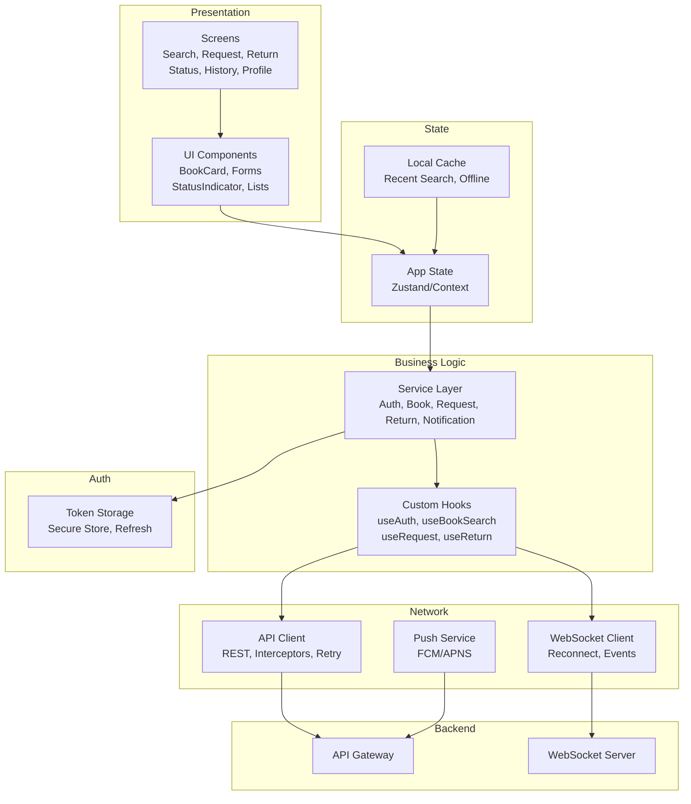
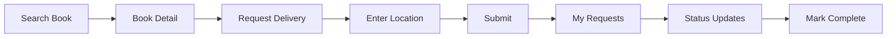

# Mobile App (Student) – Implementation Design
## LUNA Senior Project

This document outlines the **implementation plan** for the LUNA **student mobile application**. It is an outline only and derives from the [System Design Document](SYSTEM_DESIGN.md), specifically:

- **Section 2: Requirements** (functional and non-functional for Mobile App)
- **Section 3.1.1: Mobile Application Architecture** (layers, screens, state, network)
- **Section 6: API Design** (endpoints, request/response formats, authentication, roles)

**Scope:** Student-facing app only (book discovery, request, return, status, notifications). Librarian and admin flows are out of scope.

---

## Table of Contents

1. [Scope & Conventions](#1-scope--conventions)
2. [Features](#2-features)
3. [High-Level Architecture](#3-high-level-architecture)
4. [Tech Stack](#4-tech-stack)
5. [Repository & Project Layout](#5-repository--project-layout)
6. [Screen Breakdown](#6-screen-breakdown)
7. [Key User Flows](#7-key-user-flows)
8. [Component Design](#8-component-design)
9. [Data Strategy](#9-data-strategy)
10. [Auth & Session](#10-auth--session)
11. [Push & Real-Time](#11-push--real-time)
12. [Testing & Local Development](#12-testing--local-development)
13. [Risks & Considerations](#13-risks--considerations)
14. [Alignment with System Design](#14-alignment-with-system-design)

---

## 1. Scope & Conventions

| Item | Decision |
|------|----------|
| **Scope** | Student mobile app only (iOS and Android) |
| **Repo** | Monorepo; app lives under `mobile/` (or `student-app/`) |
| **Tech stack** | React Native with TypeScript (per Section 4.3.6 and team choice) |
| **Document depth** | Outline/plan only; no low-level code specs |

APIs, roles, and data shapes follow [SYSTEM_DESIGN.md](SYSTEM_DESIGN.md) Section 6. Student role only; no librarian or robot-control features in this app.

---

## 2. Features

### 2.1 Authentication & Account

- Register (email, password, name, phone, role = Student)
- Login / logout
- View and update profile (`/api/v1/auth/me`)
- Change password
- Secure token storage and refresh on 401

### 2.2 Book Discovery & Search

- Search catalog by title, author, ISBN (`/api/v1/books`)
- Browse results with filters and sort
- View book details (metadata, availability, shelf location)
- Check availability from list or detail

### 2.3 Book Request (Delivery to Student)

- Create delivery request: select book and enter request location (where the robot should deliver)
- View "My requests" list and status
- View request detail; cancel when allowed; mark as completed when book is received
- Status updates (e.g. pending, assigned, in progress, delivered) via refresh or real-time

### 2.4 Book Return (Robot Pickup)

- Initiate return: select book and enter pickup location (where the robot should come)
- View "My returns" list and status
- View return detail; confirm "picked up" when the robot has collected the book
- Status updates (e.g. pending, robot on the way, picked up, completed)

### 2.5 Notifications

- In-app notification list (`/api/v1/notifications`)
- Mark as read / read all
- Notification preferences (optional)
- Push notifications (FCM/APNS) for delivery and return updates when backend supports it

### 2.6 Real-Time Updates

- Live delivery and return status (WebSocket or polling) so the user sees "robot on the way" and "delivered" without manual refresh

### 2.7 History

- Past requests and returns (from My requests / My returns or a dedicated history view)

### 2.8 Resilience

- Graceful handling of no network (errors, retry)
- Optional: cache recent search results or book list for quick reopen

---

## 3. High-Level Architecture

Layers align with System Design Section 3.1.1 (Mobile Application Architecture).



---

## 4. Tech Stack

| Layer | Choice | Notes |
|-------|--------|--------|
| **Framework** | React Native | Cross-platform; single codebase for iOS/Android (Section 4.3.6) |
| **Language** | TypeScript | Type safety; aligns with backend and web dashboard |
| **State** | Zustand (or Context + hooks) | Lightweight; fits "State Store" in System Design diagram |
| **Server state** | React Query (or SWR) | Caching, refetch, and loading states for API data |
| **Navigation** | React Navigation | Stack and tab navigators for screens and flows |
| **API client** | Fetch or Axios | With interceptors for auth and 401/refresh |
| **WebSocket** | Native or library (e.g. socket.io-client) | Real-time delivery/return status |
| **Auth storage** | react-native-secure-store (or equivalent) | Secure storage for tokens |
| **Push** | React Native Firebase (FCM) + APNS | When backend supports push |
| **Forms / validation** | React Hook Form + Zod (or similar) | Request/return forms and validation |

**Optional:** Expo for faster setup and OTA updates; or bare React Native if native modules are needed early.

---

## 5. Repository & Project Layout

App lives in the monorepo under a single directory (e.g. `mobile/`).

**Planned layout (outline):**

```
mobile/
  src/
    screens/       # Search, Request, Return, Status/History, Notifications, Profile
    components/    # Shared UI (Button, Card, Input, StatusPill, etc.)
    navigation/    # Stack/tab config and auth flow
    services/      # API clients (auth, books, requests, returns, notifications)
    hooks/         # useAuth, useBookSearch, useRequest, useReturn, useNotifications
    store/         # Zustand (or context) slices
    types/          # TS types and API response shapes
    utils/          # Helpers, constants
  app/             # Entry, root layout (if using Expo Router or similar)
  assets/
  ios/
  android/
```

**Alignment:** Screens and services map to System Design Section 3.1.1 (Screens, Service Layer, API Client, WebSocket Client, Auth).

---

## 6. Screen Breakdown

| Screen | Purpose | Main features |
|--------|---------|----------------|
| **Auth** | Login, register | Email/password, validation, error message, link to register/login |
| **Search / Catalog** | Book discovery | Search bar, filters, book list, book detail, availability |
| **Request** | Create delivery request | Book picker (or from search), request location input, submit, success/error |
| **My Requests** | List and status of requests | List by status, tap for detail, cancel, mark complete |
| **Return** | Initiate return | Book picker, pickup location input, submit |
| **My Returns** | List and status of returns | List by status, tap for detail, confirm picked up |
| **Status / History** | Combined or separate | Active request/return status; history of past requests and returns |
| **Notifications** | In-app notifications | List, mark read, read all, preferences entry |
| **Profile / Settings** | Account and preferences | Profile info, change password, notification preferences, logout |

Navigation: bottom tabs (e.g. Search, My Requests/Returns, Notifications, Profile) and stacks for auth, search→detail→request, and return flows.

---

## 7. Key User Flows

### 7.1 Request a Book (Delivery to Student)

1. User logs in (or is already logged in).
2. Search or browse to find a book; open book detail; check availability.
3. Tap "Request delivery"; enter or confirm request location (e.g. study room, desk).
4. Submit request; backend creates request and (later) delivery task.
5. User sees request in "My requests" with status (e.g. Pending, In progress, Delivered).
6. Optional: real-time update when robot is on the way or delivered.
7. User marks request as completed when book is received (or backend marks it).



### 7.2 Return a Book (Robot Pickup)

1. User opens "Return" or "My Returns".
2. Select book to return; enter pickup location.
3. Submit return; backend creates return and (later) pickup task.
4. User sees return in "My returns" with status (e.g. Pending, Robot on the way, Picked up).
5. Optional: real-time update when robot arrives or has picked up.
6. User confirms "picked up" when robot has collected the book (if required by API).

### 7.3 First-Time User / Onboarding

1. Open app; if not logged in, show login/register.
2. Register (email, password, name, phone); or login.
3. Land on Search or Home; user can request or return from there.

---

## 8. Component Design

### 8.1 Shared UI

- **Button** (primary, secondary, text)
- **Input** (text, secure; with label and error)
- **Card** (for book cards, request/return cards)
- **StatusPill** / **StatusBadge** (e.g. Pending, In progress, Delivered; colors by status)
- **List** (flat list or section list for requests, returns, notifications, search results)
- **Empty state** (e.g. "No requests", "No notifications")
- **Loading** (spinner or skeleton)
- **AppBar** / **Header** (title, back, actions)

### 8.2 Screen-Specific Components

- **BookCard** (cover, title, author, availability)
- **BookDetail** (full metadata, availability, "Request delivery" CTA)
- **RequestForm** (book summary, location input, submit)
- **ReturnForm** (book summary, pickup location input, submit)
- **RequestListItem** / **ReturnListItem** (summary, status, tap to detail)
- **NotificationItem** (title, message, read state, time)

---

## 9. Data Strategy

- **Source of truth:** Backend APIs (Section 6). Request/response shapes and enums (e.g. request status, return status) align with System Design Section 6.2.
- **Types:** Define TypeScript types/interfaces for User, Book, BookRequest, BookReturn, Notification (and any pagination meta). Keep in sync with backend Section 5.2 and 6.2.
- **Caching:** React Query (or equivalent) for server state; cache keys by endpoint and params; invalidate on mutation (e.g. create request, mark complete).
- **Offline:** Show error and retry when network fails; optional: persist recent search or book list for offline browse (outline only).
- **Mock data:** During development, use consistent mock shapes that match API contracts so swap to real API is straightforward.

---

## 10. Auth & Session

- **Login/register:** Call `/api/v1/auth/login` and `/api/v1/auth/register`; receive access and refresh tokens (Section 6.3).
- **Storage:** Store access token in memory or short-lived storage; store refresh token in secure storage (e.g. react-native-secure-store). Send `Authorization: Bearer <access_token>` on every API request.
- **Refresh:** On 401, call `/api/v1/auth/refresh` with refresh token; update access token and retry the failed request. If refresh fails, clear tokens and redirect to login.
- **Protected routes:** If not logged in, show login (or register); after login, land on main app (e.g. Search or Home).
- **Logout:** Call `/api/v1/auth/logout` if backend requires it; clear tokens and redirect to login.

---

## 11. Push & Real-Time

- **WebSocket:** Connect to backend WebSocket (Section 4.2.3) for live delivery and return status. Subscribe to user-scoped or request/return-scoped channel; on event, update local state or invalidate React Query so UI refreshes.
- **Push (optional):** Integrate FCM (Android) and APNS (iOS) when backend supports push; handle notification tap (e.g. open relevant request or return screen).
- **Reconnection:** Implement reconnect with backoff if WebSocket drops; show connection status only if needed (e.g. "Reconnecting...").

---

## 12. Testing & Local Development

- **Unit:** Business logic and hooks (e.g. request form validation, auth refresh flow) with mocks for API and storage.
- **Integration:** Key flows (login, search, create request, view My requests) against mock API or local backend.
- **E2E (optional):** One or two critical paths (e.g. request book, return book) on simulator/emulator with test backend.
- **Local dev:** App runs on iOS simulator or Android emulator; point API base URL to local backend (Docker Compose) or shared dev environment. No Docker for the mobile app itself.

---

## 13. Risks & Considerations

| Risk | Mitigation |
|------|-------------|
| API contract drift | Keep types and mock data aligned with System Design Section 6 and backend implementation; document any app-specific fields. |
| Token expiry and refresh race | Serialize refresh (e.g. queue requests during refresh); avoid multiple simultaneous refresh calls. |
| Offline or slow network | Clear errors and retry; optional cache for search; avoid blocking critical flows on real-time if WebSocket is down (fallback to polling or manual refresh). |
| Push permission and setup | Document FCM/APNS setup and permission flow; handle "not granted" gracefully (in-app notifications still work). |
| iOS/Android differences | Use React Native abstractions (e.g. secure store, push); test on both platforms for navigation and forms. |

---

## 14. Alignment with System Design

| System Design | Mobile Implementation |
|---------------|------------------------|
| Section 2 (FR-1–FR-5, FR-8) | Section 2 (Features): auth, search, request, return, notifications, real-time |
| Section 3.1.1 (Mobile Architecture) | Section 3 (Architecture), Section 5 (Layout), Section 8 (Components) |
| Section 4.3.6 (React Native or Flutter) | Section 4 (Tech stack): React Native + TypeScript |
| Section 6.1 (Endpoints) | Auth, books, requests, returns, notifications; student-only endpoints |
| Section 6.3 (JWT, RBAC) | Section 10 (Auth & session): token storage, refresh, protected routes |
| Section 6.2 (Request/response formats) | Section 9 (Data strategy): types and caching aligned with API |

Changes to the [System Design Document](SYSTEM_DESIGN.md) that affect student flows, APIs, or roles should be reflected in this implementation plan.
