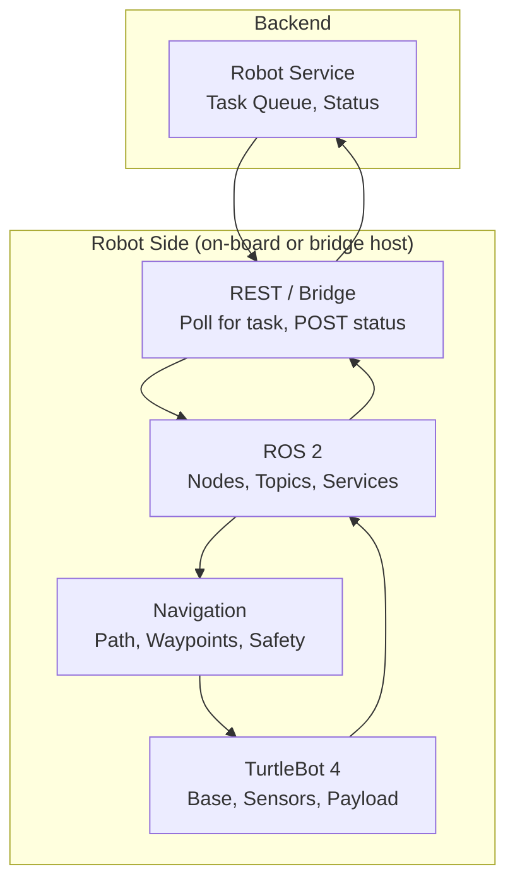

# Robot System – Implementation Design
## LUNA Senior Project

This document outlines the **implementation plan** for the LUNA **robot system** (TurtleBot 4): on-robot software, backend–robot communication, and operational behavior. It derives from the [System Design Document](SYSTEM_DESIGN.md), specifically:

- **Section 1.5:** Robot platform (TurtleBot 4), software development required, integration work
- **Section 2:** FR-6 (waypoints, routing), FR-7 (robot integration & control), NFR-8 (safety)
- **Section 3.1.3:** Robot System Architecture (backend → bridge → ROS 2 → navigation → hardware)
- **Section 6:** Delivery and Robot API (tasks, waypoints, status)

**Scope:** On-robot software (ROS 2, navigation, bridge to backend), operational model (payload, confirmations, prioritization), and development/simulation. Backend Robot Service is covered in [Backend Implementation Design](BACKEND_IMPLEMENTATION_DESIGN.md).

---

## Table of Contents

1. [Scope & Conventions](#1-scope--conventions)
2. [Platform: TurtleBot 4](#2-platform-turtlebot-4)
3. [Operational Model](#3-operational-model)
4. [Confirmation Flows (Manual)](#4-confirmation-flows-manual)
5. [Task Prioritization](#5-task-prioritization)
6. [High-Level Architecture](#6-high-level-architecture)
7. [Tech Stack](#7-tech-stack)
8. [Repository & Project Layout](#8-repository--project-layout)
9. [Backend–Robot Protocol](#9-backend-robot-protocol)
10. [Development & Simulation](#10-development--simulation)
11. [Risks & Considerations](#11-risks--considerations)
12. [Alignment with System Design](#12-alignment-with-system-design)

---

## 1. Scope & Conventions

| Item | Decision |
|------|----------|
| **Scope** | On-robot software and operational behavior; backend Robot Service is in Backend Implementation Design |
| **Repo** | Monorepo; robot code lives under `robot/` (or `turtlebot/`) |
| **Platform** | TurtleBot 4 (Clearpath Robotics; ROS 2, iRobot Create 3 base) |
| **Document depth** | Outline/plan only; no low-level code specs |

APIs and task/waypoint contracts follow [SYSTEM_DESIGN.md](SYSTEM_DESIGN.md) Section 6. Safety and behaviour follow NFR-8 and FR-6/FR-7.

---

## 2. Platform: TurtleBot 4

**Reference:** [TurtleBot 4 – Clearpath Robotics](https://clearpathrobotics.com/turtlebot-4/)

- **Base:** iRobot Create 3 (integrated battery, charging dock, ~9–15 kg payload)
- **Compute:** Raspberry Pi 4 (4 GB), ROS 2 pre-installed
- **Sensors:** OAK-D (stereo) camera, 2D LiDAR, IMU, wheel encoders, cliff/bump/slip detection
- **Software:** ROS 2; Ignition Gazebo simulation and tutorials available

Phase 1 uses a **single payload area** on the robot (top surface or single basket). The robot does **not** retrieve books from shelves; staff or students **place books on the robot** for all delivery and return scenarios.

---

## 3. Operational Model

### 3.1 How the Robot Gets the Book

- **All scenarios (Phase 1):** A person places the book on the robot.
  - **Delivery to student:** Staff places the book on the robot at the workstation, then the robot navigates to the student.
  - **Return pickup:** Robot navigates to the student; the student (or staff) places the return book on the robot; then the robot navigates to the return workstation.
  - **Inter-staff, workstation, inter-location:** Staff places the book(s) on the robot, then the robot navigates to the destination.

Automated book retrieval from shelves is out of scope for Phase 1.

### 3.2 Payload: One Area, One Task at a Time

| Decision | Description |
|----------|-------------|
| **Payload** | Single payload area (one “basket” or top surface). No separate delivery vs return baskets. |
| **Concurrency** | One active task per robot at a time. The robot completes (or cancels) the current task before starting the next. |

This keeps logic simple, matches “one book placed” per trip, and aligns with TurtleBot 4’s single payload region. Multi-item or dual-basket behaviour can be considered in a later phase.

### 3.3 Book-Placement Confirmation (Before Robot Moves)

For **delivery** tasks (student, inter-staff, workstation, transfer), the robot must not start until the book is on the robot. Confirmation is **manual** (see Section 4): librarian/staff confirms “book placed” in the dashboard; only then does the backend allow the robot to start (or the robot receives “go” from the backend).

---

## 4. Confirmation Flows (Manual)

Confirmations are manual in the **student app** (mobile) and **librarian dashboard** (web), depending on whether the flow is a **delivery** or a **return**.

### 4.1 Delivery to Student

| Step | Who | Where | Action | API (System Design §6.1.3) |
|------|-----|--------|--------|----------------------------|
| 1. Request created | Student | Mobile app | Request book, set delivery location | `POST /api/v1/requests` |
| 2. Task created | Backend | — | Delivery task created; robot assigned (when available) | — |
| 3. Book placed | Librarian / staff | **Dashboard** | Confirm book placed on robot | `PUT /api/v1/deliveries/{task_id}/book-placed` |
| 4. Robot moves | Robot | — | Navigate to student location (after backend signals go) | — |
| 5. Delivery complete | Student | **Mobile app** | Confirm “I received the book” / mark request complete | `PUT /api/v1/requests/{request_id}/complete` |
| 6. Task complete | Librarian (optional) | Dashboard | Mark delivery task complete if not auto-closed | `PUT /api/v1/deliveries/{task_id}/complete` |

**Summary:** **Dashboard** = “book placed on robot” before the robot moves. **Student (mobile)** = “I received the book” after delivery.

### 4.2 Return Pickup (Robot Picks Up from Student)

| Step | Who | Where | Action | API (System Design §6.1.3) |
|------|-----|--------|--------|----------------------------|
| 1. Return initiated | Student | **Mobile app** | Initiate return, set pickup location | `POST /api/v1/returns` |
| 2. Task created | Backend | — | Return/pickup task created; robot assigned | — |
| 3. Robot moves to student | Robot | — | Navigate to student pickup location | — |
| 4. Book handed to robot | Student | **Mobile app** | Confirm “robot picked up the book” / I handed it over | `PUT /api/v1/returns/{return_id}/picked-up` |
| 5. Robot moves to workstation | Robot | — | Navigate to return workstation | — |
| 6. Return complete | Librarian (optional) | **Dashboard** | Confirm return received at workstation / mark task complete | `PUT /api/v1/deliveries/{task_id}/complete` or equivalent |

**Summary:** **Student (mobile)** = initiate return + “robot picked up the book.” **Dashboard** = optional “return received at workstation” / task complete.

### 4.3 Other Delivery Types (Inter-Staff, Workstation, Transfer)

- **Book placed:** Librarian/staff confirms in the **dashboard** (`PUT .../book-placed`) before the robot moves.
- **Task complete:** Librarian confirms in the **dashboard** (`PUT .../complete`) when the robot has arrived and the book is received at the destination.

No student app involvement for these flows.

---

## 5. Task Prioritization

When multiple tasks are queued for the same robot (or pool of robots), the following rules apply.

| Rule | Description |
|------|-------------|
| **Ordering** | **FIFO by task creation time** (oldest task first). No inherent preference for “delivery first” vs “return first” unless explicitly configured. |
| **Optional extension** | Backend may support a **priority** field (e.g. delivery vs return, or “urgent”) and sort by (priority, created_at); robot simply consumes “next task” from the backend. |

Implementation of the queue ordering lives in the **backend** (Delivery Service / Robot Service); the robot receives the next task from the backend according to that policy. This document only states the chosen behaviour (FIFO; optional priority later).

---

## 6. High-Level Architecture

Aligned with System Design Section 3.1.3:



- **Backend:** Holds task queue, waypoints, and robot status; exposes APIs for dashboard and mobile (Section 6).
- **Bridge:** Runs on the robot (or robot-side host); polls backend for “next task” (or receives push if added later); sends status (location, battery, task state); translates “navigate to waypoint X” into ROS 2 commands.
- **ROS 2:** Navigation stack, waypoint manager, safety (e.g. emergency stop, obstacle handling).
- **TurtleBot 4:** Physical platform; sensors and actuators exposed via ROS 2.

---

## 7. Tech Stack

| Layer | Choice | Notes |
|-------|--------|--------|
| **Platform** | TurtleBot 4 (Standard or Lite) | Clearpath; ROS 2, Create 3 base |
| **Middleware** | ROS 2 (Humble or Jazzy) | Match TurtleBot 4 documentation and tutorials |
| **Language** | Python and/or C++ | Python for bridge and simple nodes; C++ for performance-critical navigation if needed |
| **Backend communication** | REST client (robot polls), or WebSocket/MQTT (optional later) | Robot (bridge) calls backend APIs to fetch next task and POST status; backend does not push to robot in minimal version |

---

## 8. Repository & Project Layout

Robot code lives under the monorepo in a single directory (e.g. `robot/`).

**Planned layout (outline):**

```
robot/
  ros2_ws/           # ROS 2 workspace (or colcon workspace)
    src/             # ROS 2 packages (navigation, waypoints, bridge node)
  bridge/            # Backend–robot bridge (poll task, POST status, translate to ROS)
  config/            # Waypoints, maps, bridge config (backend URL, auth)
  docs/              # Robot-specific notes, runbooks
  README.md          # How to build, run, and simulate
```

Waypoints can be stored in the backend (Section 5 Data Design) and referenced by ID in task payloads; the bridge or a ROS node resolves waypoint ID to coordinates (from backend or local cache).

---

## 9. Backend–Robot Protocol

- **Task receipt:** Robot (bridge) polls backend (e.g. “get next task for robot R”) or receives a single “next task” when available. Task payload includes task type, destination waypoint (or location), and any metadata. Robot does not decide prioritization; backend does.
- **Status reporting:** Robot (bridge) POSTs status to backend at intervals or on state change: battery, current location/waypoint, task state (idle, moving, arrived, error), and optional health metrics.
- **“Go” after book placed:** For delivery tasks, backend only returns (or pushes) “go” to the robot after the dashboard has called `PUT .../book-placed`. Bridge waits for “go” or treats “task assigned + book-placed” as start signal (implementation detail in backend and bridge).
- **Authentication:** Bridge uses a robot-specific credential or API key (stored securely on the robot) to call backend APIs; see Backend Implementation Design for auth details.

---

## 10. Development & Simulation

- **Simulation:** Use TurtleBot 4 simulation (e.g. Ignition Gazebo) and ROS 2 for development and testing without the physical robot. Backend can run locally (Docker Compose) or on a dev server; bridge points to that backend.
- **Physical robot:** Deploy bridge and ROS 2 nodes on the TurtleBot 4 (Raspberry Pi); robot and backend must be on the same network (or reachable). No Docker on the robot required for Phase 1; run native ROS 2 and bridge process.

---

## 11. Risks & Considerations

| Risk | Mitigation |
|------|------------|
| Network loss between robot and backend | Bridge retries and buffers status; task queue remains in backend; robot resumes when connectivity returns. |
| Confirmation skipped (robot moves without book) | Backend and bridge enforce “go” only after book-placed for delivery tasks; dashboard is single place for that confirmation. |
| Multiple tasks, one robot | FIFO (and optional priority) in backend; robot only ever has one “current” task; no local queue on robot. |
| Safety (emergency stop, obstacles) | Implement in ROS 2 (safety monitor, e-stop topic); optional: expose e-stop to backend so dashboard can trigger it (Backend §6.1.4). |

---

## 12. Alignment with System Design

| System Design | Robot Implementation |
|---------------|----------------------|
| Section 1.5 (Robot platform, software required) | Section 2 (TurtleBot 4), Section 6–9 (architecture, stack, protocol) |
| Section 2 FR-6, FR-7, NFR-8 | Section 3–5 (operational model, confirmations, prioritization), Section 11 (safety) |
| Section 3.1.3 (Robot System Architecture) | Section 6 (high-level diagram), Section 9 (protocol) |
| Section 6.1.3 (Delivery endpoints, book-placed, complete) | Section 4 (confirmation flows and API mapping) |
| Section 6.1.4 (Robot API: status, waypoints, e-stop) | Section 9 (status reporting, waypoints), Section 11 (e-stop) |

Changes to the [System Design Document](SYSTEM_DESIGN.md) or [Backend Implementation Design](BACKEND_IMPLEMENTATION_DESIGN.md) that affect tasks, waypoints, or confirmations should be reflected in this document.
