# System Design Document
## LUNA Senior Project

---

## Table of Contents

1. [System Overview & Goals](#1-system-overview--goals)
   - 1.1 [System Purpose](#11-system-purpose)
   - 1.2 [Problem Statement](#12-problem-statement)
   - 1.3 [System Goals & Objectives](#13-system-goals--objectives)
   - 1.4 [System Scope](#14-system-scope)
   - 1.5 [High-Level System Description](#15-high-level-system-description)
   - 1.6 [Target Users & Stakeholders](#16-target-users--stakeholders)

2. [Requirements](#2-requirements)
   - 2.1 [High-Level Functional Requirements](#21-high-level-functional-requirements)
   - 2.2 [High-Level Non-Functional Requirements](#22-high-level-non-functional-requirements)

3. [Architecture Diagrams](#3-architecture-diagrams)
   - 3.1 [High-Level System Architecture](#31-high-level-system-architecture)
     - 3.1.1 [Mobile Application Architecture](#311-mobile-application-architecture)
     - 3.1.2 [Web Dashboard Architecture](#312-web-dashboard-architecture)
     - 3.1.3 [Robot System Architecture](#313-robot-system-architecture)
     - 3.1.4 [Backend Services Architecture](#314-backend-services-architecture)
   - 3.2 [Component Architecture](#32-component-architecture)
   - 3.3 [Data Flow Diagrams](#33-data-flow-diagrams)
     - 3.3.1 [Student Book Request Flow](#331-student-book-request-flow)
     - 3.3.2 [Book Return Pickup Flow](#332-book-return-pickup-flow)
     - 3.3.3 [Inter-Staff Delivery Flow](#333-inter-staff-delivery-flow)
     - 3.3.4 [Catalog Management Flow](#334-catalog-management-flow)
     - 3.3.5 [Robot Status Monitoring Flow](#335-robot-status-monitoring-flow)
   - 3.4 [User Workflow Diagrams](#34-user-workflow-diagrams)
     - 3.4.1 [Student Book Request Workflow](#341-student-book-request-workflow)
     - 3.4.2 [Student Book Return Workflow](#342-student-book-return-workflow)
     - 3.4.3 [Librarian Catalog Management Workflow](#343-librarian-catalog-management-workflow)
     - 3.4.4 [Librarian Delivery Management Workflow](#344-librarian-delivery-management-workflow)
     - 3.4.5 [Librarian Robot Monitoring Workflow](#345-librarian-robot-monitoring-workflow)
     - 3.4.6 [Complete Student Journey Workflow](#346-complete-student-journey-workflow)

4. [Component Design](#4-component-design)
   - 4.1 [Services/Modules](#41-servicesmodules)
   - 4.2 [Interfaces & Contracts](#42-interfaces--contracts)
   - 4.3 [Technology Choices & Rationale](#43-technology-choices--rationale)

5. [Data Design](#5-data-design)
   - 5.1 [Database Schema](#51-database-schema)
   - 5.2 [Data Models](#52-data-models)
   - 5.3 [Data Flow & Storage Patterns](#53-data-flow--storage-patterns)

6. [API Design](#6-api-design)
   - 6.1 [Endpoints & Contracts](#61-endpoints--contracts)
   - 6.2 [Request/Response Formats](#62-requestresponse-formats)
   - 6.3 [Authentication/Authorization](#63-authenticationauthorization)
   - 6.4 [API Versioning Strategy](#64-api-versioning-strategy)

---

## 1. System Overview & Goals

### 1.1 System Purpose

LUNA (Library User Navigation Assistant) is a comprehensive library automation system designed to revolutionize how students interact with library resources and how librarians manage library operations. The system addresses the challenge of efficiently moving and delivering physical books throughout the library by automating comprehensive book delivery operations, book discovery, and inter-location transfers through intelligent robot navigation.

**Core Value Proposition:**
- **For Students:** Seamless book discovery, instant availability checking, automated robot-assisted book delivery to their location, and convenient book return through automated pickup
- **For Librarians:** Centralized catalog management, real-time TurtleBot 4 monitoring, comprehensive system health tracking, and streamlined inter-staff book transfers
- **For Libraries:** Increased operational efficiency, reduced staff workload, improved user satisfaction, and optimized book movement between sections and workstations through comprehensive delivery automation

**Phase 1 Focus:** The system's primary function in Phase 1 is **comprehensive book delivery automation** using the TurtleBot 4 platform. The robot handles multiple delivery scenarios:

- **Student Delivery:** Librarians/staff manually place requested books on the TurtleBot 4, and the robot navigates to deliver the book to the requesting student's location
- **Book Return Pickup:** TurtleBot 4 navigates to student location to pick up books being returned, then delivers them to the return workstation
- **Librarian-to-Librarian Delivery:** TurtleBot 4 transports books between different librarian workstations or library sections
- **Workstation Delivery:** TurtleBot 4 delivers books to processing workstations, cataloging areas, or other designated library locations
- **Inter-Location Transfer:** TurtleBot 4 moves books between different library sections, floors, or departments

All delivery scenarios follow the same pattern: staff manually places books on the TurtleBot 4, and the robot navigates autonomously to the destination. Automated book retrieval (where the robot navigates to shelves and retrieves books independently) is planned for future phases.

### 1.2 Problem Statement

Traditional library systems require students to manually search through catalog systems, navigate complex library layouts, and physically locate books on shelves. This process is time-consuming, error-prone, and often results in frustration when books are misplaced or unavailable. Additionally, students must physically travel to the library and navigate to book locations, which can be inconvenient and time-consuming.

Librarians face challenges in maintaining accurate catalog information, monitoring library resources, and efficiently managing book movement throughout the library. This includes delivering books to students, handling book returns, transferring books between workstations, and moving books between library sections. These operations require significant staff time and physical movement, reducing overall library efficiency.

LUNA solves these problems by:
- Providing an intuitive interface for book search and discovery
- Automating comprehensive book delivery operations through TurtleBot 4 assistance:
  - **Student Delivery:** Books delivered directly to student locations
  - **Book Returns:** Automated pickup from students and delivery to return workstations
  - **Staff Operations:** Inter-librarian and workstation deliveries for efficient library operations
  - **Location Transfers:** Automated movement of books between library sections
- Enabling real-time tracking of all delivery requests and TurtleBot 4 status
- Centralizing library management operations in a single dashboard
- Ensuring accurate catalog information through automated updates
- Reducing physical travel for both students and staff through automated delivery

### 1.3 System Goals & Objectives

#### Primary Goals

1. **Automate Comprehensive Book Delivery Operations**
   - **Student Delivery:** Enable students to request books and receive automated delivery to their location
   - **Book Return Pickup:** Automate pickup of returned books from students and delivery to return workstations
   - **Inter-Staff Delivery:** Support librarian-to-librarian book transfers between workstations
   - **Workstation Delivery:** Automate delivery to processing, cataloging, and other library workstations
   - **Location Transfers:** Enable automated movement of books between library sections, floors, or departments
   - Support manual book placement workflow (staff places book on robot for all delivery types)
   - Provide real-time status updates on all delivery operations
   - **Future Phase:** Automated book retrieval from shelves

2. **Enhance User Experience**
   - Reduce time and effort for students to receive books (delivery to their location)
   - Simplify book return process through automated pickup
   - Provide intuitive search and discovery capabilities
   - Deliver seamless, responsive user interfaces for all user types
   - Enable students to request books and receive them without navigating library shelves
   - Streamline library staff operations through automated inter-staff deliveries

3. **Improve Library Operations**
   - Centralize catalog management operations
   - Enable real-time monitoring of TurtleBot 4 health and status
   - Provide comprehensive system metrics and analytics

4. **Ensure System Reliability**
   - Maintain high availability and uptime
   - Provide robust error handling and recovery mechanisms
   - Support scalable operations as library usage grows

#### Success Metrics

*Note: Specific metrics will be defined based on robot capabilities (TurtleBot 4), library layout, and operational requirements during system design and testing phases.*

- **Performance:** TBD - To be determined based on system architecture and robot navigation capabilities
- **Availability:** TBD - Target availability will be defined based on deployment infrastructure and operational requirements
- **User Satisfaction:** 
  - Delivery times will vary based on library size, robot speed, navigation complexity, and distance
  - Metrics to be established during pilot testing with TurtleBot 4
- **Scalability:** TBD - To be determined based on concurrent user load testing and system capacity planning
- **Accuracy:** TBD - Book location and delivery accuracy targets to be established during integration testing

### 1.4 System Scope

#### In Scope

- **Student Application:** Mobile application library system for book search, request creation, return initiation, and status tracking
- **Librarian Dashboard:** Web application dashboard for catalog management, robot monitoring, delivery task management, and system analytics
- **Backend Services:** API layer, authentication, database management, and business logic
- **Robot Integration:** Communication protocols and task management for TurtleBot 4 navigation and all delivery scenarios
- **Comprehensive Delivery Workflows:** Support for manual book placement and automated delivery to:
  - Student locations (book requests)
  - Student locations for pickup (book returns)
  - Librarian workstations (inter-staff transfers)
  - Processing workstations (cataloging, processing areas)
  - Library sections (inter-location transfers)
- **Real-Time Updates:** WebSocket-based real-time status updates for requests and robot operations
- **Authentication & Authorization:** User authentication, role-based access control (students vs. librarians)
- **Catalog Management:** CRUD operations for books, shelf locations, and library resources

#### Out of Scope

- Physical robot hardware development (TurtleBot 4 hardware provided; software development, navigation, and system integration work required)
- Library infrastructure modifications
- Third-party library management system integrations (initial version)
- Additional mobile platforms beyond the primary student mobile application
- Advanced analytics and reporting (beyond basic metrics)
- Multi-library support (single library deployment)
- **Automated book retrieval from shelves** (Phase 1 - future phase feature)

### 1.5 High-Level System Description

LUNA is a distributed, cloud-native system consisting of:

1. **Frontend Applications**
   - Student-facing mobile application library system for book discovery, requests, and returns
   - Librarian-facing web application dashboard for administrative operations and delivery management

2. **Backend Services**
   - RESTful API layer for all system operations
   - Authentication and authorization services
   - Business logic and service layer
   - Background job processing for async operations

3. **Data Layer**
   - Relational database for structured data (books, requests, users, tasks)
   - Real-time data synchronization capabilities
   - Caching layer for performance optimization

4. **Robot Platform (TurtleBot 4)**
   - **Hardware:** TurtleBot 4 platform provided (hardware components included)
   - **Software Development Required:**
     - Navigation system integration (ROS/ROS2)
     - Path planning and obstacle avoidance
     - Location mapping and waypoint management
     - Communication interface with backend services
     - Task execution and status reporting
     - Book placement confirmation mechanisms
     - Safety and error handling protocols
   - **Integration Work:**
     - API/interface development for backend communication
     - Real-time status updates to system
     - Delivery task queue processing
     - Navigation command execution

5. **Integration Layer**
   - TurtleBot 4 communication interface for all delivery navigation scenarios
   - Multi-scenario delivery workflow management:
     - Student delivery workflow
     - Book return pickup workflow
     - Inter-staff delivery workflow
     - Workstation delivery workflow
     - Inter-location transfer workflow
   - Book placement workflow management (staff places book on TurtleBot 4 for all scenarios)
   - External service integrations (as needed)
   - Event-driven architecture for system coordination

6. **Infrastructure**
   - Cloud-hosted, containerized deployment
   - Scalable, horizontally-distributed architecture
   - Monitoring, logging, and observability tools

The system operates as a cohesive platform where:
- Students can seamlessly discover and request books, receive automated delivery, and return books through automated pickup
- Library staff can efficiently transfer books between workstations and sections through automated inter-staff deliveries
- TurtleBot 4 executes navigation tasks for all delivery scenarios (student delivery, return pickup, inter-staff delivery, workstation delivery, location transfers)
- Librarians maintain oversight of all delivery operations through real-time dashboards

### 1.6 Target Users & Stakeholders

#### Primary Users

1. **Students**
   - Primary consumers of the book discovery, request, and return functionality
   - Require simple, intuitive interface for searching, requesting books, and initiating returns
   - Need real-time updates on delivery and pickup status

2. **Librarians**
   - Primary users of the administrative dashboard
   - Manage library catalog, monitor system health, and oversee all delivery operations
   - Initiate and manage inter-staff deliveries, workstation deliveries, and inter-location transfers
   - Require comprehensive tools for catalog management, TurtleBot 4 monitoring, and delivery task management

#### Secondary Stakeholders

- **Library Administrators:** Oversight and system configuration
- **IT Support:** System maintenance and troubleshooting
- **System Developers:** Ongoing development and enhancement

---

## 2. Requirements

High-level requirements define the major capabilities the system must provide to meet user needs and business objectives.

**Component Legend:**
- 🟢 **Mobile App** - Student mobile application
- 🔵 **Web App** - Librarian web dashboard  
- 🟡 **Robot** - TurtleBot 4 platform
- ⚪ **Other** - Backend services, infrastructure, shared components

### 2.1 High-Level Functional Requirements

| ID | High-Level Requirement | Mobile App | Web App | Robot | Other |
|----|------------------------|:----------:|:-------:|:-----:|:-----:|
| **FR-1** | **User Authentication & Authorization** | 🟢 | 🔵 | | ⚪ |
| | Support user registration, login, and role-based access (Student, Librarian) | | | | |
| **FR-2** | **Book Discovery & Search** | 🟢 | 🔵 | | ⚪ |
| | Enable users to search and browse library catalog with real-time availability | | | | |
| **FR-3** | **Book Request & Delivery** | 🟢 | | | ⚪ |
| | Allow students to request books and receive automated delivery to their location | | | | |
| **FR-4** | **Book Return & Pickup** | 🟢 | | | ⚪ |
| | Enable students to return books with automated pickup from their location | | | | |
| **FR-5** | **Delivery Task Management** | 🟢 | 🔵 | | ⚪ |
| | Manage all delivery scenarios (student delivery, returns, inter-staff, workstation, transfers) | | | | |
| **FR-6** | **Location & Navigation Management** | | 🔵 | 🟡 | ⚪ |
| | Maintain delivery locations, waypoints, and routing for TurtleBot 4 navigation | | | | |
| **FR-7** | **Robot Integration & Control** | | 🔵 | 🟡 | ⚪ |
| | Communicate with TurtleBot 4, send navigation commands, receive status updates, handle errors | | | | |
| **FR-8** | **Real-Time Updates & Notifications** | 🟢 | 🔵 | | ⚪ |
| | Provide real-time status updates and push notifications for all delivery operations | | | | |
| **FR-9** | **Catalog Management** | | 🔵 | | ⚪ |
| | Enable librarians to manage library catalog (add, update, remove books, bulk operations) | | | | |
| **FR-10** | **System Monitoring & Analytics** | | 🔵 | | ⚪ |
| | Provide dashboard for robot status, task queue, analytics, and system health monitoring | | | | |

### 2.2 High-Level Non-Functional Requirements

| ID | High-Level Requirement | Mobile App | Web App | Robot | Other |
|----|------------------------|:----------:|:-------:|:-----:|:-----:|
| **NFR-1** | **Performance** | 🟢 | 🔵 | | ⚪ |
| | System shall provide acceptable response times and handle concurrent users (metrics TBD) | | | | |
| **NFR-2** | **Security** | 🟢 | 🔵 | | ⚪ |
| | Encrypt data in transit and at rest, implement authentication, authorization, input validation, and audit logging | | | | |
| **NFR-3** | **Reliability & Availability** | 🟢 | 🔵 | 🟡 | ⚪ |
| | System shall handle failures gracefully, maintain data consistency, support backups, and handle network interruptions | | | | |
| **NFR-4** | **Scalability** | | | | ⚪ |
| | Architecture shall support horizontal scaling, increasing data volumes, and multiple robot units | | | | |
| **NFR-5** | **Usability** | 🟢 | 🔵 | | |
| | Applications shall provide intuitive interfaces, clear feedback, responsive design, and user guidance | | | | |
| **NFR-6** | **Compatibility** | 🟢 | 🔵 | 🟡 | ⚪ |
| | Support iOS/Android (mobile), modern browsers (web), ROS/ROS2 (robot), and standard APIs (REST, JSON, WebSocket) | | | | |
| **NFR-7** | **Maintainability** | 🟢 | 🔵 | 🟡 | ⚪ |
| | Codebase shall follow standards, support modular design, provide logging/monitoring, and support CI/CD | | | | |
| **NFR-8** | **Safety (Robot Operations)** | | 🔵 | 🟡 | ⚪ |
| | Implement safety protocols, emergency stop, obstacle avoidance, manual override, and safety event logging | | | | |

---

## 3. Architecture Diagrams

### 3.1 High-Level System Architecture

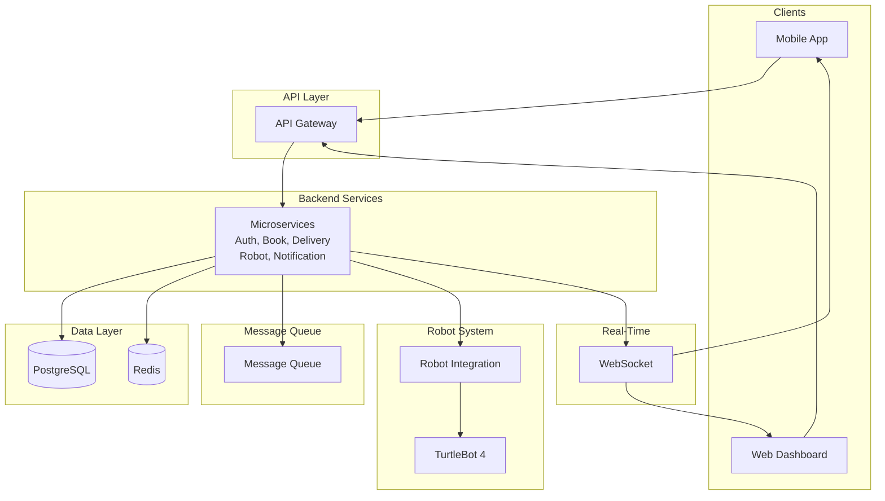
```mermaid
graph TB
    subgraph "Clients"
        MobileApp[Mobile App]
        WebApp[Web Dashboard]
    end

    subgraph "API Layer"
        Gateway[API Gateway]
    end

    subgraph "Backend Services"
        Services[Microservices<br/>Auth, Book, Delivery<br/>Robot, Notification]
    end

    subgraph "Data Layer"
        DB[(PostgreSQL)]
        Cache[(Redis)]
    end

    subgraph "Message Queue"
        MQ[Message Queue]
    end

    subgraph "Robot System"
        Robot[Robot Integration]
        TurtleBot[TurtleBot 4]
    end

    subgraph "Real-Time"
        WS[WebSocket]
    end

    MobileApp --> Gateway
    WebApp --> Gateway
    Gateway --> Services
    Services --> DB
    Services --> Cache
    Services --> MQ
    Services --> Robot
    Robot --> TurtleBot
    Services --> WS
    WS --> MobileApp
    WS --> WebApp
```

#### 3.1.1 Mobile Application Architecture

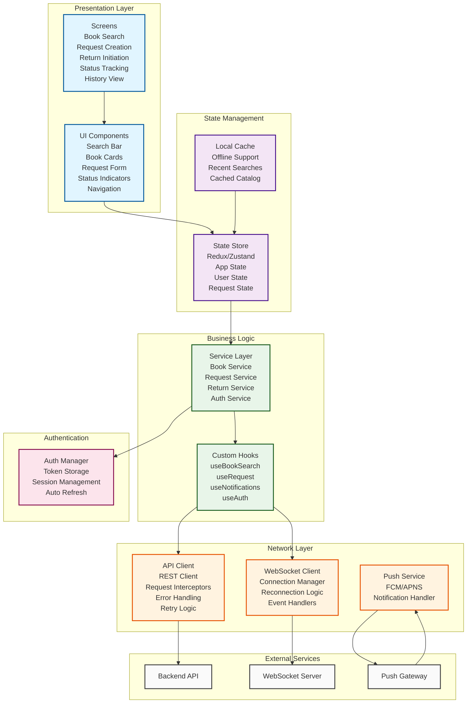
```mermaid
graph TB
    subgraph "Presentation Layer"
        Screens[Screens<br/>Book Search<br/>Request Creation<br/>Return Initiation<br/>Status Tracking<br/>History View]
        Components[UI Components<br/>Search Bar<br/>Book Cards<br/>Request Form<br/>Status Indicators<br/>Navigation]
    end

    subgraph "State Management"
        StateStore[State Store<br/>Redux/Zustand<br/>App State<br/>User State<br/>Request State]
        LocalCache[Local Cache<br/>Offline Support<br/>Recent Searches<br/>Cached Catalog]
    end

    subgraph "Business Logic"
        Services[Service Layer<br/>Book Service<br/>Request Service<br/>Return Service<br/>Auth Service]
        Hooks[Custom Hooks<br/>useBookSearch<br/>useRequest<br/>useNotifications<br/>useAuth]
    end

    subgraph "Network Layer"
        APIClient[API Client<br/>REST Client<br/>Request Interceptors<br/>Error Handling<br/>Retry Logic]
        WSClient[WebSocket Client<br/>Connection Manager<br/>Reconnection Logic<br/>Event Handlers]
        PushService[Push Service<br/>FCM/APNS<br/>Notification Handler]
    end

    subgraph "Authentication"
        AuthManager[Auth Manager<br/>Token Storage<br/>Session Management<br/>Auto Refresh]
    end

    subgraph "External Services"
        BackendAPI[Backend API]
        WebSocketServer[WebSocket Server]
        PushGateway[Push Gateway]
    end

    Screens --> Components
    Components --> StateStore
    StateStore --> Services
    Services --> Hooks
    Hooks --> APIClient
    Hooks --> WSClient
    Services --> AuthManager
    APIClient --> BackendAPI
    WSClient --> WebSocketServer
    PushService --> PushGateway
    PushGateway --> PushService
    LocalCache --> StateStore

    classDef presentation fill:#e1f5ff,stroke:#01579b,stroke-width:2px
    classDef state fill:#f3e5f5,stroke:#4a148c,stroke-width:2px
    classDef business fill:#e8f5e9,stroke:#1b5e20,stroke-width:2px
    classDef network fill:#fff3e0,stroke:#e65100,stroke-width:2px
    classDef auth fill:#fce4ec,stroke:#880e4f,stroke-width:2px
    classDef external fill:#fafafa,stroke:#424242,stroke-width:2px

    class Screens,Components presentation
    class StateStore,LocalCache state
    class Services,Hooks business
    class APIClient,WSClient,PushService network
    class AuthManager auth
    class BackendAPI,WebSocketServer,PushGateway external
```

#### 3.1.2 Web Dashboard Architecture

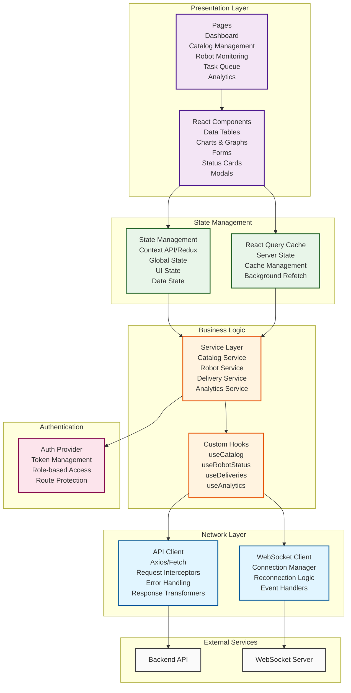
```mermaid
graph TB
    subgraph "Presentation Layer"
        Pages[Pages<br/>Dashboard<br/>Catalog Management<br/>Robot Monitoring<br/>Task Queue<br/>Analytics]
        Components[React Components<br/>Data Tables<br/>Charts & Graphs<br/>Forms<br/>Status Cards<br/>Modals]
    end

    subgraph "State Management"
        StateStore[State Management<br/>Context API/Redux<br/>Global State<br/>UI State<br/>Data State]
        QueryCache[React Query Cache<br/>Server State<br/>Cache Management<br/>Background Refetch]
    end

    subgraph "Business Logic"
        Services[Service Layer<br/>Catalog Service<br/>Robot Service<br/>Delivery Service<br/>Analytics Service]
        Hooks[Custom Hooks<br/>useCatalog<br/>useRobotStatus<br/>useDeliveries<br/>useAnalytics]
    end

    subgraph "Network Layer"
        APIClient[API Client<br/>Axios/Fetch<br/>Request Interceptors<br/>Error Handling<br/>Response Transformers]
        WSClient[WebSocket Client<br/>Connection Manager<br/>Reconnection Logic<br/>Event Handlers]
    end

    subgraph "Authentication"
        AuthProvider[Auth Provider<br/>Token Management<br/>Role-based Access<br/>Route Protection]
    end

    subgraph "External Services"
        BackendAPI[Backend API]
        WebSocketServer[WebSocket Server]
    end

    Pages --> Components
    Components --> StateStore
    Components --> QueryCache
    StateStore --> Services
    QueryCache --> Services
    Services --> Hooks
    Hooks --> APIClient
    Hooks --> WSClient
    Services --> AuthProvider
    APIClient --> BackendAPI
    WSClient --> WebSocketServer

    classDef presentation fill:#f3e5f5,stroke:#4a148c,stroke-width:2px
    classDef state fill:#e8f5e9,stroke:#1b5e20,stroke-width:2px
    classDef business fill:#fff3e0,stroke:#e65100,stroke-width:2px
    classDef network fill:#e1f5ff,stroke:#01579b,stroke-width:2px
    classDef auth fill:#fce4ec,stroke:#880e4f,stroke-width:2px
    classDef external fill:#fafafa,stroke:#424242,stroke-width:2px

    class Pages,Components presentation
    class StateStore,QueryCache state
    class Services,Hooks business
    class APIClient,WSClient network
    class AuthProvider auth
    class BackendAPI,WebSocketServer external
```

#### 3.1.3 Robot System Architecture

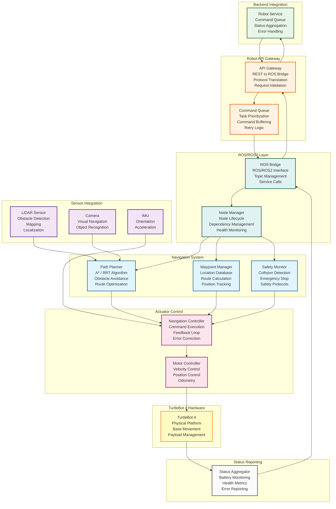
```mermaid
graph TB
    subgraph "Backend Integration"
        RobotService[Robot Service<br/>Command Queue<br/>Status Aggregation<br/>Error Handling]
    end

    subgraph "Robot API Gateway"
        APIGateway[API Gateway<br/>REST to ROS Bridge<br/>Protocol Translation<br/>Request Validation]
        CommandQueue[Command Queue<br/>Task Prioritization<br/>Command Buffering<br/>Retry Logic]
    end

    subgraph "ROS/ROS2 Layer"
        ROSBridge[ROS Bridge<br/>ROS/ROS2 Interface<br/>Topic Management<br/>Service Calls]
        NodeManager[Node Manager<br/>Node Lifecycle<br/>Dependency Management<br/>Health Monitoring]
    end

    subgraph "Navigation System"
        PathPlanner[Path Planner<br/>A* / RRT Algorithm<br/>Obstacle Avoidance<br/>Route Optimization]
        WaypointManager[Waypoint Manager<br/>Location Database<br/>Route Calculation<br/>Position Tracking]
        SafetyMonitor[Safety Monitor<br/>Collision Detection<br/>Emergency Stop<br/>Safety Protocols]
    end

    subgraph "Sensor Integration"
        Lidar[LiDAR Sensor<br/>Obstacle Detection<br/>Mapping<br/>Localization]
        Camera[Camera<br/>Visual Navigation<br/>Object Recognition]
        IMU[IMU<br/>Orientation<br/>Acceleration]
    end

    subgraph "Actuator Control"
        MotorController[Motor Controller<br/>Velocity Control<br/>Position Control<br/>Odometry]
        NavigationController[Navigation Controller<br/>Command Execution<br/>Feedback Loop<br/>Error Correction]
    end

    subgraph "TurtleBot 4 Hardware"
        PhysicalRobot[TurtleBot 4<br/>Physical Platform<br/>Base Movement<br/>Payload Management]
    end

    subgraph "Status Reporting"
        StatusAggregator[Status Aggregator<br/>Battery Monitoring<br/>Health Metrics<br/>Error Reporting]
    end

    RobotService --> APIGateway
    APIGateway --> CommandQueue
    CommandQueue --> ROSBridge
    ROSBridge --> NodeManager
    NodeManager --> PathPlanner
    NodeManager --> WaypointManager
    NodeManager --> SafetyMonitor
    PathPlanner --> NavigationController
    WaypointManager --> NavigationController
    SafetyMonitor --> NavigationController
    NavigationController --> MotorController
    Lidar --> PathPlanner
    Camera --> PathPlanner
    IMU --> NavigationController
    MotorController --> PhysicalRobot
    PhysicalRobot --> StatusAggregator
    StatusAggregator --> ROSBridge
    ROSBridge --> APIGateway
    APIGateway --> RobotService

    classDef backend fill:#e8f5e9,stroke:#1b5e20,stroke-width:2px
    classDef gateway fill:#fff3e0,stroke:#e65100,stroke-width:2px
    classDef ros fill:#e0f2f1,stroke:#004d40,stroke-width:2px
    classDef navigation fill:#e1f5ff,stroke:#01579b,stroke-width:2px
    classDef sensor fill:#f3e5f5,stroke:#4a148c,stroke-width:2px
    classDef actuator fill:#fce4ec,stroke:#880e4f,stroke-width:2px
    classDef hardware fill:#fff9c4,stroke:#f57f17,stroke-width:2px
    classDef status fill:#fafafa,stroke:#424242,stroke-width:2px

    class RobotService backend
    class APIGateway,CommandQueue gateway
    class ROSBridge,NodeManager ros
    class PathPlanner,WaypointManager,SafetyMonitor navigation
    class Lidar,Camera,IMU sensor
    class MotorController,NavigationController actuator
    class PhysicalRobot hardware
    class StatusAggregator status
```

#### 3.1.4 Backend Services Architecture

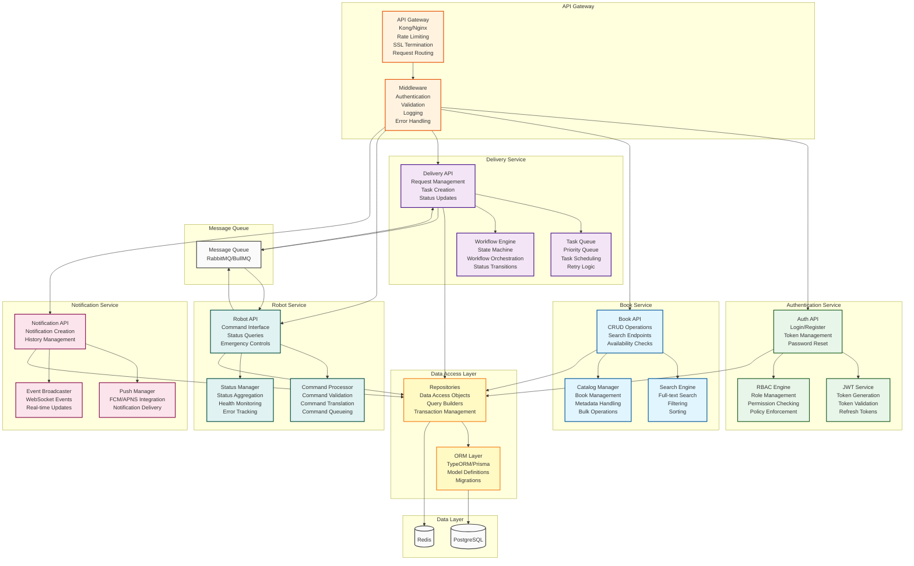
```mermaid
graph TB
    subgraph "API Gateway"
        Gateway[API Gateway<br/>Kong/Nginx<br/>Rate Limiting<br/>SSL Termination<br/>Request Routing]
        Middleware[Middleware<br/>Authentication<br/>Validation<br/>Logging<br/>Error Handling]
    end

    subgraph "Authentication Service"
        AuthAPI[Auth API<br/>Login/Register<br/>Token Management<br/>Password Reset]
        JWTService[JWT Service<br/>Token Generation<br/>Token Validation<br/>Refresh Tokens]
        RBAC[RBAC Engine<br/>Role Management<br/>Permission Checking<br/>Policy Enforcement]
    end

    subgraph "Book Service"
        BookAPI[Book API<br/>CRUD Operations<br/>Search Endpoints<br/>Availability Checks]
        SearchEngine[Search Engine<br/>Full-text Search<br/>Filtering<br/>Sorting]
        CatalogManager[Catalog Manager<br/>Book Management<br/>Metadata Handling<br/>Bulk Operations]
    end

    subgraph "Delivery Service"
        DeliveryAPI[Delivery API<br/>Request Management<br/>Task Creation<br/>Status Updates]
        TaskQueue[Task Queue<br/>Priority Queue<br/>Task Scheduling<br/>Retry Logic]
        WorkflowEngine[Workflow Engine<br/>State Machine<br/>Workflow Orchestration<br/>Status Transitions]
    end

    subgraph "Robot Service"
        RobotAPI[Robot API<br/>Command Interface<br/>Status Queries<br/>Emergency Controls]
        CommandProcessor[Command Processor<br/>Command Validation<br/>Command Translation<br/>Command Queueing]
        StatusManager[Status Manager<br/>Status Aggregation<br/>Health Monitoring<br/>Error Tracking]
    end

    subgraph "Notification Service"
        NotificationAPI[Notification API<br/>Notification Creation<br/>History Management]
        PushManager[Push Manager<br/>FCM/APNS Integration<br/>Notification Delivery]
        EventBroadcaster[Event Broadcaster<br/>WebSocket Events<br/>Real-time Updates]
    end

    subgraph "Data Access Layer"
        Repositories[Repositories<br/>Data Access Objects<br/>Query Builders<br/>Transaction Management]
        ORM[ORM Layer<br/>TypeORM/Prisma<br/>Model Definitions<br/>Migrations]
    end

    subgraph "Data Layer"
        PostgreSQL[(PostgreSQL)]
        Redis[(Redis)]
    end

    subgraph "Message Queue"
        MQ[Message Queue<br/>RabbitMQ/BullMQ]
    end

    Gateway --> Middleware
    Middleware --> AuthAPI
    Middleware --> BookAPI
    Middleware --> DeliveryAPI
    Middleware --> RobotAPI
    Middleware --> NotificationAPI

    AuthAPI --> JWTService
    AuthAPI --> RBAC
    AuthAPI --> Repositories

    BookAPI --> SearchEngine
    BookAPI --> CatalogManager
    BookAPI --> Repositories

    DeliveryAPI --> TaskQueue
    DeliveryAPI --> WorkflowEngine
    DeliveryAPI --> Repositories
    DeliveryAPI --> MQ

    RobotAPI --> CommandProcessor
    RobotAPI --> StatusManager
    RobotAPI --> Repositories
    RobotAPI --> MQ

    NotificationAPI --> PushManager
    NotificationAPI --> EventBroadcaster
    NotificationAPI --> Repositories

    Repositories --> ORM
    ORM --> PostgreSQL
    Repositories --> Redis

    MQ --> DeliveryAPI
    MQ --> RobotAPI

    classDef gateway fill:#fff3e0,stroke:#e65100,stroke-width:2px
    classDef auth fill:#e8f5e9,stroke:#1b5e20,stroke-width:2px
    classDef book fill:#e1f5ff,stroke:#01579b,stroke-width:2px
    classDef delivery fill:#f3e5f5,stroke:#4a148c,stroke-width:2px
    classDef robot fill:#e0f2f1,stroke:#004d40,stroke-width:2px
    classDef notification fill:#fce4ec,stroke:#880e4f,stroke-width:2px
    classDef data fill:#fff9c4,stroke:#f57f17,stroke-width:2px
    classDef storage fill:#fafafa,stroke:#424242,stroke-width:2px

    class Gateway,Middleware gateway
    class AuthAPI,JWTService,RBAC auth
    class BookAPI,SearchEngine,CatalogManager book
    class DeliveryAPI,TaskQueue,WorkflowEngine delivery
    class RobotAPI,CommandProcessor,StatusManager robot
    class NotificationAPI,PushManager,EventBroadcaster notification
    class Repositories,ORM data
    class PostgreSQL,Redis,MQ storage
```


### 3.2 Component Architecture

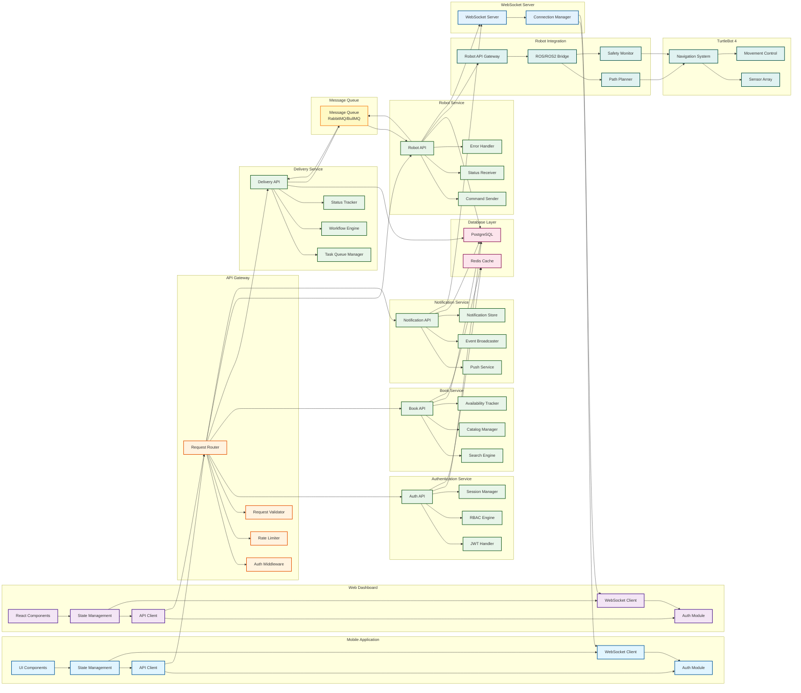
```mermaid
graph LR
    subgraph "Mobile Application"
        MobileUI[UI Components]
        MobileState[State Management]
        MobileAPI[API Client]
        MobileWS[WebSocket Client]
        MobileAuth[Auth Module]
    end

    subgraph "Web Dashboard"
        WebUI[React Components]
        WebState[State Management]
        WebAPI[API Client]
        WebWS[WebSocket Client]
        WebAuth[Auth Module]
    end

    subgraph "API Gateway"
        GatewayRouter[Request Router]
        GatewayAuth[Auth Middleware]
        GatewayRateLimit[Rate Limiter]
        GatewayValidator[Request Validator]
    end

    subgraph "Authentication Service"
        AuthAPI[Auth API]
        AuthJWT[JWT Handler]
        AuthRBAC[RBAC Engine]
        AuthSession[Session Manager]
    end

    subgraph "Book Service"
        BookAPI[Book API]
        BookSearch[Search Engine]
        BookCatalog[Catalog Manager]
        BookAvailability[Availability Tracker]
    end

    subgraph "Delivery Service"
        DeliveryAPI[Delivery API]
        TaskQueue[Task Queue Manager]
        WorkflowEngine[Workflow Engine]
        StatusTracker[Status Tracker]
    end

    subgraph "Robot Service"
        RobotAPI[Robot API]
        CommandSender[Command Sender]
        StatusReceiver[Status Receiver]
        ErrorHandler[Error Handler]
    end

    subgraph "Notification Service"
        NotificationAPI[Notification API]
        PushService[Push Service]
        EventBroadcaster[Event Broadcaster]
        NotificationStore[Notification Store]
    end

    subgraph "Database Layer"
        DB[PostgreSQL]
        Cache[Redis Cache]
    end

    subgraph "Message Queue"
        MQ[Message Queue<br/>RabbitMQ/BullMQ]
    end

    subgraph "Robot Integration"
        RobotGateway[Robot API Gateway]
        ROSBridge[ROS/ROS2 Bridge]
        PathPlanner[Path Planner]
        SafetyMonitor[Safety Monitor]
    end

    subgraph "TurtleBot 4"
        Navigation[Navigation System]
        Sensors[Sensor Array]
        Actuators[Movement Control]
    end

    subgraph "WebSocket Server"
        WSServer[WebSocket Server]
        WSManager[Connection Manager]
    end

    %% Mobile App Internal
    MobileUI --> MobileState
    MobileState --> MobileAPI
    MobileState --> MobileWS
    MobileAPI --> MobileAuth
    MobileWS --> MobileAuth

    %% Web App Internal
    WebUI --> WebState
    WebState --> WebAPI
    WebState --> WebWS
    WebAPI --> WebAuth
    WebWS --> WebAuth

    %% Frontend to Gateway
    MobileAPI --> GatewayRouter
    WebAPI --> GatewayRouter
    GatewayRouter --> GatewayAuth
    GatewayRouter --> GatewayRateLimit
    GatewayRouter --> GatewayValidator

    %% Gateway to Services
    GatewayRouter --> AuthAPI
    GatewayRouter --> BookAPI
    GatewayRouter --> DeliveryAPI
    GatewayRouter --> RobotAPI
    GatewayRouter --> NotificationAPI

    %% Service Internal Components
    AuthAPI --> AuthJWT
    AuthAPI --> AuthRBAC
    AuthAPI --> AuthSession

    BookAPI --> BookSearch
    BookAPI --> BookCatalog
    BookAPI --> BookAvailability

    DeliveryAPI --> TaskQueue
    DeliveryAPI --> WorkflowEngine
    DeliveryAPI --> StatusTracker

    RobotAPI --> CommandSender
    RobotAPI --> StatusReceiver
    RobotAPI --> ErrorHandler

    NotificationAPI --> PushService
    NotificationAPI --> EventBroadcaster
    NotificationAPI --> NotificationStore

    %% Services to Data
    AuthAPI --> DB
    AuthAPI --> Cache
    BookAPI --> DB
    BookAPI --> Cache
    DeliveryAPI --> DB
    RobotAPI --> DB
    NotificationAPI --> DB

    %% Services to Message Queue
    DeliveryAPI --> MQ
    RobotAPI --> MQ
    MQ --> DeliveryAPI
    MQ --> RobotAPI

    %% Robot Integration
    RobotAPI --> RobotGateway
    RobotGateway --> ROSBridge
    ROSBridge --> PathPlanner
    ROSBridge --> SafetyMonitor
    PathPlanner --> Navigation
    SafetyMonitor --> Navigation
    Navigation --> Sensors
    Navigation --> Actuators

    %% Real-time
    NotificationAPI --> WSServer
    RobotAPI --> WSServer
    WSServer --> WSManager
    WSManager --> MobileWS
    WSManager --> WebWS

    %% Styling
    classDef mobile fill:#e1f5ff,stroke:#01579b,stroke-width:2px
    classDef web fill:#f3e5f5,stroke:#4a148c,stroke-width:2px
    classDef gateway fill:#fff3e0,stroke:#e65100,stroke-width:2px
    classDef service fill:#e8f5e9,stroke:#1b5e20,stroke-width:2px
    classDef data fill:#fce4ec,stroke:#880e4f,stroke-width:2px
    classDef queue fill:#fff9c4,stroke:#f57f17,stroke-width:2px
    classDef robot fill:#e0f2f1,stroke:#004d40,stroke-width:2px
    classDef ws fill:#e3f2fd,stroke:#01579b,stroke-width:2px

    class MobileUI,MobileState,MobileAPI,MobileWS,MobileAuth mobile
    class WebUI,WebState,WebAPI,WebWS,WebAuth web
    class GatewayRouter,GatewayAuth,GatewayRateLimit,GatewayValidator gateway
    class AuthAPI,AuthJWT,AuthRBAC,AuthSession,BookAPI,BookSearch,BookCatalog,BookAvailability,DeliveryAPI,TaskQueue,WorkflowEngine,StatusTracker,RobotAPI,CommandSender,StatusReceiver,ErrorHandler,NotificationAPI,PushService,EventBroadcaster,NotificationStore service
    class DB,Cache data
    class MQ queue
    class RobotGateway,ROSBridge,PathPlanner,SafetyMonitor,Navigation,Sensors,Actuators robot
    class WSServer,WSManager ws
```

### 3.3 Data Flow Diagrams

#### 3.3.1 Student Book Request Flow

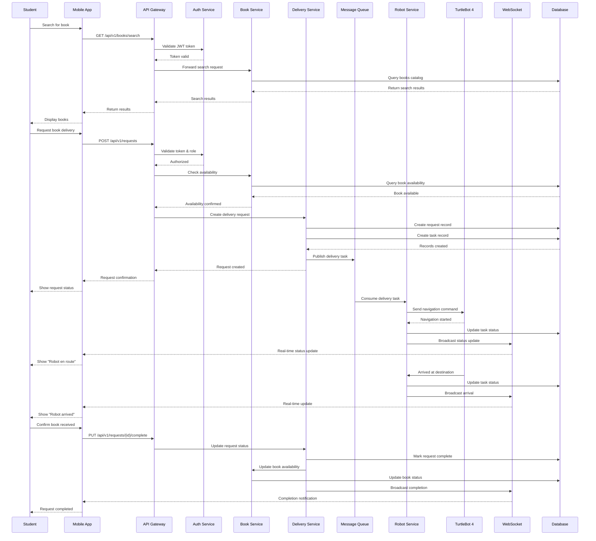
```mermaid
sequenceDiagram
    participant S as Student
    participant MA as Mobile App
    participant GW as API Gateway
    participant Auth as Auth Service
    participant Book as Book Service
    participant Del as Delivery Service
    participant MQ as Message Queue
    participant Robot as Robot Service
    participant TB as TurtleBot 4
    participant WS as WebSocket
    participant DB as Database

    S->>MA: Search for book
    MA->>GW: GET /api/v1/books/search
    GW->>Auth: Validate JWT token
    Auth-->>GW: Token valid
    GW->>Book: Forward search request
    Book->>DB: Query books catalog
    DB-->>Book: Return search results
    Book-->>GW: Search results
    GW-->>MA: Return results
    MA-->>S: Display books

    S->>MA: Request book delivery
    MA->>GW: POST /api/v1/requests
    GW->>Auth: Validate token & role
    Auth-->>GW: Authorized
    GW->>Book: Check availability
    Book->>DB: Query book availability
    DB-->>Book: Book available
    Book-->>GW: Availability confirmed
    GW->>Del: Create delivery request
    Del->>DB: Create request record
    Del->>DB: Create task record
    DB-->>Del: Records created
    Del->>MQ: Publish delivery task
    Del-->>GW: Request created
    GW-->>MA: Request confirmation
    MA-->>S: Show request status

    MQ->>Robot: Consume delivery task
    Robot->>TB: Send navigation command
    TB-->>Robot: Navigation started
    Robot->>DB: Update task status
    Robot->>WS: Broadcast status update
    WS-->>MA: Real-time status update
    MA-->>S: Show "Robot en route"

    TB->>Robot: Arrived at destination
    Robot->>DB: Update task status
    Robot->>WS: Broadcast arrival
    WS-->>MA: Real-time update
    MA-->>S: Show "Robot arrived"

    S->>MA: Confirm book received
    MA->>GW: PUT /api/v1/requests/{id}/complete
    GW->>Del: Update request status
    Del->>DB: Mark request complete
    Del->>Book: Update book availability
    Book->>DB: Update book status
    Del->>WS: Broadcast completion
    WS-->>MA: Completion notification
    MA-->>S: Request completed
```

#### 3.3.2 Book Return Pickup Flow

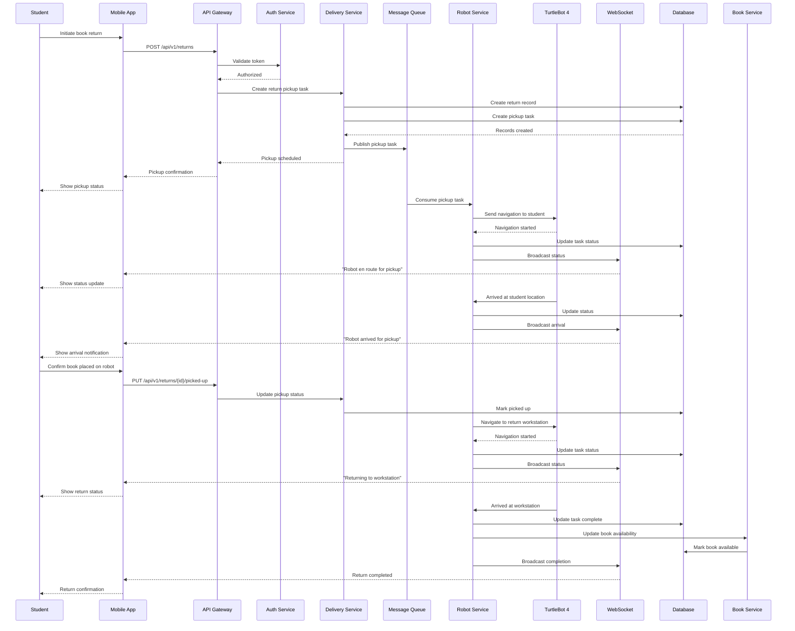
```mermaid
sequenceDiagram
    participant S as Student
    participant MA as Mobile App
    participant GW as API Gateway
    participant Auth as Auth Service
    participant Del as Delivery Service
    participant MQ as Message Queue
    participant Robot as Robot Service
    participant TB as TurtleBot 4
    participant WS as WebSocket
    participant DB as Database
    participant Book as Book Service

    S->>MA: Initiate book return
    MA->>GW: POST /api/v1/returns
    GW->>Auth: Validate token
    Auth-->>GW: Authorized
    GW->>Del: Create return pickup task
    Del->>DB: Create return record
    Del->>DB: Create pickup task
    DB-->>Del: Records created
    Del->>MQ: Publish pickup task
    Del-->>GW: Pickup scheduled
    GW-->>MA: Pickup confirmation
    MA-->>S: Show pickup status

    MQ->>Robot: Consume pickup task
    Robot->>TB: Send navigation to student
    TB-->>Robot: Navigation started
    Robot->>DB: Update task status
    Robot->>WS: Broadcast status
    WS-->>MA: "Robot en route for pickup"
    MA-->>S: Show status update

    TB->>Robot: Arrived at student location
    Robot->>DB: Update status
    Robot->>WS: Broadcast arrival
    WS-->>MA: "Robot arrived for pickup"
    MA-->>S: Show arrival notification

    S->>MA: Confirm book placed on robot
    MA->>GW: PUT /api/v1/returns/{id}/picked-up
    GW->>Del: Update pickup status
    Del->>DB: Mark picked up
    Robot->>TB: Navigate to return workstation
    TB-->>Robot: Navigation started
    Robot->>DB: Update task status
    Robot->>WS: Broadcast status
    WS-->>MA: "Returning to workstation"
    MA-->>S: Show return status

    TB->>Robot: Arrived at workstation
    Robot->>DB: Update task complete
    Robot->>Book: Update book availability
    Book->>DB: Mark book available
    Robot->>WS: Broadcast completion
    WS-->>MA: Return completed
    MA-->>S: Return confirmation
```

#### 3.3.3 Inter-Staff Delivery Flow

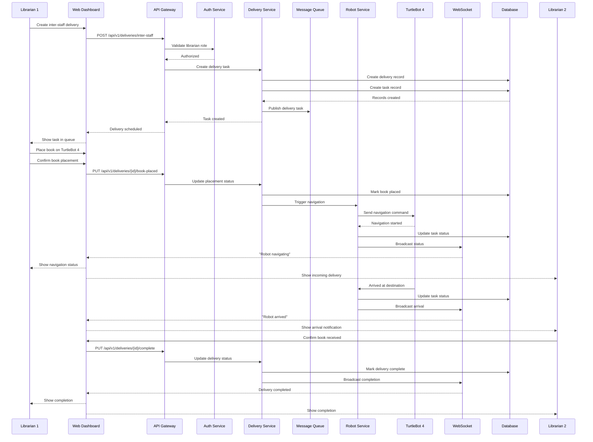
```mermaid
sequenceDiagram
    participant L1 as Librarian 1
    participant WA as Web Dashboard
    participant GW as API Gateway
    participant Auth as Auth Service
    participant Del as Delivery Service
    participant MQ as Message Queue
    participant Robot as Robot Service
    participant TB as TurtleBot 4
    participant WS as WebSocket
    participant DB as Database
    participant L2 as Librarian 2

    L1->>WA: Create inter-staff delivery
    WA->>GW: POST /api/v1/deliveries/inter-staff
    GW->>Auth: Validate librarian role
    Auth-->>GW: Authorized
    GW->>Del: Create delivery task
    Del->>DB: Create delivery record
    Del->>DB: Create task record
    DB-->>Del: Records created
    Del->>MQ: Publish delivery task
    Del-->>GW: Task created
    GW-->>WA: Delivery scheduled
    WA-->>L1: Show task in queue

    L1->>WA: Place book on TurtleBot 4
    L1->>WA: Confirm book placement
    WA->>GW: PUT /api/v1/deliveries/{id}/book-placed
    GW->>Del: Update placement status
    Del->>DB: Mark book placed
    Del->>Robot: Trigger navigation
    Robot->>TB: Send navigation command
    TB-->>Robot: Navigation started
    Robot->>DB: Update task status
    Robot->>WS: Broadcast status
    WS-->>WA: "Robot navigating"
    WA-->>L1: Show navigation status
    WA-->>L2: Show incoming delivery

    TB->>Robot: Arrived at destination
    Robot->>DB: Update task status
    Robot->>WS: Broadcast arrival
    WS-->>WA: "Robot arrived"
    WA-->>L2: Show arrival notification

    L2->>WA: Confirm book received
    WA->>GW: PUT /api/v1/deliveries/{id}/complete
    GW->>Del: Update delivery status
    Del->>DB: Mark delivery complete
    Del->>WS: Broadcast completion
    WS-->>WA: Delivery completed
    WA-->>L1: Show completion
    WA-->>L2: Show completion
```

#### 3.3.4 Catalog Management Flow

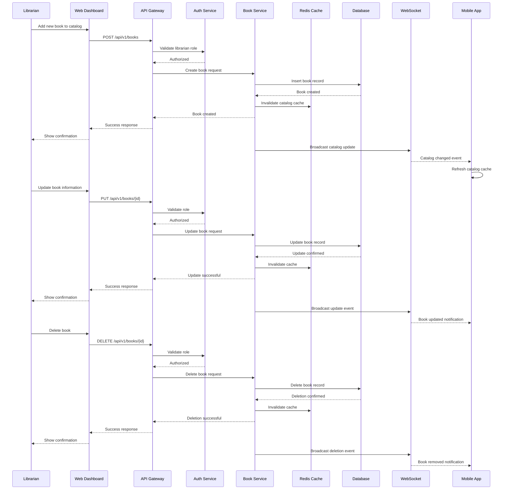
```mermaid
sequenceDiagram
    participant L as Librarian
    participant WA as Web Dashboard
    participant GW as API Gateway
    participant Auth as Auth Service
    participant Book as Book Service
    participant Cache as Redis Cache
    participant DB as Database
    participant WS as WebSocket
    participant MA as Mobile App

    L->>WA: Add new book to catalog
    WA->>GW: POST /api/v1/books
    GW->>Auth: Validate librarian role
    Auth-->>GW: Authorized
    GW->>Book: Create book request
    Book->>DB: Insert book record
    DB-->>Book: Book created
    Book->>Cache: Invalidate catalog cache
    Book-->>GW: Book created
    GW-->>WA: Success response
    WA-->>L: Show confirmation

    Book->>WS: Broadcast catalog update
    WS-->>MA: Catalog changed event
    MA->>MA: Refresh catalog cache

    L->>WA: Update book information
    WA->>GW: PUT /api/v1/books/{id}
    GW->>Auth: Validate role
    Auth-->>GW: Authorized
    GW->>Book: Update book request
    Book->>DB: Update book record
    DB-->>Book: Update confirmed
    Book->>Cache: Invalidate cache
    Book-->>GW: Update successful
    GW-->>WA: Success response
    WA-->>L: Show confirmation

    Book->>WS: Broadcast update event
    WS-->>MA: Book updated notification

    L->>WA: Delete book
    WA->>GW: DELETE /api/v1/books/{id}
    GW->>Auth: Validate role
    Auth-->>GW: Authorized
    GW->>Book: Delete book request
    Book->>DB: Delete book record
    DB-->>Book: Deletion confirmed
    Book->>Cache: Invalidate cache
    Book-->>GW: Deletion successful
    GW-->>WA: Success response
    WA-->>L: Show confirmation

    Book->>WS: Broadcast deletion event
    WS-->>MA: Book removed notification
```

#### 3.3.5 Robot Status Monitoring Flow

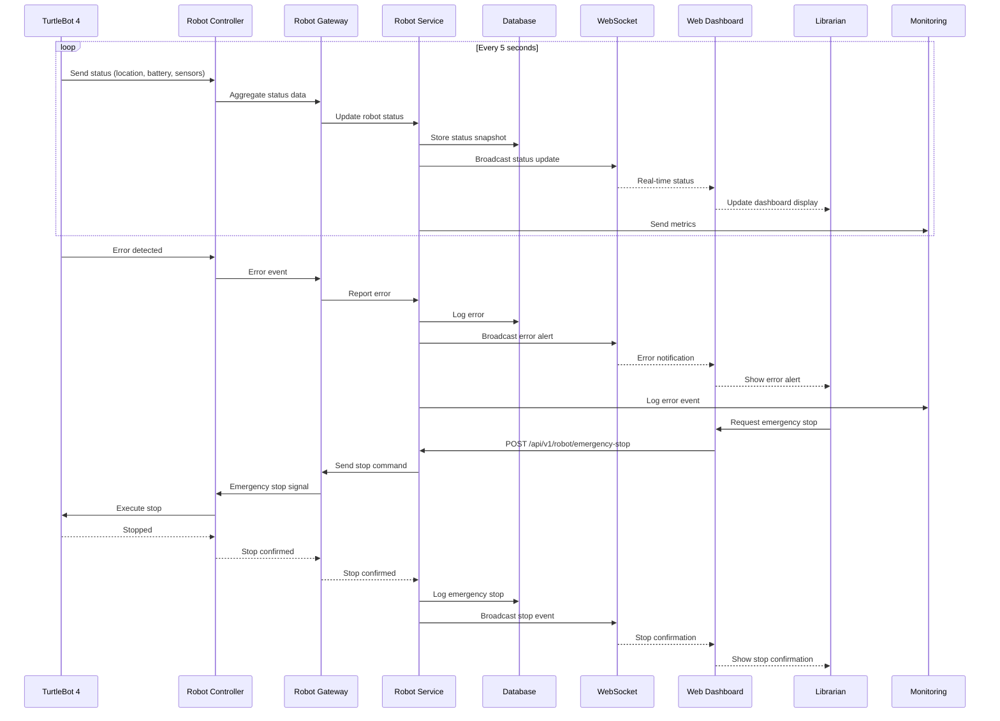
```mermaid
sequenceDiagram
    participant TB as TurtleBot 4
    participant RC as Robot Controller
    participant RG as Robot Gateway
    participant RS as Robot Service
    participant DB as Database
    participant WS as WebSocket
    participant WA as Web Dashboard
    participant L as Librarian
    participant Mon as Monitoring

    loop Every 5 seconds
        TB->>RC: Send status (location, battery, sensors)
        RC->>RG: Aggregate status data
        RG->>RS: Update robot status
        RS->>DB: Store status snapshot
        RS->>WS: Broadcast status update
        WS-->>WA: Real-time status
        WA-->>L: Update dashboard display
        RS->>Mon: Send metrics
    end

    TB->>RC: Error detected
    RC->>RG: Error event
    RG->>RS: Report error
    RS->>DB: Log error
    RS->>WS: Broadcast error alert
    WS-->>WA: Error notification
    WA-->>L: Show error alert
    RS->>Mon: Log error event

    L->>WA: Request emergency stop
    WA->>RS: POST /api/v1/robot/emergency-stop
    RS->>RG: Send stop command
    RG->>RC: Emergency stop signal
    RC->>TB: Execute stop
    TB-->>RC: Stopped
    RC-->>RG: Stop confirmed
    RG-->>RS: Stop confirmed
    RS->>DB: Log emergency stop
    RS->>WS: Broadcast stop event
    WS-->>WA: Stop confirmation
    WA-->>L: Show stop confirmation
```

### 3.4 User Workflow Diagrams

#### 3.4.1 Student Book Request Workflow

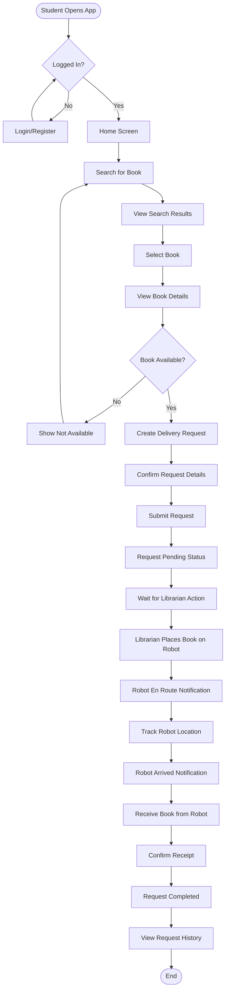
```mermaid
flowchart TD
    Start([Student Opens App]) --> Login{Logged In?}
    Login -->|No| Auth[Login/Register]
    Auth --> Login
    Login -->|Yes| Home[Home Screen]
    Home --> Search[Search for Book]
    Search --> Results[View Search Results]
    Results --> Select[Select Book]
    Select --> Details[View Book Details]
    Details --> Available{Book Available?}
    Available -->|No| Notify[Show Not Available]
    Notify --> Search
    Available -->|Yes| Request[Create Delivery Request]
    Request --> Confirm[Confirm Request Details]
    Confirm --> Submit[Submit Request]
    Submit --> Pending[Request Pending Status]
    Pending --> Wait[Wait for Librarian Action]
    Wait --> LibrarianAction[Librarian Places Book on Robot]
    LibrarianAction --> RobotEnRoute[Robot En Route Notification]
    RobotEnRoute --> Track[Track Robot Location]
    Track --> Arrived[Robot Arrived Notification]
    Arrived --> Receive[Receive Book from Robot]
    Receive --> ConfirmReceive[Confirm Receipt]
    ConfirmReceive --> Complete[Request Completed]
    Complete --> History[View Request History]
    History --> End([End])
```

#### 3.4.2 Student Book Return Workflow


```mermaid
flowchart TD
    Start([Student Opens App]) --> MyBooks[View My Books]
    MyBooks --> SelectReturn[Select Book to Return]
    SelectReturn --> InitiateReturn[Initiate Return]
    InitiateReturn --> ChooseLocation[Choose Pickup Location]
    ChooseLocation --> ConfirmReturn[Confirm Return Request]
    ConfirmReturn --> SubmitReturn[Submit Return Request]
    SubmitReturn --> PendingPickup[Pickup Scheduled]
    PendingPickup --> WaitRobot[Wait for Robot]
    WaitRobot --> RobotArriving[Robot Arriving Notification]
    RobotArriving --> TrackRobot[Track Robot Location]
    TrackRobot --> RobotArrived[Robot Arrived]
    RobotArrived --> PlaceBook[Place Book on Robot]
    PlaceBook --> ConfirmPlacement[Confirm Book Placed]
    ConfirmPlacement --> RobotReturning[Robot Returning to Workstation]
    RobotReturning --> ReturnComplete[Return Completed]
    ReturnComplete --> UpdateHistory[Update Return History]
    UpdateHistory --> End([End])
```

#### 3.4.3 Librarian Catalog Management Workflow


```mermaid
flowchart TD
    Start([Librarian Opens Dashboard]) --> Login{Logged In?}
    Login -->|No| Auth[Login]
    Auth --> Login
    Login -->|Yes| Dashboard[Dashboard]
    Dashboard --> CatalogMenu[Catalog Management]
    CatalogMenu --> Action{Action Type}
    Action -->|Add Book| AddBook[Add New Book]
    Action -->|Update Book| UpdateBook[Update Existing Book]
    Action -->|Delete Book| DeleteBook[Delete Book]
    Action -->|Bulk Import| BulkImport[Bulk Import Books]
    
    AddBook --> FillDetails[Fill Book Details]
    FillDetails --> ValidateDetails{Validate Details}
    ValidateDetails -->|Invalid| FillDetails
    ValidateDetails -->|Valid| SaveBook[Save Book]
    SaveBook --> Success[Book Added Successfully]
    
    UpdateBook --> SearchBook[Search for Book]
    SearchBook --> SelectBook[Select Book]
    SelectBook --> EditDetails[Edit Book Details]
    EditDetails --> ValidateUpdate{Validate Changes}
    ValidateUpdate -->|Invalid| EditDetails
    ValidateUpdate -->|Valid| UpdateSave[Save Changes]
    UpdateSave --> UpdateSuccess[Book Updated Successfully]
    
    DeleteBook --> FindBook[Find Book]
    FindBook --> ConfirmDelete{Confirm Deletion}
    ConfirmDelete -->|Cancel| CatalogMenu
    ConfirmDelete -->|Confirm| DeleteConfirm[Delete Book]
    DeleteConfirm --> DeleteSuccess[Book Deleted Successfully]
    
    BulkImport --> UploadFile[Upload CSV/Excel File]
    UploadFile --> ValidateFile{Validate File}
    ValidateFile -->|Invalid| UploadFile
    ValidateFile -->|Valid| ProcessImport[Process Import]
    ProcessImport --> ImportResults[Show Import Results]
    ImportResults --> ImportSuccess[Import Completed]
    
    Success --> CatalogMenu
    UpdateSuccess --> CatalogMenu
    DeleteSuccess --> CatalogMenu
    ImportSuccess --> CatalogMenu
    CatalogMenu --> End([End])
```

#### 3.4.4 Librarian Delivery Management Workflow

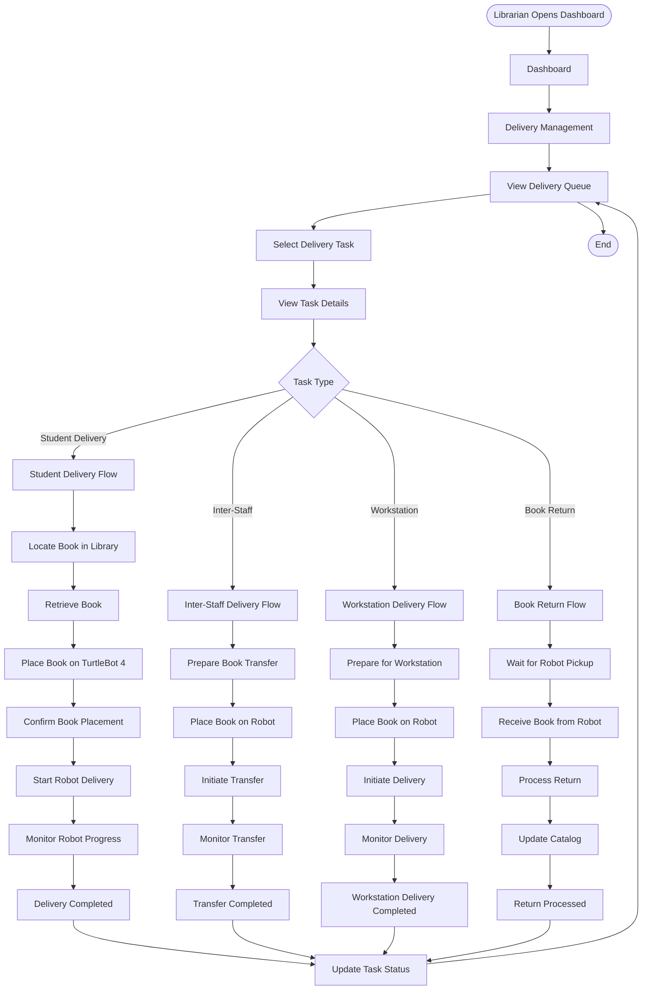
```mermaid
flowchart TD
    Start([Librarian Opens Dashboard]) --> Dashboard[Dashboard]
    Dashboard --> DeliveryMenu[Delivery Management]
    DeliveryMenu --> ViewQueue[View Delivery Queue]
    ViewQueue --> SelectTask[Select Delivery Task]
    SelectTask --> TaskDetails[View Task Details]
    TaskDetails --> TaskType{Task Type}
    
    TaskType -->|Student Delivery| StudentDelivery[Student Delivery Flow]
    TaskType -->|Book Return| BookReturn[Book Return Flow]
    TaskType -->|Inter-Staff| InterStaff[Inter-Staff Delivery Flow]
    TaskType -->|Workstation| Workstation[Workstation Delivery Flow]
    
    StudentDelivery --> LocateBook[Locate Book in Library]
    LocateBook --> RetrieveBook[Retrieve Book]
    RetrieveBook --> PlaceOnRobot[Place Book on TurtleBot 4]
    PlaceOnRobot --> ConfirmPlacement[Confirm Book Placement]
    ConfirmPlacement --> StartDelivery[Start Robot Delivery]
    StartDelivery --> Monitor[Monitor Robot Progress]
    
    BookReturn --> WaitPickup[Wait for Robot Pickup]
    WaitPickup --> ReceiveBook[Receive Book from Robot]
    ReceiveBook --> ProcessReturn[Process Return]
    ProcessReturn --> UpdateCatalog[Update Catalog]
    UpdateCatalog --> ReturnComplete[Return Processed]
    
    InterStaff --> PrepareTransfer[Prepare Book Transfer]
    PrepareTransfer --> PlaceTransfer[Place Book on Robot]
    PlaceTransfer --> InitiateTransfer[Initiate Transfer]
    InitiateTransfer --> MonitorTransfer[Monitor Transfer]
    
    Workstation --> PrepareWorkstation[Prepare for Workstation]
    PrepareWorkstation --> PlaceWorkstation[Place Book on Robot]
    PlaceWorkstation --> InitiateWorkstation[Initiate Delivery]
    InitiateWorkstation --> MonitorWorkstation[Monitor Delivery]
    
    Monitor --> DeliveryComplete[Delivery Completed]
    MonitorTransfer --> TransferComplete[Transfer Completed]
    MonitorWorkstation --> WorkstationComplete[Workstation Delivery Completed]
    
    DeliveryComplete --> UpdateStatus[Update Task Status]
    TransferComplete --> UpdateStatus
    WorkstationComplete --> UpdateStatus
    ReturnComplete --> UpdateStatus
    
    UpdateStatus --> ViewQueue
    ViewQueue --> End([End])
```

#### 3.4.5 Librarian Robot Monitoring Workflow


```mermaid
flowchart TD
    Start([Librarian Opens Dashboard]) --> Dashboard[Dashboard]
    Dashboard --> RobotMenu[Robot Monitoring]
    RobotMenu --> RobotStatus[View Robot Status]
    RobotStatus --> StatusInfo[Display Status Information<br/>Location, Battery, Health]
    StatusInfo --> MonitorOptions{Monitoring Options}
    
    MonitorOptions -->|View Live Location| LiveLocation[View Live Robot Location]
    MonitorOptions -->|View Task Queue| TaskQueue[View Active Task Queue]
    MonitorOptions -->|View History| History[View Robot History]
    MonitorOptions -->|Emergency Stop| Emergency[Emergency Stop]
    
    LiveLocation --> MapView[Display Map with Robot Position]
    MapView --> UpdateLocation[Real-time Location Updates]
    UpdateLocation --> MapView
    
    TaskQueue --> QueueList[Display Task Queue]
    QueueList --> QueueActions{Queue Actions}
    QueueActions -->|Prioritize Task| Prioritize[Change Task Priority]
    QueueActions -->|Cancel Task| CancelTask[Cancel Task]
    QueueActions -->|View Details| TaskDetails[View Task Details]
    Prioritize --> QueueList
    CancelTask --> QueueList
    TaskDetails --> QueueList
    
    History --> HistoryList[Display History Logs]
    HistoryList --> FilterHistory[Filter by Date/Type]
    FilterHistory --> HistoryList
    HistoryList --> ViewLog[View Detailed Log]
    ViewLog --> HistoryList
    
    Emergency --> ConfirmStop{Confirm Emergency Stop}
    ConfirmStop -->|Cancel| RobotStatus
    ConfirmStop -->|Confirm| ExecuteStop[Execute Emergency Stop]
    ExecuteStop --> StopConfirmation[Stop Confirmation]
    StopConfirmation --> RobotStatus
    
    RobotStatus --> End([End])
```

#### 3.4.6 Complete Student Journey Workflow

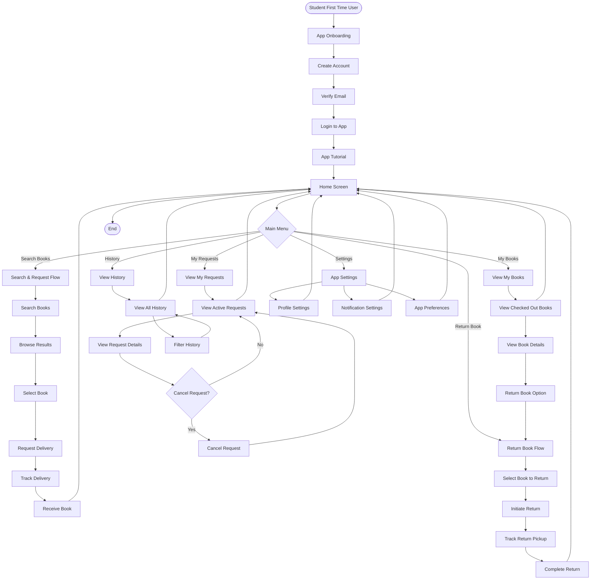
```mermaid
flowchart TD
    Start([Student First Time User]) --> Onboarding[App Onboarding]
    Onboarding --> Register[Create Account]
    Register --> Verify[Verify Email]
    Verify --> Login[Login to App]
    Login --> Tutorial[App Tutorial]
    Tutorial --> Home[Home Screen]
    
    Home --> MainMenu{Main Menu}
    MainMenu -->|Search Books| SearchFlow[Search & Request Flow]
    MainMenu -->|My Requests| MyRequests[View My Requests]
    MainMenu -->|My Books| MyBooks[View My Books]
    MainMenu -->|Return Book| ReturnFlow[Return Book Flow]
    MainMenu -->|History| History[View History]
    MainMenu -->|Settings| Settings[App Settings]
    
    SearchFlow --> Search[Search Books]
    Search --> Browse[Browse Results]
    Browse --> Select[Select Book]
    Select --> Request[Request Delivery]
    Request --> Track[Track Delivery]
    Track --> Receive[Receive Book]
    Receive --> Home
    
    MyRequests --> RequestList[View Active Requests]
    RequestList --> RequestDetails[View Request Details]
    RequestDetails --> CancelRequest{Cancel Request?}
    CancelRequest -->|Yes| Cancel[Cancel Request]
    Cancel --> RequestList
    CancelRequest -->|No| RequestList
    RequestList --> Home
    
    MyBooks --> BooksList[View Checked Out Books]
    BooksList --> BookDetails[View Book Details]
    BookDetails --> ReturnOption[Return Book Option]
    ReturnOption --> ReturnFlow
    BooksList --> Home
    
    ReturnFlow --> SelectReturn[Select Book to Return]
    SelectReturn --> InitiateReturn[Initiate Return]
    InitiateReturn --> TrackReturn[Track Return Pickup]
    TrackReturn --> CompleteReturn[Complete Return]
    CompleteReturn --> Home
    
    History --> HistoryList[View All History]
    HistoryList --> FilterHistory[Filter History]
    FilterHistory --> HistoryList
    HistoryList --> Home
    
    Settings --> ProfileSettings[Profile Settings]
    Settings --> NotificationSettings[Notification Settings]
    Settings --> AppSettings[App Preferences]
    ProfileSettings --> Home
    NotificationSettings --> Home
    AppSettings --> Home
    
    Home --> End([End])
```

---

## 4. Component Design

### 4.1 Services/Modules

The LUNA system is organized into distinct microservices, each with clear responsibilities and boundaries. This modular architecture enables independent development, deployment, and scaling of components.

#### 4.1.1 Authentication Service

**Purpose:** Manages user authentication, authorization, and session management for the entire system.

**Responsibilities:**
- User registration and account management
- User authentication (login/logout)
- JWT token generation, validation, and refresh
- Role-based access control (RBAC) enforcement
- Session management and token lifecycle
- Password management (reset, change)
- User profile management

**Key Capabilities:**
- Secure authentication using industry-standard protocols
- Token-based stateless authentication
- Role-based permission checking
- Session invalidation and security controls
- User account lifecycle management

**Data Ownership:**
- User accounts and credentials
- User roles and permissions
- Authentication tokens and sessions
- User profile information

#### 4.1.2 Book Service

**Purpose:** Manages the library catalog, book metadata, search functionality, and availability tracking.

**Responsibilities:**
- Book catalog CRUD operations (Create, Read, Update, Delete)
- Book search and discovery functionality
- Book metadata management (title, author, ISBN, description, etc.)
- Book availability tracking and status management
- Catalog indexing and search optimization
- Book location management within library
- Bulk catalog operations (import, export)

**Key Capabilities:**
- Full-text search across book catalog
- Advanced filtering and sorting
- Real-time availability status
- Catalog cache management
- Search result ranking and relevance

**Data Ownership:**
- Book catalog and metadata
- Book availability status
- Search indexes
- Book location information

#### 4.1.3 Delivery Service

**Purpose:** Orchestrates all delivery operations, manages delivery tasks, and coordinates delivery workflows.

**Responsibilities:**
- Delivery request creation and management
- Delivery task queue management
- Workflow orchestration for all delivery scenarios:
  - Student book delivery
  - Book return pickup
  - Inter-staff delivery
  - Workstation delivery
  - Inter-location transfer
- Delivery status tracking and updates
- Task prioritization and scheduling
- Delivery history and analytics

**Key Capabilities:**
- Multi-scenario delivery workflow management
- Task queue with priority handling
- State machine for delivery lifecycle
- Real-time status updates
- Delivery task coordination with Robot Service

**Data Ownership:**
- Delivery requests
- Delivery tasks and status
- Delivery history
- Task queue state

#### 4.1.4 Robot Service

**Purpose:** Interfaces with TurtleBot 4, manages robot commands, and monitors robot status.

**Responsibilities:**
- Navigation command generation and sending
- Robot status monitoring and aggregation
- Robot health monitoring (battery, sensors, errors)
- Error handling and recovery coordination
- Emergency stop and safety protocol enforcement
- Robot task execution coordination
- Location and waypoint management for navigation

**Key Capabilities:**
- Real-time robot status monitoring
- Command queue management for robot
- Error detection and recovery
- Safety protocol enforcement
- Integration with ROS/ROS2 systems

**Data Ownership:**
- Robot status and health metrics
- Navigation commands and history
- Robot error logs
- Waypoint and location data

#### 4.1.5 Notification Service

**Purpose:** Manages all system notifications, push notifications, and real-time event broadcasting.

**Responsibilities:**
- Push notification generation and delivery
- Real-time event broadcasting via WebSocket
- Notification history and management
- Notification preferences management
- Multi-channel notification delivery (push, in-app, email)
- Event subscription management

**Key Capabilities:**
- Push notification delivery (FCM/APNS)
- WebSocket event broadcasting
- Notification queuing and retry logic
- Notification history tracking
- User notification preferences

**Data Ownership:**
- Notification records
- Notification preferences
- Event subscriptions
- Delivery status and history

#### 4.1.6 API Gateway

**Purpose:** Single entry point for all client requests, providing routing, authentication, and cross-cutting concerns.

**Responsibilities:**
- Request routing to appropriate services
- Authentication and authorization enforcement
- Rate limiting and throttling
- Request/response transformation
- SSL/TLS termination
- Request logging and monitoring
- Error handling and standardization

**Key Capabilities:**
- Intelligent request routing
- Centralized authentication
- Rate limiting per user/service
- Request/response logging
- API versioning support

#### 4.1.7 Message Queue Service

**Purpose:** Provides asynchronous message processing and event distribution across services.

**Responsibilities:**
- Asynchronous task queue management
- Event publishing and subscription
- Message routing and delivery
- Task retry and failure handling
- Message persistence and durability

**Key Capabilities:**
- Priority-based task queuing
- Event pub/sub patterns
- Message persistence
- Dead letter queue handling
- Task scheduling and delayed execution

### 4.2 Interfaces & Contracts

This section defines how services communicate and interact with each other, establishing clear boundaries and contracts.

#### 4.2.1 Synchronous Communication (REST APIs)

**Pattern:** Request-Response via RESTful HTTP APIs

**Usage:**
- Client-to-service communication (Mobile App, Web Dashboard → Backend Services)
- Service-to-service communication for immediate data needs
- Real-time queries and operations

**Contracts:**
- **Standard HTTP Methods:** GET (read), POST (create), PUT (update), DELETE (remove)
- **Response Format:** JSON
- **Status Codes:** Standard HTTP status codes (200, 201, 400, 401, 403, 404, 500, etc.)
- **Authentication:** JWT tokens in Authorization header
- **API Versioning:** URL-based versioning (/api/v1/, /api/v2/)

**Service Boundaries:**
- **Authentication Service:** Exposes `/api/v1/auth/*` endpoints
- **Book Service:** Exposes `/api/v1/books/*` endpoints
- **Delivery Service:** Exposes `/api/v1/deliveries/*` and `/api/v1/requests/*` endpoints
- **Robot Service:** Exposes `/api/v1/robot/*` endpoints
- **Notification Service:** Exposes `/api/v1/notifications/*` endpoints

#### 4.2.2 Asynchronous Communication (Message Queue)

**Pattern:** Event-driven messaging via message queue

**Usage:**
- Delivery task processing
- Robot command queuing
- Event distribution for real-time updates
- Background job processing

**Message Types:**
- **Delivery Task Events:** Task creation, status updates, completion
- **Robot Command Events:** Navigation commands, status updates, errors
- **Catalog Events:** Book added, updated, deleted
- **Notification Events:** Delivery status changes, system alerts

**Contracts:**
- **Message Format:** JSON
- **Message Structure:** 
  ```json
  {
    "eventType": "string",
    "timestamp": "ISO8601",
    "source": "service-name",
    "payload": {}
  }
  ```
- **Delivery Guarantees:** At-least-once delivery with idempotency handling
- **Retry Policy:** Exponential backoff with max retries

#### 4.2.3 Real-Time Communication (WebSocket)

**Pattern:** Bidirectional WebSocket connections for real-time updates

**Usage:**
- Real-time delivery status updates
- Live robot location tracking
- Instant notification delivery
- Real-time catalog updates

**Contracts:**
- **Connection:** WebSocket (WSS for secure)
- **Message Format:** JSON
- **Message Types:**
  - Status updates
  - Notifications
  - Error alerts
  - Heartbeat/ping-pong
- **Authentication:** JWT token in connection handshake
- **Reconnection:** Automatic reconnection with exponential backoff

#### 4.2.4 Service Dependencies

**Authentication Service:**
- **Depends on:** Database (PostgreSQL), Cache (Redis)
- **Used by:** All services (via API Gateway middleware)

**Book Service:**
- **Depends on:** Database (PostgreSQL), Cache (Redis), Authentication Service (for authorization)
- **Publishes:** Catalog change events to Message Queue
- **Used by:** Mobile App, Web Dashboard

**Delivery Service:**
- **Depends on:** Database (PostgreSQL), Message Queue, Book Service (for availability), Authentication Service
- **Publishes:** Delivery status events to Message Queue
- **Consumes:** Delivery task events from Message Queue
- **Used by:** Mobile App, Web Dashboard, Robot Service

**Robot Service:**
- **Depends on:** Database (PostgreSQL), Message Queue, Delivery Service, Robot Integration Layer
- **Publishes:** Robot status events to Message Queue and WebSocket
- **Consumes:** Robot command events from Message Queue
- **Used by:** Web Dashboard

**Notification Service:**
- **Depends on:** Database (PostgreSQL), Message Queue, Push notification services (FCM/APNS)
- **Publishes:** Notifications via WebSocket and Push services
- **Consumes:** Notification events from Message Queue
- **Used by:** All services (for notification delivery)

#### 4.2.5 Data Flow Contracts

**Request Flow:**
1. Client → API Gateway (with JWT token)
2. API Gateway → Authentication Service (validate token)
3. API Gateway → Target Service (route request)
4. Target Service → Database/Cache (read/write data)
5. Target Service → Message Queue (publish events if needed)
6. Target Service → API Gateway → Client (return response)

**Event Flow:**
1. Service publishes event to Message Queue
2. Message Queue delivers to subscribers
3. Subscriber services process event
4. Subscriber services update database/state
5. Subscriber services publish notifications via WebSocket if needed

**Real-Time Update Flow:**
1. Service publishes status update to WebSocket Server
2. WebSocket Server broadcasts to connected clients
3. Clients receive real-time update

### 4.3 Technology Choices & Rationale

This section outlines the high-level technology decisions for the LUNA system and the rationale behind each choice.

#### 4.3.1 Backend Services

**Technology Choice:** Python with FastAPI

**Rationale:**
- **ROS Integration:** Native Python support for ROS/ROS2, which is critical for TurtleBot 4 integration
- **FastAPI Framework:** Modern, high-performance async framework with excellent performance
- **Developer Productivity:** Clean, readable code with excellent tooling and libraries
- **Ecosystem:** Rich ecosystem of libraries for web development, data processing, and robotics
- **Type Hints:** Python type hints provide type safety and better developer experience
- **Microservices:** Lightweight and suitable for microservices architecture
- **Real-Time:** Excellent async/await support for WebSocket and real-time features
- **Documentation:** Auto-generated API documentation with FastAPI
- **Robot Service:** Direct integration with ROS/ROS2 nodes without bridges or wrappers

**Alternative Considered:** Node.js (TypeScript), Java (Spring Boot)
- **Not Chosen:** Node.js requires ROS bridges/wrappers adding complexity; Java has limited ROS support and is more heavyweight

#### 4.3.2 Database

**Technology Choice:** PostgreSQL

**Rationale:**
- **ACID Compliance:** Strong transactional guarantees for critical operations
- **Relational Model:** Well-suited for structured data (books, users, requests)
- **Performance:** Excellent query performance and optimization
- **Features:** Full-text search, JSON support, advanced indexing
- **Reliability:** Mature, battle-tested database with strong consistency
- **Open Source:** No licensing costs

**Alternative Considered:** MongoDB, MySQL
- **Not Chosen:** MongoDB lacks ACID guarantees needed for financial/transactional data, MySQL has fewer advanced features

#### 4.3.3 Caching Layer

**Technology Choice:** Redis

**Rationale:**
- **Performance:** In-memory storage for sub-millisecond access
- **Data Structures:** Rich data structures (strings, hashes, lists, sets)
- **Session Storage:** Ideal for session management and token storage
- **Pub/Sub:** Built-in pub/sub for event distribution
- **Scalability:** Horizontal scaling with Redis Cluster
- **Persistence:** Optional persistence for durability

**Use Cases:**
- Session storage
- Query result caching
- Rate limiting data
- Real-time data caching

#### 4.3.4 Message Queue

**Technology Choice:** RabbitMQ or BullMQ (Redis-based)

**Rationale:**
- **Reliability:** Message persistence and delivery guarantees
- **Flexibility:** Support for multiple messaging patterns (queues, pub/sub)
- **Scalability:** Horizontal scaling capabilities
- **Management:** Good tooling and monitoring
- **Integration:** Easy integration with Node.js ecosystem

**Considerations:**
- **RabbitMQ:** More features, separate service to manage, excellent Python support
- **Celery:** Python-native task queue, integrates well with Python ecosystem
- **Redis with RQ/Celery:** Simpler deployment, good Python integration

**Decision:** To be determined based on deployment complexity and feature requirements

#### 4.3.5 API Gateway

**Technology Choice:** Kong or Nginx

**Rationale:**
- **Routing:** Efficient request routing and load balancing
- **Middleware:** Plugin ecosystem for authentication, rate limiting, logging
- **Performance:** High-performance reverse proxy
- **Management:** API management and monitoring capabilities

**Considerations:**
- **Kong:** More features, better API management
- **Nginx:** Simpler, lighter weight, more widely used

**Decision:** To be determined based on feature requirements

#### 4.3.6 Frontend Technologies

**Mobile Application:**
- **Technology Choice:** React Native or Flutter
- **Rationale:** Cross-platform development, single codebase for iOS/Android, native performance

**Web Dashboard:**
- **Technology Choice:** React with TypeScript
- **Rationale:** Component-based architecture, large ecosystem, type safety, excellent tooling

#### 4.3.7 Robot Integration

**Technology Choice:** ROS 2 (Robot Operating System 2)

**Rationale:**
- **Standard:** Industry standard for robotics development
- **TurtleBot 4:** Native ROS 2 support
- **Ecosystem:** Rich ecosystem of packages and tools
- **Real-Time:** Real-time capabilities for robot control
- **Navigation:** Built-in navigation stack and packages

#### 4.3.8 Real-Time Communication

**Technology Choice:** WebSocket (FastAPI WebSocket support / python-socketio)

**Rationale:**
- **Bidirectional:** Full-duplex communication for real-time updates
- **Low Latency:** Lower overhead than HTTP polling
- **Standard:** Web standard, supported by all modern browsers
- **FastAPI Integration:** Native WebSocket support in FastAPI
- **Scalability:** Can scale horizontally with proper architecture (Redis adapter for Socket.IO)

#### 4.3.9 Deployment & Infrastructure

**Technology Choice:** Docker containers with Kubernetes (or Docker Compose for simpler deployments)

**Rationale:**
- **Containerization:** Consistent deployment across environments
- **Scalability:** Easy horizontal scaling
- **Orchestration:** Kubernetes for production, Docker Compose for development
- **Cloud-Native:** Compatible with cloud platforms (AWS, GCP, Azure)

#### 4.3.10 Monitoring & Observability

**Technology Choice:** To be determined (options: Prometheus + Grafana, ELK Stack, CloudWatch)

**Rationale:**
- **Metrics:** System and application metrics collection
- **Logging:** Centralized logging for debugging and auditing
- **Tracing:** Distributed tracing for request flow analysis
- **Alerting:** Alerting for system issues and anomalies

**Decision:** To be determined based on deployment platform and requirements

---

## 5. Data Design

### 5.1 Database Schema

The LUNA system uses PostgreSQL as the primary relational database. The schema is designed to support all system operations including user management, catalog management, delivery operations, and robot integration.

#### 5.1.1 Entity Relationship Diagram

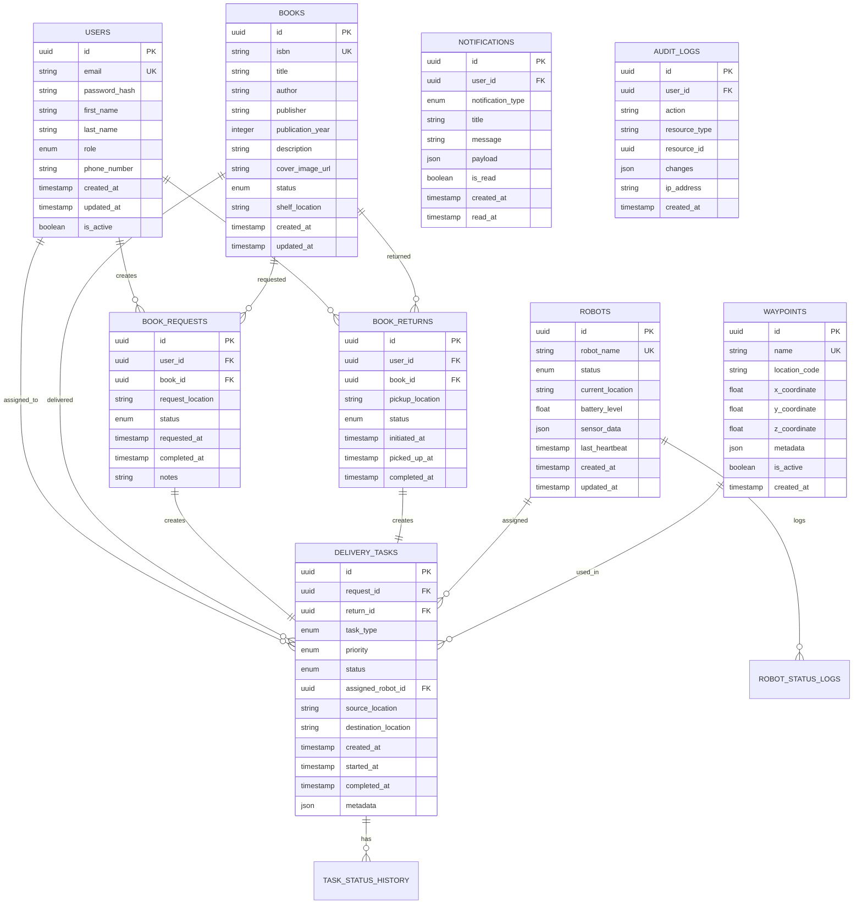
```mermaid
erDiagram
    USERS ||--o{ BOOK_REQUESTS : creates
    USERS ||--o{ BOOK_RETURNS : initiates
    USERS ||--o{ DELIVERY_TASKS : assigned_to
    USERS {
        uuid id PK
        string email UK
        string password_hash
        string first_name
        string last_name
        enum role
        string phone_number
        timestamp created_at
        timestamp updated_at
        boolean is_active
    }
    
    BOOKS ||--o{ BOOK_REQUESTS : requested
    BOOKS ||--o{ BOOK_RETURNS : returned
    BOOKS ||--o{ DELIVERY_TASKS : delivered
    BOOKS {
        uuid id PK
        string isbn UK
        string title
        string author
        string publisher
        integer publication_year
        string description
        string cover_image_url
        enum status
        string shelf_location
        timestamp created_at
        timestamp updated_at
    }
    
    BOOK_REQUESTS ||--|| DELIVERY_TASKS : creates
    BOOK_REQUESTS {
        uuid id PK
        uuid user_id FK
        uuid book_id FK
        string request_location
        enum status
        timestamp requested_at
        timestamp completed_at
        string notes
    }
    
    BOOK_RETURNS ||--|| DELIVERY_TASKS : creates
    BOOK_RETURNS {
        uuid id PK
        uuid user_id FK
        uuid book_id FK
        string pickup_location
        enum status
        timestamp initiated_at
        timestamp picked_up_at
        timestamp completed_at
    }
    
    DELIVERY_TASKS ||--o{ TASK_STATUS_HISTORY : has
    DELIVERY_TASKS {
        uuid id PK
        uuid request_id FK
        uuid return_id FK
        enum task_type
        enum priority
        enum status
        uuid assigned_robot_id FK
        string source_location
        string destination_location
        timestamp created_at
        timestamp started_at
        timestamp completed_at
        json metadata
    }
    
    ROBOTS ||--o{ DELIVERY_TASKS : assigned
    ROBOTS ||--o{ ROBOT_STATUS_LOGS : logs
    ROBOTS {
        uuid id PK
        string robot_name UK
        enum status
        string current_location
        float battery_level
        json sensor_data
        timestamp last_heartbeat
        timestamp created_at
        timestamp updated_at
    }
    
    WAYPOINTS ||--o{ DELIVERY_TASKS : used_in
    WAYPOINTS {
        uuid id PK
        string name UK
        string location_code
        float x_coordinate
        float y_coordinate
        float z_coordinate
        json metadata
        boolean is_active
        timestamp created_at
    }
    
    NOTIFICATIONS {
        uuid id PK
        uuid user_id FK
        enum notification_type
        string title
        string message
        json payload
        boolean is_read
        timestamp created_at
        timestamp read_at
    }
    
    AUDIT_LOGS {
        uuid id PK
        uuid user_id FK
        string action
        string resource_type
        uuid resource_id
        json changes
        string ip_address
        timestamp created_at
    }
```

#### 5.1.2 Core Tables

**Users Table**
- Stores user accounts (students and librarians)
- Supports role-based access control
- Includes authentication and profile information

**Books Table**
- Library catalog with book metadata
- Tracks availability status and shelf location
- Supports search and discovery operations

**Book Requests Table**
- Student book delivery requests
- Links users to requested books
- Tracks request status and location

**Book Returns Table**
- Book return operations
- Tracks return pickup and completion
- Links to delivery tasks for automated pickup

**Delivery Tasks Table**
- All delivery operations (student delivery, returns, inter-staff, workstation, transfers)
- Task queue management
- Links to requests/returns and robots
- Tracks task lifecycle and status

**Robots Table**
- TurtleBot 4 instances and status
- Current location and health metrics
- Battery and sensor data

**Waypoints Table**
- Navigation waypoints for robot navigation
- Library location mapping
- Coordinates and metadata for path planning

**Notifications Table**
- User notifications and alerts
- Supports push notifications and in-app notifications
- Tracks read status

**Task Status History Table**
- Historical record of task status changes
- Audit trail for delivery operations
- Supports analytics and debugging

**Audit Logs Table**
- System-wide audit trail
- User actions and system changes
- Security and compliance logging

#### 5.1.3 Indexes

**Performance Indexes:**
- `users.email` - Unique index for authentication
- `books.isbn` - Unique index for catalog lookups
- `books.title`, `books.author` - Full-text search indexes
- `book_requests.user_id`, `book_requests.status` - Query optimization
- `delivery_tasks.status`, `delivery_tasks.priority` - Task queue queries
- `robots.robot_name` - Robot lookup
- `waypoints.location_code` - Navigation queries
- `notifications.user_id`, `notifications.is_read` - User notification queries

**Composite Indexes:**
- `(book_requests.user_id, book_requests.status)` - User request queries
- `(delivery_tasks.status, delivery_tasks.priority, delivery_tasks.created_at)` - Task queue ordering
- `(notifications.user_id, notifications.is_read, notifications.created_at)` - Notification queries

### 5.2 Data Models

This section defines the core data models and their relationships, representing the business entities in the LUNA system.

#### 5.2.1 User Model

```python
class User(BaseModel):
    id: UUID
    email: str  # Unique
    password_hash: str
    first_name: str
    last_name: str
    role: UserRole  # STUDENT, LIBRARIAN, ADMIN
    phone_number: Optional[str]
    created_at: datetime
    updated_at: datetime
    is_active: bool
```

**Relationships:**
- One-to-Many with BookRequest
- One-to-Many with BookReturn
- One-to-Many with Notification
- One-to-Many with AuditLog

#### 5.2.2 Book Model

```python
class Book(BaseModel):
    id: UUID
    isbn: str  # Unique
    title: str
    author: str
    publisher: Optional[str]
    publication_year: Optional[int]
    description: Optional[str]
    cover_image_url: Optional[str]
    status: BookStatus  # AVAILABLE, CHECKED_OUT, RESERVED, UNAVAILABLE
    shelf_location: Optional[str]
    created_at: datetime
    updated_at: datetime
```

**Relationships:**
- One-to-Many with BookRequest
- One-to-Many with BookReturn
- One-to-Many with DeliveryTask

#### 5.2.3 Book Request Model

```python
class BookRequest(BaseModel):
    id: UUID
    user_id: UUID  # Foreign Key to User
    book_id: UUID  # Foreign Key to Book
    request_location: str  # Student's location for delivery
    status: RequestStatus  # PENDING, APPROVED, IN_PROGRESS, COMPLETED, CANCELLED
    requested_at: datetime
    completed_at: Optional[datetime]
    notes: Optional[str]
```

**Relationships:**
- Many-to-One with User
- Many-to-One with Book
- One-to-One with DeliveryTask

#### 5.2.4 Book Return Model

```python
class BookReturn(BaseModel):
    id: UUID
    user_id: UUID  # Foreign Key to User
    book_id: UUID  # Foreign Key to Book
    pickup_location: str  # Student's location for pickup
    status: ReturnStatus  # PENDING, PICKUP_SCHEDULED, PICKED_UP, COMPLETED, CANCELLED
    initiated_at: datetime
    picked_up_at: Optional[datetime]
    completed_at: Optional[datetime]
```

**Relationships:**
- Many-to-One with User
- Many-to-One with Book
- One-to-One with DeliveryTask

#### 5.2.5 Delivery Task Model

```python
class DeliveryTask(BaseModel):
    id: UUID
    request_id: Optional[UUID]  # Foreign Key to BookRequest (if student delivery)
    return_id: Optional[UUID]  # Foreign Key to BookReturn (if return pickup)
    task_type: TaskType  # STUDENT_DELIVERY, RETURN_PICKUP, INTER_STAFF, WORKSTATION, TRANSFER
    priority: TaskPriority  # LOW, NORMAL, HIGH, URGENT
    status: TaskStatus  # PENDING, QUEUED, ASSIGNED, IN_PROGRESS, COMPLETED, FAILED, CANCELLED
    assigned_robot_id: Optional[UUID]  # Foreign Key to Robot
    source_location: str
    destination_location: str
    created_at: datetime
    started_at: Optional[datetime]
    completed_at: Optional[datetime]
    metadata: dict  # JSON field for additional task data
```

**Relationships:**
- Many-to-One with BookRequest (optional)
- Many-to-One with BookReturn (optional)
- Many-to-One with Robot
- One-to-Many with TaskStatusHistory

#### 5.2.6 Robot Model

```python
class Robot(BaseModel):
    id: UUID
    robot_name: str  # Unique
    status: RobotStatus  # IDLE, BUSY, NAVIGATING, ERROR, MAINTENANCE
    current_location: Optional[str]
    battery_level: float  # 0.0 to 1.0
    sensor_data: dict  # JSON field for sensor readings
    last_heartbeat: datetime
    created_at: datetime
    updated_at: datetime
```

**Relationships:**
- One-to-Many with DeliveryTask
- One-to-Many with RobotStatusLog

#### 5.2.7 Waypoint Model

```python
class Waypoint(BaseModel):
    id: UUID
    name: str  # Unique
    location_code: str  # Unique location identifier
    x_coordinate: float
    y_coordinate: float
    z_coordinate: float
    metadata: dict  # JSON field for additional waypoint data
    is_active: bool
    created_at: datetime
```

**Relationships:**
- Many-to-Many with DeliveryTask (via navigation paths)

#### 5.2.8 Notification Model

```python
class Notification(BaseModel):
    id: UUID
    user_id: UUID  # Foreign Key to User
    notification_type: NotificationType  # DELIVERY_UPDATE, REQUEST_STATUS, SYSTEM_ALERT, etc.
    title: str
    message: str
    payload: dict  # JSON field for additional notification data
    is_read: bool
    created_at: datetime
    read_at: Optional[datetime]
```

**Relationships:**
- Many-to-One with User

### 5.3 Data Flow & Storage Patterns

This section describes how data flows through the system and where different types of data are stored.

#### 5.3.1 Data Storage Strategy

**PostgreSQL (Primary Database):**
- **Structured Data:** All persistent business entities (users, books, requests, tasks, robots)
- **Transactional Data:** All operations requiring ACID guarantees
- **Historical Data:** Audit logs, status history, delivery records
- **Relationships:** Foreign keys and referential integrity
- **Search Data:** Full-text search indexes for book catalog

**Redis (Cache & Session Storage):**
- **Session Data:** User sessions and authentication tokens
- **Query Results:** Frequently accessed data (catalog search results, user profiles)
- **Rate Limiting:** API rate limit counters
- **Real-Time Data:** Temporary data for real-time features
- **Task Queue:** Message queue for async task processing (if using Redis-based queue)

#### 5.3.2 Data Flow Patterns

**Read-Heavy Operations (Catalog Search):**
1. Client requests book search
2. Check Redis cache for search results
3. If cache miss, query PostgreSQL with full-text search
4. Store results in Redis cache (TTL: 5-15 minutes)
5. Return results to client

**Write Operations (Request Creation):**
1. Client creates book request
2. Validate request (check book availability, user permissions)
3. Begin database transaction
4. Create BookRequest record in PostgreSQL
5. Create DeliveryTask record in PostgreSQL
6. Update Book status to RESERVED
7. Commit transaction
8. Publish event to message queue
9. Invalidate relevant cache entries
10. Return response to client

**Real-Time Updates (Delivery Status):**
1. Robot Service updates task status
2. Update DeliveryTask in PostgreSQL
3. Create TaskStatusHistory record
4. Publish status update event to message queue
5. Notification Service consumes event
6. Update notification in PostgreSQL
7. Broadcast via WebSocket to connected clients
8. Update Redis cache if applicable

**Async Task Processing (Delivery Execution):**
1. Delivery Service creates task and publishes to message queue
2. Message queue stores task (persistent storage)
3. Robot Service worker consumes task from queue
4. Robot Service updates task status to ASSIGNED in PostgreSQL
5. Robot Service sends command to Robot Integration Layer
6. Robot executes navigation
7. Status updates flow back through system (PostgreSQL → Message Queue → WebSocket)

#### 5.3.3 Caching Strategy

**Cache Layers:**
1. **Application-Level Cache (Redis):**
   - Catalog search results (TTL: 15 minutes)
   - User profile data (TTL: 30 minutes)
   - Book details (TTL: 10 minutes)
   - Robot status (TTL: 5 seconds - frequently updated)

2. **Cache Invalidation:**
   - **On Write:** Invalidate related cache entries when data is modified
   - **On Create:** Invalidate search/index caches
   - **On Update:** Invalidate specific item cache and related indexes
   - **On Delete:** Invalidate item cache and search indexes

3. **Cache Keys:**
   - `book:{book_id}` - Individual book data
   - `search:{query_hash}` - Search result cache
   - `user:{user_id}` - User profile cache
   - `robot:{robot_id}:status` - Robot status cache
   - `session:{session_id}` - User session data

#### 5.3.4 Data Consistency Patterns

**Strong Consistency (PostgreSQL):**
- User authentication and authorization
- Book availability updates
- Financial/transactional operations
- Critical status updates

**Eventual Consistency (Message Queue + Cache):**
- Real-time status updates
- Notification delivery
- Search index updates
- Analytics data aggregation

**Transaction Management:**
- **ACID Transactions:** Used for multi-step operations (request creation, status updates)
- **Optimistic Locking:** For concurrent updates (book availability, task assignment)
- **Pessimistic Locking:** For critical operations (robot assignment, inventory updates)

#### 5.3.5 Data Retention & Archival

**Active Data:**
- Current requests, active tasks, recent notifications (retained indefinitely)
- User accounts (retained while active)
- Book catalog (retained indefinitely)

**Historical Data:**
- Completed delivery tasks (retained for 2 years)
- Audit logs (retained for 7 years for compliance)
- Task status history (retained for 1 year)
- Notification history (retained for 90 days)

**Archival Strategy:**
- Move old data to archive tables/partitions
- Compress historical data
- Maintain referential integrity for reporting

---

## 6. API Design

The LUNA system exposes RESTful APIs for all client interactions. All APIs follow REST conventions, use JSON for data exchange, and implement consistent error handling and authentication.

### 6.1 Endpoints & Contracts

#### 6.1.1 Authentication Service Endpoints

**Base Path:** `/api/v1/auth`

| Method | Endpoint | Description | Auth Required |
|--------|----------|-------------|---------------|
| POST | `/register` | Register new user account | No |
| POST | `/login` | Authenticate user and get tokens | No |
| POST | `/logout` | Logout user and invalidate token | Yes |
| POST | `/refresh` | Refresh access token | Yes |
| POST | `/forgot-password` | Request password reset | No |
| POST | `/reset-password` | Reset password with token | No |
| GET | `/me` | Get current user profile | Yes |
| PUT | `/me` | Update current user profile | Yes |
| PUT | `/change-password` | Change user password | Yes |

#### 6.1.2 Book Service Endpoints

**Base Path:** `/api/v1/books`

| Method | Endpoint | Description | Auth Required | Role |
|--------|----------|-------------|---------------|------|
| GET | `/` | Search and list books | Yes | All |
| GET | `/{book_id}` | Get book details | Yes | All |
| POST | `/` | Create new book | Yes | Librarian |
| PUT | `/{book_id}` | Update book information | Yes | Librarian |
| DELETE | `/{book_id}` | Delete book from catalog | Yes | Librarian |
| POST | `/bulk-import` | Bulk import books | Yes | Librarian |
| GET | `/{book_id}/availability` | Check book availability | Yes | All |

#### 6.1.3 Delivery Service Endpoints

**Base Path:** `/api/v1/requests` (Student Requests) and `/api/v1/deliveries` (Delivery Management)

| Method | Endpoint | Description | Auth Required | Role |
|--------|----------|-------------|---------------|------|
| POST | `/api/v1/requests` | Create book delivery request | Yes | Student |
| GET | `/api/v1/requests` | Get user's book requests | Yes | Student |
| GET | `/api/v1/requests/{request_id}` | Get request details | Yes | Student |
| PUT | `/api/v1/requests/{request_id}/cancel` | Cancel book request | Yes | Student |
| PUT | `/api/v1/requests/{request_id}/complete` | Mark request as completed | Yes | Student |
| POST | `/api/v1/returns` | Initiate book return | Yes | Student |
| GET | `/api/v1/returns` | Get user's return requests | Yes | Student |
| GET | `/api/v1/returns/{return_id}` | Get return details | Yes | Student |
| PUT | `/api/v1/returns/{return_id}/picked-up` | Confirm book picked up | Yes | Student |
| GET | `/api/v1/deliveries` | List all delivery tasks | Yes | Librarian |
| GET | `/api/v1/deliveries/{task_id}` | Get delivery task details | Yes | Librarian |
| POST | `/api/v1/deliveries/inter-staff` | Create inter-staff delivery | Yes | Librarian |
| POST | `/api/v1/deliveries/workstation` | Create workstation delivery | Yes | Librarian |
| POST | `/api/v1/deliveries/transfer` | Create inter-location transfer | Yes | Librarian |
| PUT | `/api/v1/deliveries/{task_id}/book-placed` | Confirm book placed on robot | Yes | Librarian |
| PUT | `/api/v1/deliveries/{task_id}/complete` | Mark delivery as complete | Yes | Librarian |
| PUT | `/api/v1/deliveries/{task_id}/cancel` | Cancel delivery task | Yes | Librarian |

#### 6.1.4 Robot Service Endpoints

**Base Path:** `/api/v1/robot`

| Method | Endpoint | Description | Auth Required | Role |
|--------|----------|-------------|---------------|------|
| GET | `/status` | Get robot status | Yes | Librarian |
| GET | `/status/{robot_id}` | Get specific robot status | Yes | Librarian |
| GET | `/tasks` | Get robot task queue | Yes | Librarian |
| POST | `/emergency-stop` | Emergency stop robot | Yes | Librarian |
| POST | `/emergency-stop/{robot_id}` | Emergency stop specific robot | Yes | Librarian |
| GET | `/waypoints` | List all waypoints | Yes | Librarian |
| POST | `/waypoints` | Create new waypoint | Yes | Librarian |
| PUT | `/waypoints/{waypoint_id}` | Update waypoint | Yes | Librarian |
| DELETE | `/waypoints/{waypoint_id}` | Delete waypoint | Yes | Librarian |

#### 6.1.5 Notification Service Endpoints

**Base Path:** `/api/v1/notifications`

| Method | Endpoint | Description | Auth Required | Role |
|--------|----------|-------------|---------------|------|
| GET | `/` | Get user notifications | Yes | All |
| GET | `/{notification_id}` | Get notification details | Yes | All |
| PUT | `/{notification_id}/read` | Mark notification as read | Yes | All |
| PUT | `/read-all` | Mark all notifications as read | Yes | All |
| DELETE | `/{notification_id}` | Delete notification | Yes | All |
| GET | `/preferences` | Get notification preferences | Yes | All |
| PUT | `/preferences` | Update notification preferences | Yes | All |

### 6.2 Request/Response Formats

#### 6.2.1 Standard Request Format

All requests use JSON format with `Content-Type: application/json` header.

**Request Headers:**
```
Authorization: Bearer {access_token}
Content-Type: application/json
Accept: application/json
```

**Pagination (for list endpoints):**
```
GET /api/v1/books?page=1&limit=20&sort=title&order=asc
```

**Query Parameters:**
- `page`: Page number (default: 1)
- `limit`: Items per page (default: 20, max: 100)
- `sort`: Field to sort by
- `order`: Sort order (asc/desc)
- `filter`: Filter criteria (varies by endpoint)

#### 6.2.2 Standard Response Format

**Success Response:**
```json
{
  "success": true,
  "data": {
    // Response data
  },
  "meta": {
    "timestamp": "2024-01-15T10:30:00Z",
    "request_id": "req_123456"
  }
}
```

**Paginated Response:**
```json
{
  "success": true,
  "data": [
    // Array of items
  ],
  "pagination": {
    "page": 1,
    "limit": 20,
    "total": 150,
    "total_pages": 8
  },
  "meta": {
    "timestamp": "2024-01-15T10:30:00Z",
    "request_id": "req_123456"
  }
}
```

**Error Response:**
```json
{
  "success": false,
  "error": {
    "code": "ERROR_CODE",
    "message": "Human-readable error message",
    "details": {
      // Additional error details
    }
  },
  "meta": {
    "timestamp": "2024-01-15T10:30:00Z",
    "request_id": "req_123456"
  }
}
```

#### 6.2.3 Example Requests and Responses

**Register User:**
```http
POST /api/v1/auth/register
Content-Type: application/json

{
  "email": "student@university.edu",
  "password": "SecurePassword123!",
  "first_name": "John",
  "last_name": "Doe",
  "phone_number": "+1234567890",
  "role": "STUDENT"
}
```

**Response:**
```json
{
  "success": true,
  "data": {
    "user": {
      "id": "550e8400-e29b-41d4-a716-446655440000",
      "email": "student@university.edu",
      "first_name": "John",
      "last_name": "Doe",
      "role": "STUDENT"
    },
    "access_token": "eyJhbGciOiJIUzI1NiIsInR5cCI6IkpXVCJ9...",
    "refresh_token": "eyJhbGciOiJIUzI1NiIsInR5cCI6IkpXVCJ9...",
    "expires_in": 3600
  }
}
```

**Login:**
```http
POST /api/v1/auth/login
Content-Type: application/json

{
  "email": "student@university.edu",
  "password": "SecurePassword123!"
}
```

**Response:**
```json
{
  "success": true,
  "data": {
    "access_token": "eyJhbGciOiJIUzI1NiIsInR5cCI6IkpXVCJ9...",
    "refresh_token": "eyJhbGciOiJIUzI1NiIsInR5cCI6IkpXVCJ9...",
    "expires_in": 3600,
    "token_type": "Bearer"
  }
}
```

**Search Books:**
```http
GET /api/v1/books?q=python&page=1&limit=10
Authorization: Bearer {access_token}
```

**Response:**
```json
{
  "success": true,
  "data": [
    {
      "id": "550e8400-e29b-41d4-a716-446655440000",
      "isbn": "978-0134685991",
      "title": "Effective Python",
      "author": "Brett Slatkin",
      "publisher": "Addison-Wesley",
      "publication_year": 2019,
      "status": "AVAILABLE",
      "shelf_location": "A-123-45"
    }
  ],
  "pagination": {
    "page": 1,
    "limit": 10,
    "total": 25,
    "total_pages": 3
  }
}
```

**Create Book Request:**
```http
POST /api/v1/requests
Authorization: Bearer {access_token}
Content-Type: application/json

{
  "book_id": "550e8400-e29b-41d4-a716-446655440000",
  "request_location": "Library Study Room 201"
}
```

**Response:**
```json
{
  "success": true,
  "data": {
    "id": "660e8400-e29b-41d4-a716-446655440001",
    "user_id": "550e8400-e29b-41d4-a716-446655440000",
    "book_id": "550e8400-e29b-41d4-a716-446655440000",
    "request_location": "Library Study Room 201",
    "status": "PENDING",
    "requested_at": "2024-01-15T10:30:00Z"
  }
}
```

**Initiate Book Return:**
```http
POST /api/v1/returns
Authorization: Bearer {access_token}
Content-Type: application/json

{
  "book_id": "550e8400-e29b-41d4-a716-446655440000",
  "pickup_location": "Library Study Room 201"
}
```

**Response:**
```json
{
  "success": true,
  "data": {
    "id": "770e8400-e29b-41d4-a716-446655440002",
    "user_id": "550e8400-e29b-41d4-a716-446655440000",
    "book_id": "550e8400-e29b-41d4-a716-446655440000",
    "pickup_location": "Library Study Room 201",
    "status": "PENDING",
    "initiated_at": "2024-01-15T10:30:00Z"
  }
}
```

**Get Robot Status:**
```http
GET /api/v1/robot/status
Authorization: Bearer {access_token}
```

**Response:**
```json
{
  "success": true,
  "data": {
    "id": "880e8400-e29b-41d4-a716-446655440003",
    "robot_name": "TurtleBot-4-001",
    "status": "NAVIGATING",
    "current_location": "Waypoint-A-12",
    "battery_level": 0.85,
    "current_task": {
      "task_id": "990e8400-e29b-41d4-a716-446655440004",
      "task_type": "STUDENT_DELIVERY",
      "destination": "Library Study Room 201"
    },
    "last_heartbeat": "2024-01-15T10:29:55Z"
  }
}
```

#### 6.2.4 Error Codes

**HTTP Status Codes:**
- `200 OK` - Successful request
- `201 Created` - Resource created successfully
- `400 Bad Request` - Invalid request data
- `401 Unauthorized` - Authentication required or invalid
- `403 Forbidden` - Insufficient permissions
- `404 Not Found` - Resource not found
- `409 Conflict` - Resource conflict (e.g., duplicate)
- `422 Unprocessable Entity` - Validation errors
- `429 Too Many Requests` - Rate limit exceeded
- `500 Internal Server Error` - Server error
- `503 Service Unavailable` - Service temporarily unavailable

**Error Code Examples:**
```json
{
  "success": false,
  "error": {
    "code": "BOOK_NOT_AVAILABLE",
    "message": "The requested book is currently unavailable",
    "details": {
      "book_id": "550e8400-e29b-41d4-a716-446655440000",
      "current_status": "CHECKED_OUT"
    }
  }
}
```

```json
{
  "success": false,
  "error": {
    "code": "VALIDATION_ERROR",
    "message": "Request validation failed",
    "details": {
      "fields": {
        "email": ["Invalid email format"],
        "password": ["Password must be at least 8 characters"]
      }
    }
  }
}
```

### 6.3 Authentication/Authorization

#### 6.3.1 Authentication Mechanism

**JWT (JSON Web Token) Based Authentication:**
- Access tokens for API authentication
- Refresh tokens for token renewal
- Stateless authentication (no server-side session storage)

**Token Structure:**
- **Access Token:** Short-lived (1 hour), contains user ID and role
- **Refresh Token:** Long-lived (7 days), used to obtain new access tokens
- **Token Format:** JWT with HS256 or RS256 algorithm

**Token Claims:**
```json
{
  "sub": "user_id",
  "email": "user@example.com",
  "role": "STUDENT",
  "iat": 1705315200,
  "exp": 1705318800
}
```

#### 6.3.2 Authentication Flow

1. **Login:**
   - Client sends credentials to `/api/v1/auth/login`
   - Server validates credentials
   - Server generates access token and refresh token
   - Server returns tokens to client

2. **API Request:**
   - Client includes access token in `Authorization: Bearer {token}` header
   - API Gateway validates token
   - If valid, request is forwarded to service
   - If invalid/expired, returns 401 Unauthorized

3. **Token Refresh:**
   - Client sends refresh token to `/api/v1/auth/refresh`
   - Server validates refresh token
   - Server generates new access token
   - Server returns new access token

4. **Logout:**
   - Client sends logout request with access token
   - Server invalidates refresh token (stored in Redis)
   - Client discards tokens

#### 6.3.3 Authorization (Role-Based Access Control)

**Roles:**
- **STUDENT:** Can create requests, view own data, initiate returns
- **LIBRARIAN:** Full access to catalog management, delivery management, robot control
- **ADMIN:** System administration and configuration

**Permission Matrix:**

| Endpoint | Student | Librarian | Admin |
|----------|---------|-----------|-------|
| Create book request | ✅ | ✅ | ✅ |
| View own requests | ✅ | ✅ | ✅ |
| Cancel own request | ✅ | ❌ | ✅ |
| Create book | ❌ | ✅ | ✅ |
| Update book | ❌ | ✅ | ✅ |
| Delete book | ❌ | ✅ | ✅ |
| View all deliveries | ❌ | ✅ | ✅ |
| Control robot | ❌ | ✅ | ✅ |
| Create inter-staff delivery | ❌ | ✅ | ✅ |

**Authorization Checks:**
- Performed at API Gateway level (middleware)
- Additional checks at service level for sensitive operations
- Resource-level authorization (users can only access their own data)

#### 6.3.4 Security Best Practices

- **Password Requirements:** Minimum 8 characters, mix of letters, numbers, special characters
- **Password Hashing:** bcrypt with salt rounds
- **HTTPS Only:** All API communication over HTTPS
- **Token Storage:** Access tokens in memory, refresh tokens in secure HTTP-only cookies (web) or secure storage (mobile)
- **Rate Limiting:** Per-user and per-endpoint rate limiting
- **Input Validation:** All inputs validated and sanitized
- **SQL Injection Prevention:** Parameterized queries, ORM usage
- **XSS Prevention:** Input sanitization, output encoding

### 6.4 API Versioning Strategy

#### 6.4.1 Versioning Approach

**URL-Based Versioning:**
- Version included in URL path: `/api/v1/`, `/api/v2/`
- Clear and explicit versioning
- Easy to deprecate old versions

**Version Format:**
- Major version number (v1, v2, v3)
- Breaking changes increment major version
- Non-breaking changes (additions) can be added to current version

#### 6.4.2 Version Lifecycle

**Active Versions:**
- Current version (v1) - actively maintained
- Previous version (v0) - supported for backward compatibility during transition

**Deprecation Policy:**
- Deprecated versions supported for minimum 6 months
- Deprecation announced 3 months in advance
- Deprecation headers in API responses: `X-API-Deprecation-Date: 2024-07-15`

**Version Migration:**
- Clear migration guides provided
- Breaking changes documented with examples
- Deprecation warnings in API responses

#### 6.4.3 Versioning Guidelines

**Breaking Changes (Require New Version):**
- Removing endpoints
- Changing request/response structure
- Changing authentication mechanism
- Removing required fields
- Changing data types of fields

**Non-Breaking Changes (Same Version):**
- Adding new endpoints
- Adding optional fields to requests/responses
- Adding new query parameters
- Adding new response fields
- Improving error messages

**Example Version Evolution:**

**v1 (Current):**
```
POST /api/v1/requests
{
  "book_id": "uuid",
  "request_location": "string"
}
```

**v2 (Future - Breaking Change):**
```
POST /api/v2/requests
{
  "book_id": "uuid",
  "delivery_location": {
    "building": "string",
    "room": "string",
    "coordinates": {
      "x": "float",
      "y": "float"
    }
  },
  "preferred_delivery_time": "datetime"
}
```

#### 6.4.4 Version Headers

**Request Headers:**
```
Accept: application/json
Accept-Version: v1
```

**Response Headers:**
```
Content-Type: application/json
API-Version: v1
X-API-Deprecation-Date: 2024-07-15 (if deprecated)
```

#### 6.4.5 Backward Compatibility

- Maintain backward compatibility within major version
- Additive changes preferred over breaking changes
- Provide clear upgrade paths
- Support multiple versions during transition periods
- Comprehensive changelog and migration documentation
