# System Design Document
## LUNA Senior Project

---

## 1. System Overview & Goals

### 1.1 System Purpose

LUNA (Library User Navigation Assistant) is a comprehensive library automation system designed to revolutionize how students interact with library resources and how librarians manage library operations. The system addresses the challenge of efficiently moving and delivering physical books throughout the library by automating comprehensive book delivery operations, book discovery, and inter-location transfers through intelligent robot navigation.

**Core Value Proposition:**
- **For Students:** Seamless book discovery, instant availability checking, automated robot-assisted book delivery to their location, and convenient book return through automated pickup
- **For Librarians:** Centralized catalog management, real-time TurtleBot 4 monitoring, comprehensive system health tracking, and streamlined inter-staff book transfers
- **For Libraries:** Increased operational efficiency, reduced staff workload, improved user satisfaction, and optimized book movement between sections and workstations through comprehensive delivery automation

**Phase 1 Focus:** The system's primary function in Phase 1 is **comprehensive book delivery automation** using the TurtleBot 4 platform. The robot handles multiple delivery scenarios:

- **Student Delivery:** Librarians/staff manually place requested books on the TurtleBot 4, and the robot navigates to deliver the book to the requesting student's location
- **Book Return Pickup:** TurtleBot 4 navigates to student location to pick up books being returned, then delivers them to the return workstation
- **Librarian-to-Librarian Delivery:** TurtleBot 4 transports books between different librarian workstations or library sections
- **Workstation Delivery:** TurtleBot 4 delivers books to processing workstations, cataloging areas, or other designated library locations
- **Inter-Location Transfer:** TurtleBot 4 moves books between different library sections, floors, or departments

All delivery scenarios follow the same pattern: staff manually places books on the TurtleBot 4, and the robot navigates autonomously to the destination. Automated book retrieval (where the robot navigates to shelves and retrieves books independently) is planned for future phases.

### 1.2 Problem Statement

Traditional library systems require students to manually search through catalog systems, navigate complex library layouts, and physically locate books on shelves. This process is time-consuming, error-prone, and often results in frustration when books are misplaced or unavailable. Additionally, students must physically travel to the library and navigate to book locations, which can be inconvenient and time-consuming.

Librarians face challenges in maintaining accurate catalog information, monitoring library resources, and efficiently managing book movement throughout the library. This includes delivering books to students, handling book returns, transferring books between workstations, and moving books between library sections. These operations require significant staff time and physical movement, reducing overall library efficiency.

LUNA solves these problems by:
- Providing an intuitive interface for book search and discovery
- Automating comprehensive book delivery operations through TurtleBot 4 assistance:
  - **Student Delivery:** Books delivered directly to student locations
  - **Book Returns:** Automated pickup from students and delivery to return workstations
  - **Staff Operations:** Inter-librarian and workstation deliveries for efficient library operations
  - **Location Transfers:** Automated movement of books between library sections
- Enabling real-time tracking of all delivery requests and TurtleBot 4 status
- Centralizing library management operations in a single dashboard
- Ensuring accurate catalog information through automated updates
- Reducing physical travel for both students and staff through automated delivery

### 1.3 System Goals & Objectives

#### Primary Goals

1. **Automate Comprehensive Book Delivery Operations**
   - **Student Delivery:** Enable students to request books and receive automated delivery to their location
   - **Book Return Pickup:** Automate pickup of returned books from students and delivery to return workstations
   - **Inter-Staff Delivery:** Support librarian-to-librarian book transfers between workstations
   - **Workstation Delivery:** Automate delivery to processing, cataloging, and other library workstations
   - **Location Transfers:** Enable automated movement of books between library sections, floors, or departments
   - Support manual book placement workflow (staff places book on robot for all delivery types)
   - Provide real-time status updates on all delivery operations
   - **Future Phase:** Automated book retrieval from shelves

2. **Enhance User Experience**
   - Reduce time and effort for students to receive books (delivery to their location)
   - Simplify book return process through automated pickup
   - Provide intuitive search and discovery capabilities
   - Deliver seamless, responsive user interfaces for all user types
   - Enable students to request books and receive them without navigating library shelves
   - Streamline library staff operations through automated inter-staff deliveries

3. **Improve Library Operations**
   - Centralize catalog management operations
   - Enable real-time monitoring of TurtleBot 4 health and status
   - Provide comprehensive system metrics and analytics

4. **Ensure System Reliability**
   - Maintain high availability and uptime
   - Provide robust error handling and recovery mechanisms
   - Support scalable operations as library usage grows

#### Success Metrics

*Note: Specific metrics will be defined based on robot capabilities (TurtleBot 4), library layout, and operational requirements during system design and testing phases.*

- **Performance:** TBD - To be determined based on system architecture and robot navigation capabilities
- **Availability:** TBD - Target availability will be defined based on deployment infrastructure and operational requirements
- **User Satisfaction:** 
  - Delivery times will vary based on library size, robot speed, navigation complexity, and distance
  - Metrics to be established during pilot testing with TurtleBot 4
- **Scalability:** TBD - To be determined based on concurrent user load testing and system capacity planning
- **Accuracy:** TBD - Book location and delivery accuracy targets to be established during integration testing

### 1.4 System Scope

#### In Scope

- **Student Application:** Mobile application library system for book search, request creation, return initiation, and status tracking
- **Librarian Dashboard:** Web application dashboard for catalog management, robot monitoring, delivery task management, and system analytics
- **Backend Services:** API layer, authentication, database management, and business logic
- **Robot Integration:** Communication protocols and task management for TurtleBot 4 navigation and all delivery scenarios
- **Comprehensive Delivery Workflows:** Support for manual book placement and automated delivery to:
  - Student locations (book requests)
  - Student locations for pickup (book returns)
  - Librarian workstations (inter-staff transfers)
  - Processing workstations (cataloging, processing areas)
  - Library sections (inter-location transfers)
- **Real-Time Updates:** WebSocket-based real-time status updates for requests and robot operations
- **Authentication & Authorization:** User authentication, role-based access control (students vs. librarians)
- **Catalog Management:** CRUD operations for books, shelf locations, and library resources

#### Out of Scope

- Physical robot hardware development (TurtleBot 4 hardware provided; software development, navigation, and system integration work required)
- Library infrastructure modifications
- Third-party library management system integrations (initial version)
- Additional mobile platforms beyond the primary student mobile application
- Advanced analytics and reporting (beyond basic metrics)
- Multi-library support (single library deployment)
- **Automated book retrieval from shelves** (Phase 1 - future phase feature)

### 1.5 High-Level System Description

LUNA is a distributed, cloud-native system consisting of:

1. **Frontend Applications**
   - Student-facing mobile application library system for book discovery, requests, and returns
   - Librarian-facing web application dashboard for administrative operations and delivery management

2. **Backend Services**
   - RESTful API layer for all system operations
   - Authentication and authorization services
   - Business logic and service layer
   - Background job processing for async operations

3. **Data Layer**
   - Relational database for structured data (books, requests, users, tasks)
   - Real-time data synchronization capabilities
   - Caching layer for performance optimization

4. **Robot Platform (TurtleBot 4)**
   - **Hardware:** TurtleBot 4 platform provided (hardware components included)
   - **Software Development Required:**
     - Navigation system integration (ROS/ROS2)
     - Path planning and obstacle avoidance
     - Location mapping and waypoint management
     - Communication interface with backend services
     - Task execution and status reporting
     - Book placement confirmation mechanisms
     - Safety and error handling protocols
   - **Integration Work:**
     - API/interface development for backend communication
     - Real-time status updates to system
     - Delivery task queue processing
     - Navigation command execution

5. **Integration Layer**
   - TurtleBot 4 communication interface for all delivery navigation scenarios
   - Multi-scenario delivery workflow management:
     - Student delivery workflow
     - Book return pickup workflow
     - Inter-staff delivery workflow
     - Workstation delivery workflow
     - Inter-location transfer workflow
   - Book placement workflow management (staff places book on TurtleBot 4 for all scenarios)
   - External service integrations (as needed)
   - Event-driven architecture for system coordination

6. **Infrastructure**
   - Cloud-hosted, containerized deployment
   - Scalable, horizontally-distributed architecture
   - Monitoring, logging, and observability tools

The system operates as a cohesive platform where:
- Students can seamlessly discover and request books, receive automated delivery, and return books through automated pickup
- Library staff can efficiently transfer books between workstations and sections through automated inter-staff deliveries
- TurtleBot 4 executes navigation tasks for all delivery scenarios (student delivery, return pickup, inter-staff delivery, workstation delivery, location transfers)
- Librarians maintain oversight of all delivery operations through real-time dashboards

### 1.6 Target Users & Stakeholders

#### Primary Users

1. **Students**
   - Primary consumers of the book discovery, request, and return functionality
   - Require simple, intuitive interface for searching, requesting books, and initiating returns
   - Need real-time updates on delivery and pickup status

2. **Librarians**
   - Primary users of the administrative dashboard
   - Manage library catalog, monitor system health, and oversee all delivery operations
   - Initiate and manage inter-staff deliveries, workstation deliveries, and inter-location transfers
   - Require comprehensive tools for catalog management, TurtleBot 4 monitoring, and delivery task management

#### Secondary Stakeholders

- **Library Administrators:** Oversight and system configuration
- **IT Support:** System maintenance and troubleshooting
- **System Developers:** Ongoing development and enhancement

---

## 2. Requirements

High-level requirements define the major capabilities the system must provide to meet user needs and business objectives.

**Component Legend:**
- 🟢 **Mobile App** - Student mobile application
- 🔵 **Web App** - Librarian web dashboard  
- 🟡 **Robot** - TurtleBot 4 platform
- ⚪ **Other** - Backend services, infrastructure, shared components

### 2.1 High-Level Functional Requirements

| ID | High-Level Requirement | Mobile App | Web App | Robot | Other |
|----|------------------------|:----------:|:-------:|:-----:|:-----:|
| **FR-1** | **User Authentication & Authorization** | 🟢 | 🔵 | | ⚪ |
| | Support user registration, login, and role-based access (Student, Librarian) | | | | |
| **FR-2** | **Book Discovery & Search** | 🟢 | 🔵 | | ⚪ |
| | Enable users to search and browse library catalog with real-time availability | | | | |
| **FR-3** | **Book Request & Delivery** | 🟢 | | | ⚪ |
| | Allow students to request books and receive automated delivery to their location | | | | |
| **FR-4** | **Book Return & Pickup** | 🟢 | | | ⚪ |
| | Enable students to return books with automated pickup from their location | | | | |
| **FR-5** | **Delivery Task Management** | 🟢 | 🔵 | | ⚪ |
| | Manage all delivery scenarios (student delivery, returns, inter-staff, workstation, transfers) | | | | |
| **FR-6** | **Location & Navigation Management** | | 🔵 | 🟡 | ⚪ |
| | Maintain delivery locations, waypoints, and routing for TurtleBot 4 navigation | | | | |
| **FR-7** | **Robot Integration & Control** | | 🔵 | 🟡 | ⚪ |
| | Communicate with TurtleBot 4, send navigation commands, receive status updates, handle errors | | | | |
| **FR-8** | **Real-Time Updates & Notifications** | 🟢 | 🔵 | | ⚪ |
| | Provide real-time status updates and push notifications for all delivery operations | | | | |
| **FR-9** | **Catalog Management** | | 🔵 | | ⚪ |
| | Enable librarians to manage library catalog (add, update, remove books, bulk operations) | | | | |
| **FR-10** | **System Monitoring & Analytics** | | 🔵 | | ⚪ |
| | Provide dashboard for robot status, task queue, analytics, and system health monitoring | | | | |

### 2.2 High-Level Non-Functional Requirements

| ID | High-Level Requirement | Mobile App | Web App | Robot | Other |
|----|------------------------|:----------:|:-------:|:-----:|:-----:|
| **NFR-1** | **Performance** | 🟢 | 🔵 | | ⚪ |
| | System shall provide acceptable response times and handle concurrent users (metrics TBD) | | | | |
| **NFR-2** | **Security** | 🟢 | 🔵 | | ⚪ |
| | Encrypt data in transit and at rest, implement authentication, authorization, input validation, and audit logging | | | | |
| **NFR-3** | **Reliability & Availability** | 🟢 | 🔵 | 🟡 | ⚪ |
| | System shall handle failures gracefully, maintain data consistency, support backups, and handle network interruptions | | | | |
| **NFR-4** | **Scalability** | | | | ⚪ |
| | Architecture shall support horizontal scaling, increasing data volumes, and multiple robot units | | | | |
| **NFR-5** | **Usability** | 🟢 | 🔵 | | |
| | Applications shall provide intuitive interfaces, clear feedback, responsive design, and user guidance | | | | |
| **NFR-6** | **Compatibility** | 🟢 | 🔵 | 🟡 | ⚪ |
| | Support iOS/Android (mobile), modern browsers (web), ROS/ROS2 (robot), and standard APIs (REST, JSON, WebSocket) | | | | |
| **NFR-7** | **Maintainability** | 🟢 | 🔵 | 🟡 | ⚪ |
| | Codebase shall follow standards, support modular design, provide logging/monitoring, and support CI/CD | | | | |
| **NFR-8** | **Safety (Robot Operations)** | | 🔵 | 🟡 | ⚪ |
| | Implement safety protocols, emergency stop, obstacle avoidance, manual override, and safety event logging | | | | |

---

## 3. Architecture Diagrams

### 3.1 High-Level System Architecture

The LUNA system follows a modern, cloud-native architecture with clear separation of concerns, horizontal scalability, and event-driven communication patterns.

```mermaid
graph TB
    subgraph "User Layer"
        Student[👤 Students]
        Librarian[👤 Librarians]
    end

    subgraph "Frontend Layer"
        MobileApp[📱 Mobile Application<br/>iOS/Android<br/>Book Discovery & Requests]
        WebApp[💻 Web Dashboard<br/>React/TypeScript<br/>Catalog & Robot Management]
    end

    subgraph "API Gateway & Load Balancer"
        Gateway[🔀 API Gateway<br/>Rate Limiting<br/>Request Routing<br/>SSL Termination]
    end

    subgraph "Backend Services Layer"
        AuthService[🔐 Authentication Service<br/>JWT Tokens<br/>RBAC<br/>Session Management]
        BookService[📚 Book Service<br/>Catalog Management<br/>Search & Discovery<br/>Availability Tracking]
        DeliveryService[📦 Delivery Service<br/>Task Queue Management<br/>Workflow Orchestration<br/>Status Tracking]
        RobotService[🤖 Robot Service<br/>Navigation Commands<br/>Status Monitoring<br/>Error Handling]
        NotificationService[🔔 Notification Service<br/>Push Notifications<br/>Real-time Updates<br/>Event Broadcasting]
    end

    subgraph "Data & Cache Layer"
        PostgreSQL[(🗄️ PostgreSQL Database<br/>Books, Requests, Users<br/>Tasks, Locations<br/>Audit Logs)]
        Redis[(⚡ Redis Cache<br/>Session Storage<br/>Query Results<br/>Rate Limiting)]
    end

    subgraph "Message Queue"
        MessageQueue[📬 Message Queue<br/>RabbitMQ/BullMQ<br/>Async Task Processing<br/>Event Distribution]
    end

    subgraph "Robot Integration Layer"
        RobotAPI[🔌 Robot API Gateway<br/>ROS/ROS2 Interface<br/>Command Translation<br/>Status Aggregation]
        RobotController[🎮 Robot Controller<br/>Path Planning<br/>Waypoint Management<br/>Safety Protocols]
    end

    subgraph "Robot Platform"
        TurtleBot[TurtleBot 4<br/>Navigation System<br/>Sensor Integration<br/>Physical Movement]
    end

    subgraph "Real-Time Communication"
        WebSocket[🔌 WebSocket Server<br/>Real-time Updates<br/>Bidirectional Communication]
    end

    subgraph "Monitoring & Observability"
        Monitoring[📊 Monitoring Stack<br/>Logging, Metrics<br/>Error Tracking<br/>Health Checks]
    end

    %% User to Frontend
    Student -->|Search, Request, Return| MobileApp
    Librarian -->|Manage Catalog, Monitor Robot| WebApp

    %% Frontend to Gateway
    MobileApp -->|HTTPS/REST API| Gateway
    WebApp -->|HTTPS/REST API| Gateway

    %% Gateway to Services
    Gateway -->|Route Requests| AuthService
    Gateway -->|Route Requests| BookService
    Gateway -->|Route Requests| DeliveryService
    Gateway -->|Route Requests| RobotService
    Gateway -->|Route Requests| NotificationService

    %% Services to Data Layer
    AuthService -->|Read/Write| PostgreSQL
    AuthService -->|Session Cache| Redis
    BookService -->|Read/Write| PostgreSQL
    BookService -->|Query Cache| Redis
    DeliveryService -->|Read/Write| PostgreSQL
    DeliveryService -->|Task Queue| MessageQueue
    RobotService -->|Read/Write| PostgreSQL
    NotificationService -->|Read| PostgreSQL

    %% Services to Message Queue
    DeliveryService -->|Publish Events| MessageQueue
    RobotService -->|Publish Events| MessageQueue
    MessageQueue -->|Consume Tasks| DeliveryService
    MessageQueue -->|Consume Tasks| RobotService

    %% Robot Integration
    RobotService -->|Send Commands| RobotAPI
    RobotAPI -->|Translate & Forward| RobotController
    RobotController -->|Navigation Commands| TurtleBot
    TurtleBot -->|Status Updates| RobotController
    RobotController -->|Aggregate Status| RobotAPI
    RobotAPI -->|Status Events| RobotService

    %% Real-Time Communication
    NotificationService -->|Broadcast Updates| WebSocket
    WebSocket -->|Push Notifications| MobileApp
    WebSocket -->|Real-time Updates| WebApp
    RobotService -->|Status Events| WebSocket

    %% Monitoring
    AuthService -.->|Logs, Metrics| Monitoring
    BookService -.->|Logs, Metrics| Monitoring
    DeliveryService -.->|Logs, Metrics| Monitoring
    RobotService -.->|Logs, Metrics| Monitoring
    TurtleBot -.->|Health Metrics| Monitoring

    %% Styling
    classDef userLayer fill:#e1f5ff,stroke:#01579b,stroke-width:2px
    classDef frontendLayer fill:#f3e5f5,stroke:#4a148c,stroke-width:2px
    classDef gatewayLayer fill:#fff3e0,stroke:#e65100,stroke-width:2px
    classDef serviceLayer fill:#e8f5e9,stroke:#1b5e20,stroke-width:2px
    classDef dataLayer fill:#fce4ec,stroke:#880e4f,stroke-width:2px
    classDef queueLayer fill:#fff9c4,stroke:#f57f17,stroke-width:2px
    classDef robotLayer fill:#e0f2f1,stroke:#004d40,stroke-width:2px
    classDef realtimeLayer fill:#e3f2fd,stroke:#01579b,stroke-width:2px
    classDef monitorLayer fill:#fafafa,stroke:#424242,stroke-width:2px

    class Student,Librarian userLayer
    class MobileApp,WebApp frontendLayer
    class Gateway gatewayLayer
    class AuthService,BookService,DeliveryService,RobotService,NotificationService serviceLayer
    class PostgreSQL,Redis dataLayer
    class MessageQueue queueLayer
    class RobotAPI,RobotController,TurtleBot robotLayer
    class WebSocket realtimeLayer
    class Monitoring monitorLayer
```

#### Architecture Overview

**User Layer:**
- **Students:** Interact with the system through the mobile application to search, request, and return books
- **Librarians:** Use the web dashboard to manage catalog, monitor robot operations, and oversee delivery tasks

**Frontend Layer:**
- **Mobile Application:** Native iOS/Android app providing book discovery, request creation, return initiation, and real-time status tracking
- **Web Dashboard:** Responsive web application for librarians to manage catalog, monitor TurtleBot 4, and handle delivery operations

**API Gateway & Load Balancer:**
- Single entry point for all API requests
- Handles SSL termination, rate limiting, request routing, and load distribution
- Provides unified authentication and request validation

**Backend Services Layer:**
- **Authentication Service:** Manages user authentication, JWT token generation/validation, role-based access control, and session management
- **Book Service:** Handles catalog operations (CRUD), search functionality, availability tracking, and book metadata management
- **Delivery Service:** Orchestrates all delivery scenarios, manages task queues, tracks delivery status, and coordinates workflow execution
- **Robot Service:** Interfaces with TurtleBot 4, sends navigation commands, monitors robot status, and handles error recovery
- **Notification Service:** Manages push notifications, real-time event broadcasting, and notification history

**Data & Cache Layer:**
- **PostgreSQL Database:** Primary data store for books, requests, users, delivery tasks, locations, and audit logs
- **Redis Cache:** High-performance caching for session storage, query results, and rate limiting data

**Message Queue:**
- Asynchronous task processing for delivery operations
- Event distribution for real-time updates
- Decouples services and enables scalable processing

**Robot Integration Layer:**
- **Robot API Gateway:** Translates between backend services and ROS/ROS2 protocols, aggregates robot status
- **Robot Controller:** Manages path planning, waypoint navigation, safety protocols, and obstacle avoidance

**Robot Platform:**
- **TurtleBot 4:** Physical robot platform executing navigation commands, providing sensor data, and performing book delivery operations

**Real-Time Communication:**
- **WebSocket Server:** Enables bidirectional real-time communication for status updates, notifications, and live robot tracking

**Monitoring & Observability:**
- Comprehensive logging, metrics collection, error tracking, and health monitoring across all system components

#### Key Architectural Patterns

1. **Microservices Architecture:** Services are independently deployable and scalable
2. **Event-Driven Communication:** Message queue enables asynchronous processing and loose coupling
3. **API Gateway Pattern:** Single entry point simplifies client interactions and provides cross-cutting concerns
4. **Caching Strategy:** Redis cache reduces database load and improves response times
5. **Real-Time Updates:** WebSocket connections provide instant status updates to clients
6. **Horizontal Scalability:** Stateless services enable easy scaling based on load
7. **Separation of Concerns:** Clear boundaries between frontend, backend, data, and robot layers

### 3.2 Component Architecture

### 3.3 Data Flow Diagrams

### 3.4 Deployment Architecture

---

## 4. Component Design

### 4.1 Services/Modules

### 4.2 Interfaces & Contracts

### 4.3 Technology Choices & Rationale

---

## 5. Data Design

### 5.1 Database Schema

### 5.2 Data Models

### 5.3 Data Flow & Storage Patterns

---

## 6. API Design

### 6.1 Endpoints & Contracts

### 6.2 Request/Response Formats

### 6.3 Authentication/Authorization

### 6.4 API Versioning Strategy

---

## 7. Event-Driven Architecture

### 7.1 Event Flows

### 7.2 Message Queues & Pub/Sub Patterns

### 7.3 Async Processing Patterns

---

## 8. Scalability & Performance

### 8.1 Scaling Strategies

### 8.2 Performance Targets

### 8.3 Caching Strategies

### 8.4 Load Balancing

---

## 9. Security

### 9.1 Authentication & Authorization

### 9.2 Data Protection

### 9.3 Threat Model

### 9.4 Security Best Practices

---

## 10. Reliability & Resilience

### 10.1 Error Handling

### 10.2 Failover Strategies

### 10.3 Disaster Recovery

### 10.4 Data Consistency & Transactions

---

## 11. Monitoring & Observability

### 11.1 Logging Strategy

### 11.2 Metrics & Monitoring

### 11.3 Distributed Tracing

### 11.4 Alerting Strategy

---

## 12. Cloud-Native Considerations

### 12.1 Containerization

### 12.2 Infrastructure as Code

### 12.3 Multi-Region Deployment

---

## 13. Real-Time Capabilities

### 13.1 WebSocket/SSE Patterns

### 13.2 Real-Time Data Sync

### 13.3 Live Updates Architecture

---

## 14. AI/ML Considerations

### 14.1 AI Service Integration Points

### 14.2 Prompt Engineering Patterns

### 14.3 AI Reliability & Hallucination Handling

### 14.4 Trust Boundaries

---

## 15. DevOps & CI/CD

### 15.1 Deployment Pipelines

### 15.2 Environment Strategy

### 15.3 Rollback Strategies

---

## 16. Cost Optimization

### 16.1 Resource Estimation

### 16.2 Cost Analysis per Component

### 16.3 Optimization Strategies

---

## 17. Integration & Third-Party Services

### 17.1 Third-Party Integrations

### 17.2 Webhook/Event Subscriptions

---

## 18. Future Considerations

---

## Appendix

### A. Glossary

### B. References

### C. Change Log
