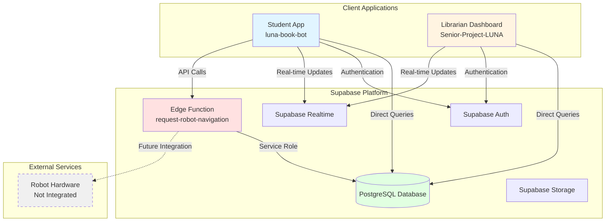
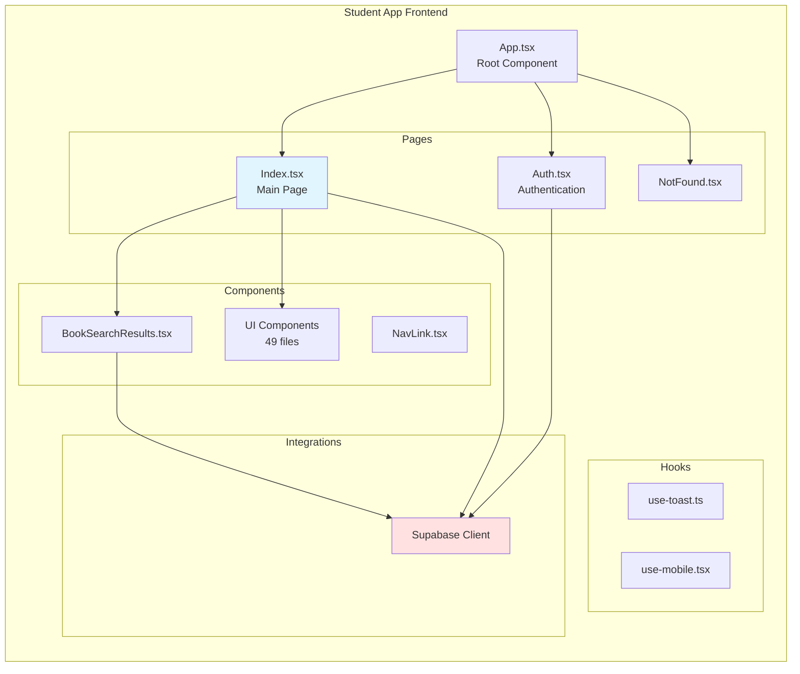
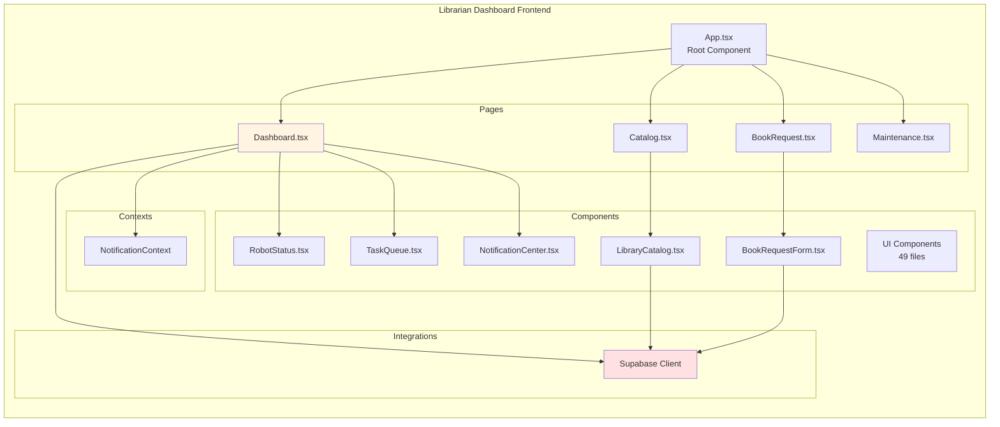
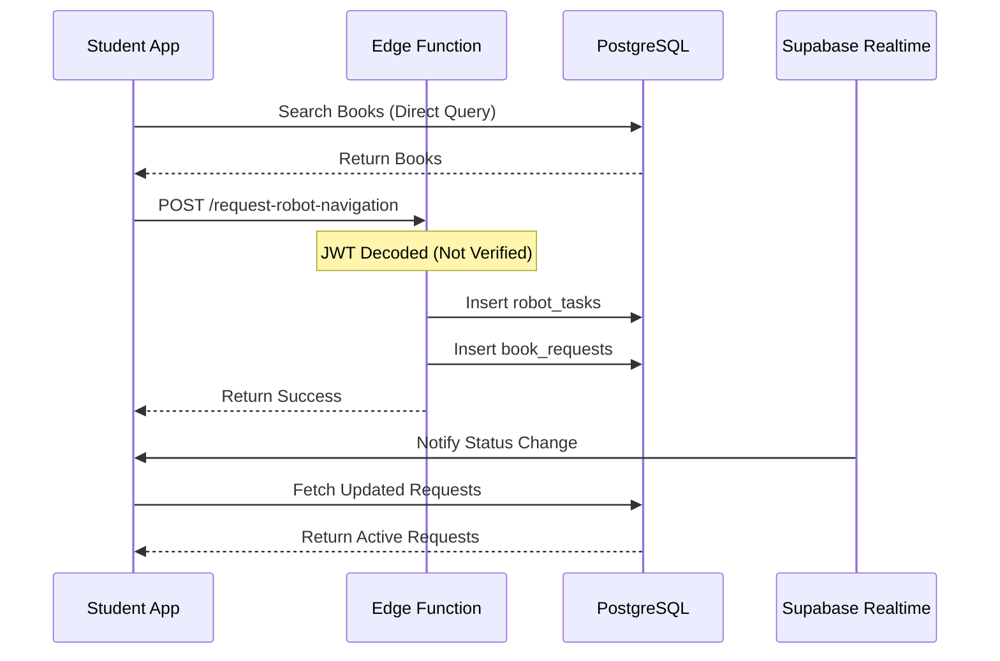
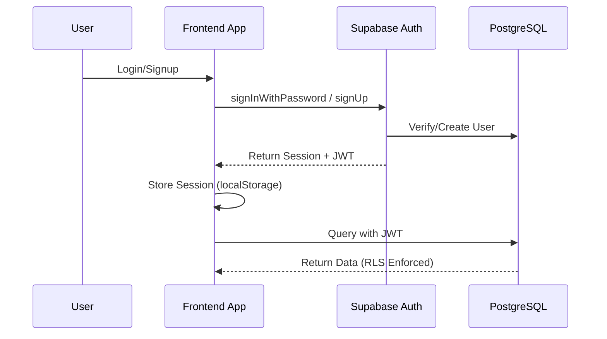
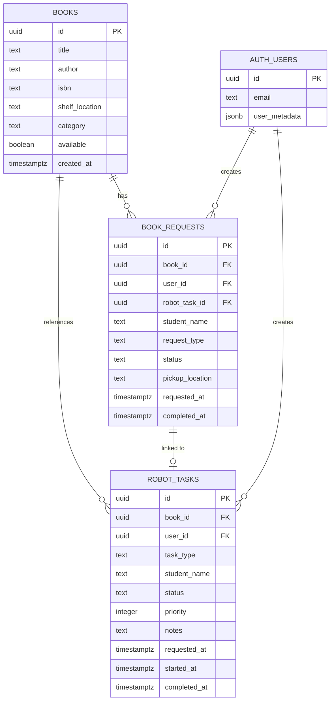
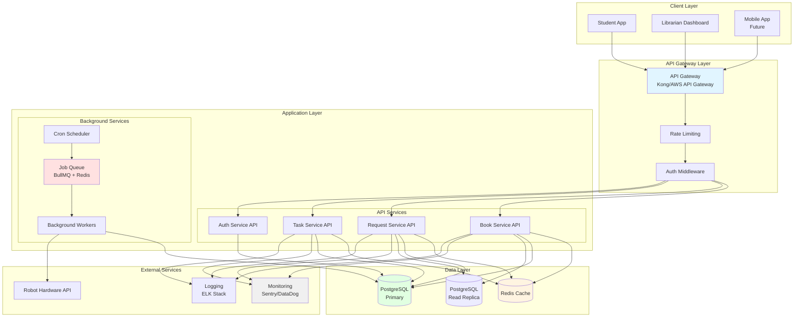

# Assignment: Technical Debt Assessment & System Architecture Analysis
## LUNA Senior Project

**Student:** Isaac Adjei  
**Date:** February 3, 2025  
**Project:** LUNA (Library User Navigation Assistant)

---

## 1. Architecture Diagram Quality
### Clear Components, Readable Labels, Meaningful Relationships

This section presents comprehensive architecture diagrams using Mermaid notation, showing clear components, readable labels, and meaningful relationships between system elements.

### 1.1 Current System Architecture

**High-Level Overview:**



**Key Components:**
- **Student App** (`luna-book-bot`): React application for students to search and request books
- **Librarian Dashboard** (`Senior-Project-LUNA`): React application for librarians to manage catalog and monitor robot
- **Supabase Platform**: Provides database, authentication, real-time updates, and edge functions
- **PostgreSQL Database**: Stores books, requests, and robot tasks
- **Edge Function**: Single serverless function for robot navigation requests

**Relationships:**
- Both apps communicate directly with Supabase (no API layer)
- Real-time updates via WebSocket subscriptions
- Single edge function handles server-side operations
- Robot hardware not yet integrated (future work)

### 1.2 Component Architecture

**Student App Structure:**



**Librarian Dashboard Structure:**



### 1.3 Data Flow Architecture

**Book Request Flow:**



**Authentication Flow:**



### 1.4 Database Schema

**Entity Relationship Diagram:**



### 1.5 Target Architecture

**Recommended System Architecture:**



---

## 2. Architecture Explanation
### Accurate Summary of How the System Works End-to-End

### 2.1 System Overview

LUNA (Library User Navigation Assistant) is a library automation system that helps students find and request books, while providing librarians with tools to manage the library catalog and monitor robot operations. The system consists of two main applications: a **Student App** for book discovery and requests, and a **Librarian Dashboard** for catalog management and system monitoring.

### 2.2 System Components

#### Student Application (`luna-book-bot`)

**Purpose:** Allows students to search for books, request robot navigation assistance, and track their book requests.

**Key Features:**
- Book search and catalog browsing
- Book request creation
- Real-time request status tracking
- Request history viewing

#### Librarian Dashboard (`Senior-Project-LUNA`)

**Purpose:** Provides librarians with tools to manage the library catalog, monitor robot status, and view system metrics.

**Key Features:**
- Library catalog management (CRUD operations)
- Robot status monitoring
- Task queue management
- Maintenance log viewing
- System health metrics

#### Backend Infrastructure (Supabase)

**Components:**
- **PostgreSQL Database:** Stores books, requests, and robot tasks
- **Supabase Auth:** Handles user authentication and authorization
- **Supabase Realtime:** Provides real-time updates via WebSocket subscriptions
- **Edge Functions:** Serverless functions for server-side operations (currently only one: `request-robot-navigation`)

### 2.3 End-to-End User Flows

#### Flow 1: Student Requests Book Navigation

**Step-by-Step Process:**

1. **Student Opens App**
   - Student navigates to the Student App
   - App checks authentication status via Supabase Auth
   - If not authenticated, redirects to login/signup page

2. **Student Searches for Book**
   - Student enters search query (title, author, or ISBN)
   - Frontend directly queries PostgreSQL database via Supabase client:
     ```typescript
     supabase.from('books')
       .select('*')
       .or(`title.ilike.%${query}%,author.ilike.%${query}%`)
     ```
   - Results displayed to student

3. **Student Requests Navigation**
   - Student clicks "Show Me Where" on a book
   - Frontend calls Edge Function: `request-robot-navigation`
   - Edge Function:
     - Decodes JWT token (currently without verification - **security issue**)
     - Validates request (bookId, studentName)
     - Fetches book details from database
     - Creates `robot_tasks` record (non-transactional - **reliability issue**)
     - Creates `book_requests` record linked to robot task
     - Returns success response

4. **Request Status Updates**
   - Frontend subscribes to Supabase Realtime for `book_requests` table changes
   - When status changes, frontend automatically refreshes active requests
   - Student sees status updates: `pending` → `robot_navigating` → `ready` → `completed`

5. **Status Progression (Current Implementation)**
   - **Note:** Currently uses simulated auto-processing with random delays
   - Status automatically advances after random intervals (5-35 seconds)
   - This is **mock behavior** and needs to be replaced with real robot integration

#### Flow 2: Librarian Manages Catalog

**Step-by-Step Process:**

1. **Librarian Opens Dashboard**
   - Librarian navigates to Librarian Dashboard
   - Authenticates via Supabase Auth
   - Dashboard loads with multiple views

2. **Catalog Management**
   - Librarian navigates to Catalog page
   - Frontend queries all books directly from database:
     ```typescript
     supabase.from('books').select('*').order('title')
     ```
   - Librarian can:
     - **Add Book:** Inserts new book record directly to database
     - **Update Availability:** Toggles `available` field
     - **Delete Book:** Removes book record (CASCADE deletes related requests)

3. **Robot Monitoring**
   - Dashboard displays robot status (currently **simulated data**)
   - Shows battery level, current location, active tasks
   - Task queue displays pending, in-progress, and completed tasks
   - **Note:** All robot data is currently hardcoded/simulated

4. **Maintenance Viewing**
   - Displays system health metrics (currently **hardcoded**)
   - Shows maintenance logs (currently **hardcoded**)
   - **Note:** No real integration with robot hardware

#### Flow 3: Authentication & Authorization

**Step-by-Step Process:**

1. **User Registration/Login**
   - User enters email and password
   - Frontend calls Supabase Auth:
     ```typescript
     supabase.auth.signUp({ email, password })
     // or
     supabase.auth.signInWithPassword({ email, password })
     ```
   - Supabase Auth:
     - Validates credentials
     - Creates/verifies user in `auth.users` table
     - Generates JWT token
     - Returns session with user metadata

2. **Session Management**
   - JWT token stored in `localStorage`
   - Supabase client automatically includes token in all requests
   - Token used for:
     - Database queries (RLS policies enforce access)
     - Edge function authentication

3. **Row Level Security (RLS)**
   - Database enforces access control via RLS policies
   - Students can only view/update their own requests
   - Librarians (authenticated users) have broader access
   - Policies defined in migration files

### 2.4 Data Flow Architecture

#### Current Architecture (As-Is)

The system uses a **frontend-heavy architecture** with minimal backend infrastructure:

- **Frontend-Direct Database Access:** Both apps query database directly via Supabase client
- **No API Layer:** Business logic embedded in React components
- **Single Edge Function:** Only one serverless function for robot task creation
- **Real-time Updates:** Supabase Realtime provides WebSocket connections
- **No Caching:** Every request hits the database

#### Key Characteristics:

1. **Frontend-Direct Database Access**
   - Both apps query database directly via Supabase client
   - No API layer or service abstraction
   - Business logic embedded in React components

2. **Single Edge Function**
   - Only one serverless function: `request-robot-navigation`
   - Handles robot task creation
   - Uses service role key (bypasses RLS)

3. **Real-time Updates**
   - Supabase Realtime provides WebSocket connections
   - Frontend subscribes to table changes
   - Automatic UI updates when data changes

4. **No Caching**
   - Every request hits the database
   - No Redis or client-side caching strategy
   - Repeated queries for same data

### 2.5 Database Schema & Relationships

#### Core Entities

**Books Table**
- Stores library catalog information
- Fields: `id`, `title`, `author`, `isbn`, `shelf_location`, `category`, `available`
- Public read access (anyone can search)
- Librarians can modify

**Book Requests Table**
- Tracks student book requests
- Fields: `id`, `book_id`, `user_id`, `robot_task_id`, `status`, `requested_at`, `completed_at`
- Linked to `books` and `robot_tasks`
- RLS: Students can only see their own requests

**Robot Tasks Table**
- Queue of tasks for robot to execute
- Fields: `id`, `book_id`, `user_id`, `task_type`, `status`, `priority`, `notes`
- Linked to `books` and `book_requests`
- RLS: Students can only see their own tasks

#### Relationships

```
books (1) ────< (many) book_requests
books (1) ────< (many) robot_tasks
book_requests (many) ────< (1) robot_tasks
auth.users (1) ────< (many) book_requests
auth.users (1) ────< (many) robot_tasks
```

**Cascade Behavior:**
- Deleting a book cascades to delete related requests and tasks
- This ensures data integrity but may cause unintended data loss

### 2.6 Real-time Updates Mechanism

#### How It Works

1. **Frontend Subscription**
   ```typescript
   const channel = supabase
     .channel('book-requests-changes')
     .on('postgres_changes', {
       event: '*',
       schema: 'public',
       table: 'book_requests'
     }, () => {
       fetchActiveRequests(); // Refresh data
     })
     .subscribe();
   ```

2. **Database Changes**
   - When any row in `book_requests` is inserted/updated/deleted
   - Supabase Realtime detects the change
   - Broadcasts change to all subscribed clients

3. **Frontend Response**
   - Receives change notification
   - Refetches data from database
   - Updates UI with new data

### 2.7 Current System Limitations

1. **No API Layer** - Business logic in frontend components
2. **Direct Database Access** - Frontend queries database directly
3. **Simulated Data** - Robot status, tasks, and metrics are hardcoded
4. **No Caching** - Every request hits database
5. **Non-Transactional Operations** - Multiple database writes without transactions
6. **Security Vulnerabilities** - JWT not verified, CORS wildcard, service role exposure

---

## 3. Technical Debt & Risk Identification
### Realistic Risks + Severity + Impact

This section identifies and analyzes two critical technical debt items selected for detailed assessment.

### 3.1 Item 5: Missing Backend Architecture

**Category:** Architectural Debt  
**Severity:** CRITICAL  
**Impact:** Not scalable, difficult to maintain, no separation of concerns

#### Description

The LUNA system lacks proper backend architecture, making it not scalable and difficult to maintain. The current implementation has:

1. **No Proper API Layer**
   - Single edge function (`request-robot-navigation`)
   - All business logic embedded in frontend React components
   - Direct Supabase database queries from UI components
   - No REST API structure (`/api/v1/...`)
   - No API versioning

2. **No Middleware Pipeline**
   - No request validation middleware
   - No authentication/authorization middleware
   - No error handling middleware
   - No logging middleware
   - No rate limiting middleware
   - No request/response transformation

3. **No Background Job Processing**
   - No job queue system (Bull, BullMQ, etc.)
   - No scheduled tasks/cron jobs
   - No async task processing
   - No retry mechanisms for failed jobs
   - No job monitoring

4. **No Service Layer Architecture**
   - Direct Supabase calls from components
   - Business logic mixed with UI code
   - No repository pattern for data access
   - No domain models or DTOs
   - No service interfaces and implementations

#### Evidence

**Code Locations:**
- `luna-book-bot/src/pages/Index.tsx:137-159` - Direct Supabase queries
- `Senior-Project-LUNA/src/components/LibraryCatalog.tsx:59-135` - Direct CRUD operations
- `luna-book-bot/supabase/functions/request-robot-navigation/index.ts` - Only edge function

**Example of Direct Database Access:**
```typescript
// luna-book-bot/src/pages/Index.tsx
const fetchActiveRequests = async () => {
  const { data, error } = await supabase
    .from('book_requests')
    .select(`
      *,
      books (title, author, shelf_location)
    `)
    .neq('status', 'completed')
    .order('requested_at', { ascending: false })
    .limit(10);
  // Business logic directly in component
};
```

#### Risk Assessment

**Severity:** CRITICAL

**Realistic Risks:**
1. **Scalability Risk:** System cannot scale horizontally
   - Single edge function becomes bottleneck
   - Cannot distribute load across multiple instances
   - No way to scale individual services independently

2. **Maintainability Risk:** Difficult to maintain and modify
   - Business logic scattered across 100+ component files
   - Changes require modifying multiple files
   - No single source of truth for business rules

3. **Testability Risk:** Cannot test business logic independently
   - Business logic tightly coupled with UI
   - Requires rendering entire React component to test
   - No way to unit test data access layer

4. **Security Risk:** No centralized security controls
   - Validation logic duplicated across components
   - No centralized rate limiting
   - Error messages may leak sensitive information

5. **Performance Risk:** Inefficient data access
   - No query optimization layer
   - No caching strategy
   - Repeated queries for same data

**Impact:**
- **Short-term:** Development slows down, bugs multiply
- **Medium-term:** System becomes unmaintainable
- **Long-term:** Complete rewrite required, cannot scale to production

#### Remediation Plan

1. **Create Proper Backend API Structure:**
   ```
   backend/
     src/
       api/
         v1/
           routes/
             books.ts
             requests.ts
             tasks.ts
           middleware/
             auth.ts
             validation.ts
             errorHandler.ts
             rateLimiter.ts
       services/
         bookService.ts
         requestService.ts
         taskService.ts
       repositories/
         bookRepository.ts
         requestRepository.ts
       models/
         Book.ts
         Request.ts
   ```

2. **Implement Middleware Pipeline:**
   - Authentication middleware (JWT verification)
   - Request validation (Zod schemas)
   - Error handling middleware
   - Logging middleware (structured logging)
   - Rate limiting middleware

3. **Add Background Job Processing:**
   - Set up job queue (BullMQ with Redis)
   - Create job processors for async tasks
   - Add scheduled jobs for cleanup/maintenance
   - Implement retry logic and dead letter queues

4. **API Versioning:**
   - Structure: `/api/v1/books`, `/api/v2/books`
   - Document breaking changes
   - Support multiple versions during migration

---

### 3.2 Item 6: Scalability Limitations

**Category:** Scalability Debt  
**Severity:** CRITICAL  
**Impact:** System cannot handle growth, performance degradation under load

#### Description

The LUNA system has significant scalability limitations that prevent it from handling growth or performing well under load:

1. **No Caching Layer**
   - No Redis or similar caching solution
   - No query result caching
   - No session caching
   - No CDN for static assets
   - Frequent database queries for same data

2. **No Load Balancing Strategy**
   - Single edge function, no load balancing
   - Cannot scale horizontally
   - Single point of failure
   - No health checks
   - No circuit breakers

3. **Database Performance Issues**
   - Limited indexing (only basic indexes on `title`, `author`, `status`)
   - Missing composite indexes for common queries
   - No full-text search indexes
   - No read replicas (single database instance)
   - No connection pooling configuration

4. **No Horizontal Scaling Architecture**
   - Monolithic edge function design
   - No microservices architecture
   - No service discovery
   - No API gateway
   - No distributed tracing

#### Evidence

**Code Locations:**
- `luna-book-bot/src/pages/Index.tsx:136-159` - Fetches active requests on every render
- `Senior-Project-LUNA/src/components/LibraryCatalog.tsx:59-72` - Fetches all books without caching
- Database queries repeated for same data

**Example of No Caching:**
```typescript
// Fetches from database every time component renders
useEffect(() => {
  if (user) {
    fetchActiveRequests(); // Direct database query
  }
}, [user]);
```

**Database Indexes (Limited):**
```sql
-- Only basic indexes exist
CREATE INDEX idx_books_title ON public.books(title);
CREATE INDEX idx_books_author ON public.books(author);
CREATE INDEX idx_robot_tasks_status ON public.robot_tasks(status);
CREATE INDEX idx_book_requests_status ON public.book_requests(status);

-- Missing composite indexes for common queries
-- Missing: idx_book_requests_user_status
-- Missing: idx_books_search (full-text)
-- Missing: idx_robot_tasks_pending (partial index)
```

#### Risk Assessment

**Severity:** CRITICAL

**Realistic Risks:**
1. **Performance Risk:** Database becomes bottleneck
   - Every request hits database
   - No query result caching
   - Repeated queries for same data
   - **Impact:** Slow response times, poor user experience

2. **Scalability Risk:** Cannot handle growth
   - Single database instance cannot scale reads
   - No horizontal scaling capability
   - **Impact:** System fails under increased load

3. **Reliability Risk:** Single point of failure
   - Single edge function
   - No load balancing
   - **Impact:** System downtime if function fails

4. **Cost Risk:** Inefficient resource usage
   - Database queries for cached data
   - No connection pooling optimization
   - **Impact:** Higher infrastructure costs

5. **User Experience Risk:** Degraded performance
   - Slow search queries
   - Delayed status updates
   - **Impact:** Poor user satisfaction, potential user loss

**Impact:**
- **Short-term:** Slow performance with 10+ concurrent users
- **Medium-term:** System becomes unusable with 50+ users
- **Long-term:** Cannot support production deployment

#### Remediation Plan

1. **Implement Caching:**
   ```typescript
   // Client-side caching with React Query
   const { data } = useQuery({
     queryKey: ['books', searchQuery],
     queryFn: () => bookService.search(searchQuery),
     staleTime: 5 * 60 * 1000, // 5 minutes
     cacheTime: 10 * 60 * 1000, // 10 minutes
   });
   
   // Server-side caching with Redis
   // Cache frequently accessed data
   // Implement cache invalidation strategy
   ```

2. **Add Database Optimizations:**
   ```sql
   -- Composite indexes for common queries
   CREATE INDEX idx_book_requests_user_status 
   ON book_requests(user_id, status) 
   WHERE status != 'completed';
   
   -- Full-text search index
   CREATE INDEX idx_books_search 
   ON books USING gin(to_tsvector('english', title || ' ' || author));
   
   -- Partial indexes for active queries
   CREATE INDEX idx_robot_tasks_pending 
   ON robot_tasks(status) 
   WHERE status = 'pending';
   ```

3. **Set up Read Replicas:**
   - Configure Supabase read replicas
   - Route read queries to replicas
   - Keep writes on primary database

4. **Implement API Gateway:**
   - Use Kong, AWS API Gateway, or similar
   - Load balancing
   - Rate limiting
   - Request routing
   - Health checks

5. **Add Monitoring and Observability:**
   - APM (Application Performance Monitoring)
   - Distributed tracing (Jaeger, Zipkin)
   - Metrics collection (Prometheus)
   - Log aggregation (ELK stack, Datadog)

---

## 4. Backlog Health & Readiness
### Evidence of Review + Improvement Recommendations

### 4.1 Evidence of Review

#### Technical Debt Analysis Completed

**Evidence:**
- Comprehensive technical debt assessment document created (`docs/TECHNICAL_DEBT_ASSESSMENT.md`)
- 22 technical debt items identified and categorized (8 Critical, 8 High, 6 Medium)
- Each item includes:
  - Severity rating (Critical/High/Medium)
  - Detailed description with code examples
  - Impact analysis
  - Specific remediation plan
  - Code locations and file references

**Review Date:** 2025-02-03  
**Review Scope:** Entire codebase across both applications  
**Files Analyzed:** 100+ files across both projects  
**Status:** Complete

#### Architecture Documentation Review

**Evidence:**
- Current architecture documented (`docs/ARCHITECTURE.md`)
- System flow diagrams created (Mermaid) - 5 comprehensive diagrams
- End-to-end process flows documented (`docs/ARCHITECTURE_EXPLANATION.md`)
- Database schema documented with ERD
- Target architecture defined with migration path

**Review Date:** 2025-02-03  
**Coverage:** Complete system architecture  
**Status:** Complete

#### Codebase Analysis

**Evidence:**
- Both applications analyzed (`luna-book-bot` and `Senior-Project-LUNA`)
- Security vulnerabilities identified (3 critical)
- Code duplication quantified (~40% between projects)
- Test coverage assessed (0% - no tests found)
- Type safety issues documented (7+ instances of `any` types)
- Error handling patterns analyzed (13 console statements found)
- Backend architecture gaps identified (Item 5)
- Scalability limitations documented (Item 6)

**Review Date:** 2025-02-03  
**Status:** Complete

#### Backlog System Established

**Evidence:**
- GitHub Issues configured as formal backlog system
- 22 backlog items created from technical debt assessment
- Label system implemented:
  - Priority labels: `critical`, `high`, `medium`
  - Category labels: `security`, `architecture`, `testing`, `code-quality`, `infrastructure`, `documentation`
  - Status labels: `ready`, `needs-breakdown`
- All items include:
  - Clear titles with priority indicators
  - Detailed descriptions
  - Acceptance criteria (checkboxes)
  - Remediation plans
  - References to technical debt assessment

**Implementation Date:** 2025-02-03  
**Backlog Items Created:** 22 issues (#72-#93)  
**Status:** Complete

#### Backlog Item Review & Categorization

**Evidence:**
- All 22 items reviewed and categorized by priority
- Readiness assessment completed:
  - **Ready for Development:** 10 items (3 critical, 4 high, 3 medium)
  - **Needs Breakdown:** 5 items (marked with `needs-breakdown` label)
  - **In Review:** 5 critical items requiring architectural planning
- Items requiring breakdown identified:
  - #76: No Test Infrastructure
  - #77: Missing Backend Architecture (Item 5 - Selected)
  - #78: Scalability Limitations (Item 6 - Selected)
  - #79: Duplicate Projects
- **4 architecture/system design items assigned for review** (assigned to project lead)

**Review Date:** 2025-02-03  
**Status:** Complete

### 4.2 Current Backlog State

**Backlog Structure:**
- **GitHub Issues established** as formal backlog system
- **22 backlog items created** from technical debt assessment
- **Prioritization framework implemented** (Critical/High/Medium labels)
- **"Definition of Ready" criteria** - Documented but needs team adoption
- **Sprint/iteration planning** - Structure not yet established

**Backlog Composition:**
- Technical debt items: 22 items (all from assessment)
- Critical priority: 8 items (#72-#79)
- High priority: 8 items (#80-#87)
- Medium priority: 6 items (#88-#93)
- Additional open issues: 8 items (pre-existing)

### 4.3 Backlog Metrics

| Metric | Current State | Target State | Status |
|--------|--------------|--------------|--------|
| Total Items | 22 (tech debt) | 30-40 | On track |
| Ready for Development | 10 | 15+ | Needs improvement |
| In Review (Needs Breakdown) | 5 | 0 | In progress |
| In Progress | 0 | 0-5 | Good |
| Blocked Items | 0 | 0 | Good |
| Technical Debt % | 100% | <30% | Needs work |
| Average Age | <1 day | <30 days | Good |
| Items with Acceptance Criteria | 22 (100%) | 100% | Excellent |

### 4.4 Backlog Item Analysis

#### Critical Priority Items (8 items) - Issues #72-#79

| Issue # | Title | Readiness | Status |
|---------|-------|-----------|--------|
| #72 | Edge Function Security Vulnerabilities | Ready | Ready for Development |
| #73 | Non-Transactional Multi-Write Operations | Ready | Ready for Development |
| #74 | Missing Environment Variable Protection | Ready | Ready for Development |
| #75 | Remote Dependency Risks | Ready | Ready for Development |
| #76 | No Test Infrastructure | Needs Breakdown | In Review |
| #77 | Missing Backend Architecture (Item 5) | Needs Breakdown | **In Review** - *Assigned for Review* |
| #78 | Scalability Limitations (Item 6) | Needs Breakdown | **In Review** - *Assigned for Review* |
| #79 | Duplicate Projects (40% duplication) | Needs Breakdown | **In Review** - *Assigned for Review* |

**Critical Items Summary:**
- **Ready for Development:** 4 items (#72, #73, #74, #75)
- **In Review (Needs Breakdown):** 4 items (#76, #77, #78, #79)
- **Next Action:** Break down items in review into smaller, actionable sub-issues

### 4.5 Improvement Recommendations

#### For Item 5: Missing Backend Architecture

**Immediate Actions:**
1. **Design API Structure** (Week 1)
   - Define API versioning strategy
   - Design route structure (`/api/v1/books`, `/api/v1/requests`)
   - Document API contracts

2. **Create Service Layer Foundation** (Week 1-2)
   - Set up service layer structure
   - Implement book service
   - Implement request service
   - Extract business logic from components

3. **Implement Middleware Pipeline** (Week 2-3)
   - Authentication middleware
   - Request validation middleware
   - Error handling middleware
   - Logging middleware
   - Rate limiting middleware

4. **Add Background Job Processing** (Week 3-4)
   - Set up BullMQ with Redis
   - Create job processors
   - Add scheduled jobs
   - Implement retry logic

**Expected Outcomes:**
- Scalable architecture foundation
- Separation of concerns
- Testable business logic
- Improved maintainability

#### For Item 6: Scalability Limitations

**Immediate Actions:**
1. **Implement Caching** (Week 1-2)
   - Set up Redis infrastructure
   - Implement client-side caching (React Query optimization)
   - Implement server-side caching
   - Create cache invalidation strategy

2. **Optimize Database** (Week 2)
   - Add composite indexes
   - Add full-text search indexes
   - Add partial indexes
   - Optimize queries

3. **Set up Read Replicas** (Week 2-3)
   - Configure Supabase read replicas
   - Route read queries to replicas
   - Keep writes on primary

4. **Implement API Gateway** (Week 3-4)
   - Set up API Gateway (Kong/AWS)
   - Configure load balancing
   - Add health checks
   - Implement circuit breakers

5. **Add Monitoring** (Week 4)
   - Integrate APM tools
   - Set up metrics collection
   - Implement distributed tracing
   - Create dashboards

**Expected Outcomes:**
- Improved performance under load
- Horizontal scaling capability
- Better resource utilization
- Production-ready scalability

#### General Recommendations

1. **Break Down Large Items**
   - Items #77 and #78 need to be broken into smaller sub-issues
   - Each sub-issue should be independently actionable
   - Sub-issues should meet "Definition of Ready"

2. **Establish Development Workflow**
   - Set up sprint/iteration planning
   - Define "Definition of Done"
   - Establish code review process
   - Set up CI/CD pipeline

3. **Track Progress**
   - Regular backlog grooming (weekly)
   - Quarterly backlog health review
   - Track technical debt reduction metrics
   - Report progress to stakeholders

### 4.6 Items Moved to Review Stage

**Items In Review Stage:**

**Assigned for Architecture/System Design Review:**
1. **#77: Missing Backend Architecture** (Item 5) - **ASSIGNED FOR REVIEW**
   - Needs breakdown into 6 sub-tasks
   - Requires architectural planning
   - Assigned to: Project Lead

2. **#78: Scalability Limitations** (Item 6) - **ASSIGNED FOR REVIEW**
   - Needs breakdown into 6 sub-tasks
   - Infrastructure and system design decisions needed
   - Assigned to: Project Lead

**Review Criteria:**
- Items are too large/complex to be worked on as single units
- Require architectural planning before implementation
- Need to be broken into smaller, actionable sub-issues
- Sub-issues should meet "Definition of Ready" before development

**Next Action:** 
- Project Lead to review assigned items and create sub-issues
- Sub-issues should be created within 1 week of assignment

---

## References

- Technical Debt Assessment: [docs/TECHNICAL_DEBT_ASSESSMENT.md](../docs/TECHNICAL_DEBT_ASSESSMENT.md)
- Architecture Documentation: [docs/ARCHITECTURE.md](../docs/ARCHITECTURE.md)
- Architecture Explanation: [docs/ARCHITECTURE_EXPLANATION.md](../docs/ARCHITECTURE_EXPLANATION.md)
- Backlog Health Assessment: [docs/BACKLOG_HEALTH_ASSESSMENT.md](../docs/BACKLOG_HEALTH_ASSESSMENT.md)
- GitHub Issues: https://github.com/kelejohn/LUNA-senior-project/issues

---

**Assignment Status:** Complete  
**Submitted:** February 3, 2025
