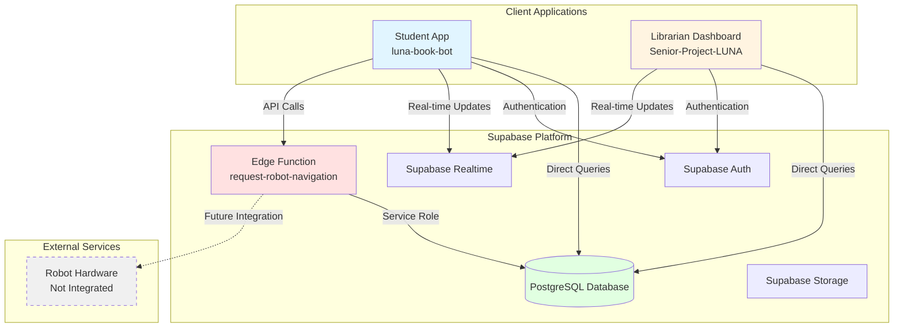
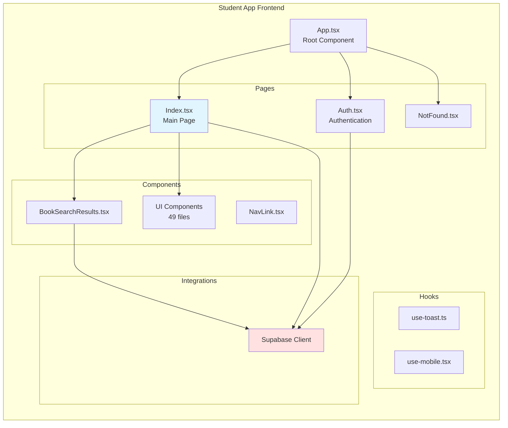
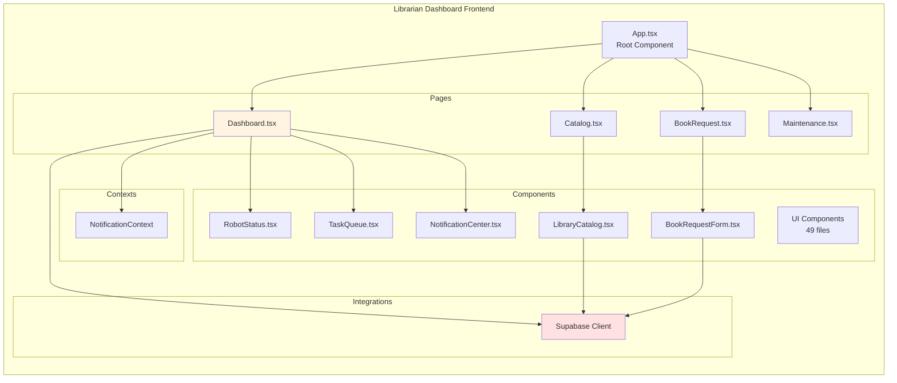
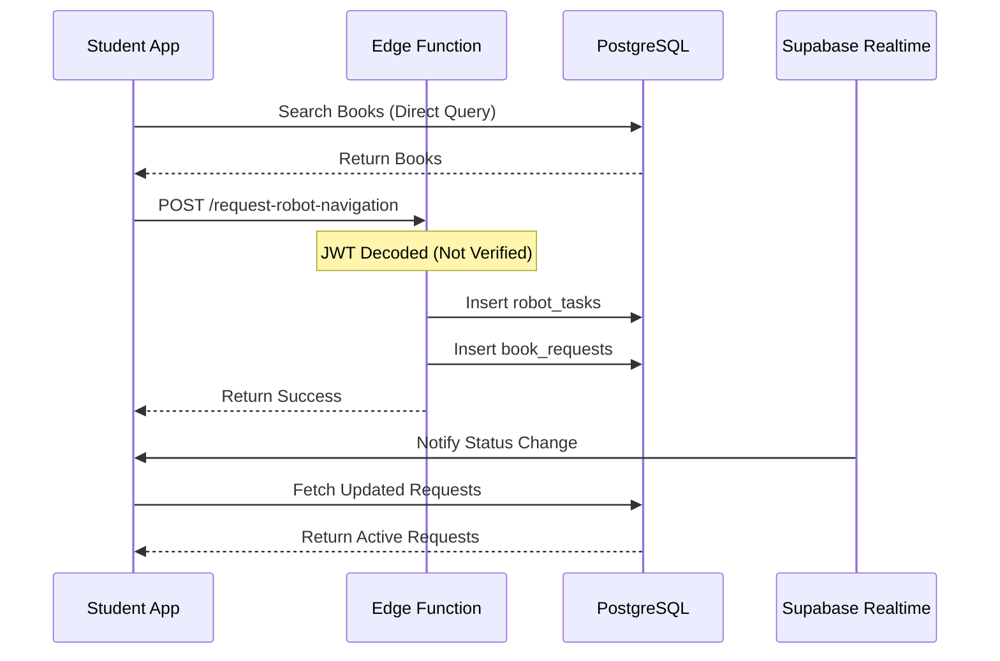
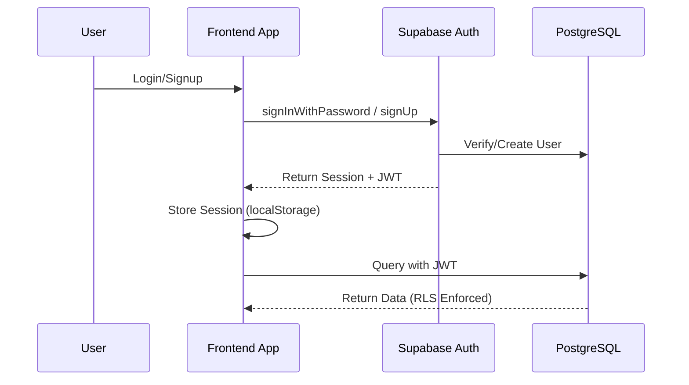
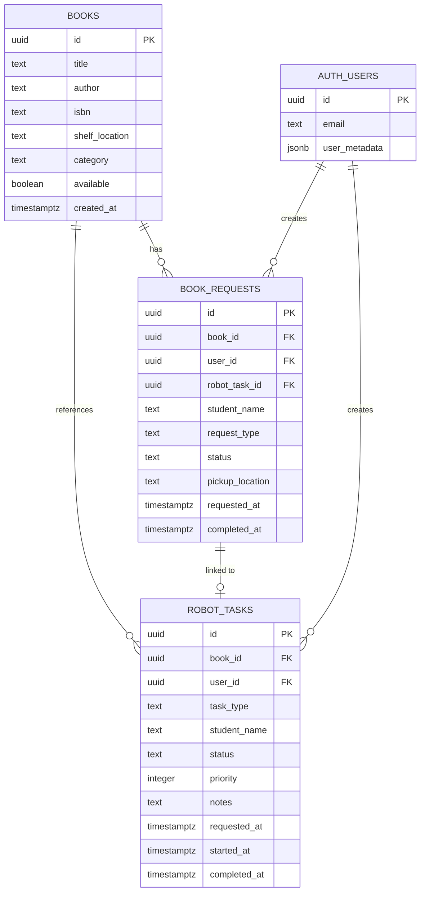
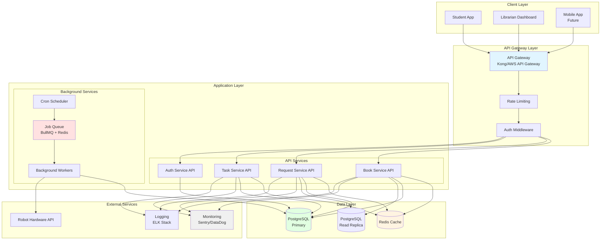

# Assignment: Technical Debt Assessment & System Architecture Analysis
## LUNA Senior Project

**Student:** Kritika Pant  
**Date:** February 3, 2025  
**Project:** LUNA (Library User Navigation Assistant)

---

## 1. Architecture Diagram Quality
### Clear Components, Readable Labels, Meaningful Relationships

This section presents comprehensive architecture diagrams using Mermaid notation, showing clear components, readable labels, and meaningful relationships between system elements.

### 1.1 Current System Architecture

**High-Level Overview:**



**Key Components:**
- **Student App** (`luna-book-bot`): React application for students to search and request books
- **Librarian Dashboard** (`Senior-Project-LUNA`): React application for librarians to manage catalog and monitor robot
- **Supabase Platform**: Provides database, authentication, real-time updates, and edge functions
- **PostgreSQL Database**: Stores books, requests, and robot tasks
- **Edge Function**: Single serverless function for robot navigation requests

**Relationships:**
- Both apps communicate directly with Supabase (no API layer)
- Real-time updates via WebSocket subscriptions
- Single edge function handles server-side operations
- Robot hardware not yet integrated (future work)

### 1.2 Component Architecture

**Student App Structure:**



**Librarian Dashboard Structure:**



### 1.3 Data Flow Architecture

**Book Request Flow:**



**Authentication Flow:**



### 1.4 Database Schema

**Entity Relationship Diagram:**



### 1.5 Target Architecture

**Recommended System Architecture:**



---

## 2. Architecture Explanation
### Accurate Summary of How the System Works End-to-End

### 2.1 System Overview

LUNA (Library User Navigation Assistant) is a library automation system that helps students find and request books, while providing librarians with tools to manage the library catalog and monitor robot operations. The system consists of two main applications: a **Student App** for book discovery and requests, and a **Librarian Dashboard** for catalog management and system monitoring.

### 2.2 System Components

#### Student Application (`luna-book-bot`)

**Purpose:** Allows students to search for books, request robot navigation assistance, and track their book requests.

**Key Features:**
- Book search and catalog browsing
- Book request creation
- Real-time request status tracking
- Request history viewing

#### Librarian Dashboard (`Senior-Project-LUNA`)

**Purpose:** Provides librarians with tools to manage the library catalog, monitor robot status, and view system metrics.

**Key Features:**
- Library catalog management (CRUD operations)
- Robot status monitoring
- Task queue management
- Maintenance log viewing
- System health metrics

#### Backend Infrastructure (Supabase)

**Components:**
- **PostgreSQL Database:** Stores books, requests, and robot tasks
- **Supabase Auth:** Handles user authentication and authorization
- **Supabase Realtime:** Provides real-time updates via WebSocket subscriptions
- **Edge Functions:** Serverless functions for server-side operations (currently only one: `request-robot-navigation`)

### 2.3 End-to-End User Flows

#### Flow 1: Student Requests Book Navigation

**Step-by-Step Process:**

1. **Student Opens App**
   - Student navigates to the Student App
   - App checks authentication status via Supabase Auth
   - If not authenticated, redirects to login/signup page

2. **Student Searches for Book**
   - Student enters search query (title, author, or ISBN)
   - Frontend directly queries PostgreSQL database via Supabase client:
     ```typescript
     supabase.from('books')
       .select('*')
       .or(`title.ilike.%${query}%,author.ilike.%${query}%`)
     ```
   - Results displayed to student

3. **Student Requests Navigation**
   - Student clicks "Show Me Where" on a book
   - Frontend calls Edge Function: `request-robot-navigation`
   - Edge Function:
     - Decodes JWT token (currently without verification - **security issue**)
     - Validates request (bookId, studentName)
     - Fetches book details from database
     - Creates `robot_tasks` record (non-transactional - **reliability issue**)
     - Creates `book_requests` record linked to robot task
     - Returns success response

4. **Request Status Updates**
   - Frontend subscribes to Supabase Realtime for `book_requests` table changes
   - When status changes, frontend automatically refreshes active requests
   - Student sees status updates: `pending` → `robot_navigating` → `ready` → `completed`

5. **Status Progression (Current Implementation)**
   - **Note:** Currently uses simulated auto-processing with random delays
   - Status automatically advances after random intervals (5-35 seconds)
   - This is **mock behavior** and needs to be replaced with real robot integration

#### Flow 2: Librarian Manages Catalog

**Step-by-Step Process:**

1. **Librarian Opens Dashboard**
   - Librarian navigates to Librarian Dashboard
   - Authenticates via Supabase Auth
   - Dashboard loads with multiple views

2. **Catalog Management**
   - Librarian navigates to Catalog page
   - Frontend queries all books directly from database:
     ```typescript
     supabase.from('books').select('*').order('title')
     ```
   - Librarian can:
     - **Add Book:** Inserts new book record directly to database
     - **Update Availability:** Toggles `available` field
     - **Delete Book:** Removes book record (CASCADE deletes related requests)

3. **Robot Monitoring**
   - Dashboard displays robot status (currently **simulated data**)
   - Shows battery level, current location, active tasks
   - Task queue displays pending, in-progress, and completed tasks
   - **Note:** All robot data is currently hardcoded/simulated

4. **Maintenance Viewing**
   - Displays system health metrics (currently **hardcoded**)
   - Shows maintenance logs (currently **hardcoded**)
   - **Note:** No real integration with robot hardware

#### Flow 3: Authentication & Authorization

**Step-by-Step Process:**

1. **User Registration/Login**
   - User enters email and password
   - Frontend calls Supabase Auth:
     ```typescript
     supabase.auth.signUp({ email, password })
     // or
     supabase.auth.signInWithPassword({ email, password })
     ```
   - Supabase Auth:
     - Validates credentials
     - Creates/verifies user in `auth.users` table
     - Generates JWT token
     - Returns session with user metadata

2. **Session Management**
   - JWT token stored in `localStorage`
   - Supabase client automatically includes token in all requests
   - Token used for:
     - Database queries (RLS policies enforce access)
     - Edge function authentication

3. **Row Level Security (RLS)**
   - Database enforces access control via RLS policies
   - Students can only view/update their own requests
   - Librarians (authenticated users) have broader access
   - Policies defined in migration files

### 2.4 Data Flow Architecture

#### Current Architecture (As-Is)

The system uses a **frontend-heavy architecture** with minimal backend infrastructure:

- **Frontend-Direct Database Access:** Both apps query database directly via Supabase client
- **No API Layer:** Business logic embedded in React components
- **Single Edge Function:** Only one serverless function for robot task creation
- **Real-time Updates:** Supabase Realtime provides WebSocket connections
- **No Caching:** Every request hits the database

#### Key Characteristics:

1. **Frontend-Direct Database Access**
   - Both apps query database directly via Supabase client
   - No API layer or service abstraction
   - Business logic embedded in React components

2. **Single Edge Function**
   - Only one serverless function: `request-robot-navigation`
   - Handles robot task creation
   - Uses service role key (bypasses RLS)

3. **Real-time Updates**
   - Supabase Realtime provides WebSocket connections
   - Frontend subscribes to table changes
   - Automatic UI updates when data changes

4. **No Caching**
   - Every request hits the database
   - No Redis or client-side caching strategy
   - Repeated queries for same data

### 2.5 Database Schema & Relationships

#### Core Entities

**Books Table**
- Stores library catalog information
- Fields: `id`, `title`, `author`, `isbn`, `shelf_location`, `category`, `available`
- Public read access (anyone can search)
- Librarians can modify

**Book Requests Table**
- Tracks student book requests
- Fields: `id`, `book_id`, `user_id`, `robot_task_id`, `status`, `requested_at`, `completed_at`
- Linked to `books` and `robot_tasks`
- RLS: Students can only see their own requests

**Robot Tasks Table**
- Queue of tasks for robot to execute
- Fields: `id`, `book_id`, `user_id`, `task_type`, `status`, `priority`, `notes`
- Linked to `books` and `book_requests`
- RLS: Students can only see their own tasks

#### Relationships

```
books (1) ────< (many) book_requests
books (1) ────< (many) robot_tasks
book_requests (many) ────< (1) robot_tasks
auth.users (1) ────< (many) book_requests
auth.users (1) ────< (many) robot_tasks
```

**Cascade Behavior:**
- Deleting a book cascades to delete related requests and tasks
- This ensures data integrity but may cause unintended data loss

### 2.6 Real-time Updates Mechanism

#### How It Works

1. **Frontend Subscription**
   ```typescript
   const channel = supabase
     .channel('book-requests-changes')
     .on('postgres_changes', {
       event: '*',
       schema: 'public',
       table: 'book_requests'
     }, () => {
       fetchActiveRequests(); // Refresh data
     })
     .subscribe();
   ```

2. **Database Changes**
   - When any row in `book_requests` is inserted/updated/deleted
   - Supabase Realtime detects the change
   - Broadcasts change to all subscribed clients

3. **Frontend Response**
   - Receives change notification
   - Refetches data from database
   - Updates UI with new data

### 2.7 Current System Limitations

1. **No API Layer** - Business logic in frontend components
2. **Direct Database Access** - Frontend queries database directly
3. **Simulated Data** - Robot status, tasks, and metrics are hardcoded
4. **No Caching** - Every request hits database
5. **Non-Transactional Operations** - Multiple database writes without transactions
6. **Security Vulnerabilities** - JWT not verified, CORS wildcard, service role exposure

---

## 3. Technical Debt & Risk Identification
### Realistic Risks + Severity + Impact

This section identifies and analyzes two high-priority technical debt items selected for detailed assessment.

### 3.1 Item 11: Inconsistent Domain Types

**Category:** Architectural Debt  
**Severity:** HIGH  
**Impact:** Type safety issues, maintenance burden, bugs

#### Description

The LUNA system suffers from inconsistent domain type definitions across the codebase. The same types are defined in multiple locations, leading to type drift, inconsistencies, and maintenance challenges.

**Issues Identified:**

1. **Duplicate Type Definitions**
   - `Book` interface defined in 4+ different locations:
     - `luna-book-bot/src/components/BookSearchResults.tsx:9-18`
     - `Senior-Project-LUNA/src/components/LibraryCatalog.tsx:28-37`
     - `Senior-Project-LUNA/src/components/BookRequestForm.tsx:10-17`
     - `luna-book-bot/src/pages/Index.tsx:19-26` (BookRequest)
   - Each definition may have slight variations
   - Types drift over time as developers modify them independently

2. **Not Using Supabase-Generated Types**
   - Supabase generates TypeScript types from database schema
   - These types are the single source of truth for database structure
   - Current codebase does not leverage these generated types
   - Manual type definitions can become out of sync with database schema

3. **No Centralized Type Management**
   - No shared types directory or package
   - Types scattered across component files
   - No type utilities or helpers
   - Difficult to maintain consistency

#### Evidence

**Code Locations:**
- `luna-book-bot/src/components/BookSearchResults.tsx:9-18` - Book interface definition
- `Senior-Project-LUNA/src/components/LibraryCatalog.tsx:28-37` - Book interface definition
- `Senior-Project-LUNA/src/components/BookRequestForm.tsx:10-17` - Book interface definition
- `luna-book-bot/src/pages/Index.tsx:19-26` - BookRequest interface definition

**Example of Duplicate Type Definitions:**

```typescript
// luna-book-bot/src/components/BookSearchResults.tsx
interface Book {
  id: string;
  title: string;
  author: string;
  isbn: string;
  shelf_location: string;
  category: string;
  available: boolean;
  created_at: string;
}

// Senior-Project-LUNA/src/components/LibraryCatalog.tsx
interface Book {
  id: string;
  title: string;
  author: string;
  isbn: string;
  shelf_location: string;
  category: string;
  available: boolean;
  created_at: string;
  // Note: Slight variations may exist
}
```

**Example of Not Using Generated Types:**

```typescript
// Current approach - manual type definition
interface Book {
  id: string;
  title: string;
  // ... manual definition
}

// Should use Supabase generated types
import type { Database } from '@/integrations/supabase/types';
type Book = Database['public']['Tables']['books']['Row'];
```

#### Risk Assessment

**Severity:** HIGH

**Realistic Risks:**

1. **Type Safety Risk:** Types become inconsistent
   - Different components expect different shapes
   - TypeScript may not catch mismatches if types drift
   - Runtime errors when types don't match actual data
   - **Impact:** Bugs, type errors, runtime failures

2. **Maintenance Risk:** Difficult to maintain
   - Changes to database schema require updating multiple type definitions
   - Easy to miss updating one location
   - No single source of truth
   - **Impact:** Increased development time, higher bug rate

3. **Refactoring Risk:** Difficult to refactor
   - Changing a type requires finding all definitions
   - Risk of missing some locations
   - No automated way to ensure consistency
   - **Impact:** Slower development, more bugs

4. **Developer Experience Risk:** Confusing for developers
   - Unclear which type definition is correct
   - May use wrong type in new code
   - Inconsistent patterns across codebase
   - **Impact:** Slower onboarding, more mistakes

5. **Data Integrity Risk:** Type mismatches with database
   - Manual types may not match actual database schema
   - Database changes not reflected in types
   - Potential for runtime errors
   - **Impact:** Data corruption, application crashes

**Impact:**
- **Short-term:** Type inconsistencies cause bugs, slower development
- **Medium-term:** Maintenance burden increases, more bugs introduced
- **Long-term:** Technical debt accumulates, refactoring becomes difficult

#### Remediation Plan

1. **Consolidate into Shared Types:**
   ```
   src/types/
     index.ts           # Re-export all types
     book.types.ts      # Book-related types
     request.types.ts    # Request-related types
     database.types.ts  # Supabase-generated types
   ```

2. **Use Supabase Types as Source of Truth:**
   ```typescript
   // types/book.types.ts
   import type { Database } from '@/integrations/supabase/types';
   
   // Use generated types directly
   export type Book = Database['public']['Tables']['books']['Row'];
   export type BookInsert = Database['public']['Tables']['books']['Insert'];
   export type BookUpdate = Database['public']['Tables']['books']['Update'];
   
   // Create derived types if needed
   export type BookWithRelations = Book & {
     requests?: BookRequest[];
   };
   ```

3. **Create Type Utilities:**
   ```typescript
   // types/utils.ts
   import type { Database } from '@/integrations/supabase/types';
   
   // Helper to extract table types
   export type TableRow<T extends keyof Database['public']['Tables']> = 
     Database['public']['Tables'][T]['Row'];
   
   export type TableInsert<T extends keyof Database['public']['Tables']> = 
     Database['public']['Tables'][T]['Insert'];
   
   export type TableUpdate<T extends keyof Database['public']['Tables']> = 
     Database['public']['Tables'][T]['Update'];
   ```

4. **Update All Components:**
   - Remove duplicate type definitions
   - Import from shared types directory
   - Ensure all components use same types
   - Update imports across codebase

5. **Add Type Validation:**
   - Use runtime validation (Zod) for API boundaries
   - Ensure types match runtime data
   - Add type guards where needed

6. **Document Type Strategy:**
   - Document which types to use where
   - Establish patterns for type usage
   - Create guidelines for adding new types

---

### 3.2 Item 13: Inconsistent Error Handling

**Category:** Code Quality Debt  
**Severity:** HIGH  
**Impact:** Poor user experience, difficult debugging

#### Description

The LUNA system has inconsistent error handling patterns across the codebase, making it difficult to debug issues and provide a good user experience when errors occur.

**Issues Identified:**

1. **Mixed Error Handling Patterns**
   - Some code uses try-catch blocks
   - Some code only checks for error objects
   - No consistent pattern across components
   - Different error handling in different parts of the app

2. **Console Statements in Production**
   - 13 console.log/error statements found in production code
   - Errors logged to console instead of proper logging service
   - No structured logging
   - No error tracking service integration

3. **No React Error Boundaries**
   - No error boundaries to catch React component errors
   - Unhandled errors can crash entire application
   - No graceful error recovery
   - Poor user experience when errors occur

4. **Missing Error Recovery Mechanisms**
   - No retry logic for failed operations
   - No fallback mechanisms
   - No error state management
   - Users see cryptic error messages

5. **Generic Error Messages**
   - Error messages not user-friendly
   - No error codes for tracking
   - No context about what went wrong
   - Difficult to debug issues

#### Evidence

**Code Locations:**
- Multiple files with console.log/error statements
- Inconsistent try-catch usage
- No error boundaries found
- Generic error handling in components

**Example of Inconsistent Error Handling:**

```typescript
// Pattern 1: Try-catch with console.error
try {
  const { data, error } = await supabase.from('books').select('*');
  if (error) throw error;
  // handle data
} catch (error) {
  console.error('Error fetching books:', error);
  // No user feedback
}

// Pattern 2: Only error checking
const { data, error } = await supabase.from('books').select('*');
if (error) {
  console.log('Error:', error);
  // No try-catch, no error handling
}

// Pattern 3: No error handling at all
const { data } = await supabase.from('books').select('*');
// No error checking, will crash if error occurs
```

**Example of Console Statements:**

```typescript
// Found in multiple files
console.log('Fetching books...');
console.error('Error:', error);
console.log('Data:', data);
```

#### Risk Assessment

**Severity:** HIGH

**Realistic Risks:**

1. **User Experience Risk:** Poor error handling
   - Users see cryptic error messages
   - Application crashes without recovery
   - No feedback when operations fail
   - **Impact:** Poor user satisfaction, user abandonment

2. **Debugging Risk:** Difficult to debug issues
   - Console statements not captured in production
   - No error tracking or monitoring
   - No context about errors
   - **Impact:** Longer time to fix bugs, more user complaints

3. **Reliability Risk:** Application crashes
   - No error boundaries to catch React errors
   - Unhandled errors crash entire app
   - No graceful degradation
   - **Impact:** Application downtime, data loss

4. **Maintenance Risk:** Inconsistent patterns
   - Different error handling in different places
   - Difficult to maintain and update
   - No centralized error handling
   - **Impact:** Slower development, more bugs

5. **Security Risk:** Error messages leak information
   - Generic errors may leak sensitive information
   - Stack traces exposed to users
   - No error sanitization
   - **Impact:** Security vulnerabilities, information disclosure

**Impact:**
- **Short-term:** Poor user experience, difficult debugging
- **Medium-term:** More bugs, user complaints increase
- **Long-term:** Application becomes unreliable, user trust lost

#### Remediation Plan

1. **Implement Error Boundaries:**
   ```typescript
   // components/ErrorBoundary.tsx
   import React from 'react';
   
   class ErrorBoundary extends React.Component<
     { children: React.ReactNode },
     { hasError: boolean; error: Error | null }
   > {
     constructor(props: { children: React.ReactNode }) {
       super(props);
       this.state = { hasError: false, error: null };
     }
   
     static getDerivedStateFromError(error: Error) {
       return { hasError: true, error };
     }
   
     componentDidCatch(error: Error, errorInfo: React.ErrorInfo) {
       // Log to error tracking service
       logger.error('React Error Boundary caught error', {
         error,
         errorInfo,
       });
     }
   
     render() {
       if (this.state.hasError) {
         return <ErrorFallback error={this.state.error} />;
       }
       return this.props.children;
     }
   }
   ```

2. **Replace Console Statements:**
   ```typescript
   // utils/logger.ts
   const logger = {
     info: (message: string, context?: object) => {
       if (import.meta.env.DEV) {
         console.log(message, context);
       }
       // Send to logging service in production
       if (import.meta.env.PROD) {
         logService.info(message, context);
       }
     },
     error: (message: string, error: Error, context?: object) => {
       if (import.meta.env.DEV) {
         console.error(message, error, context);
       }
       // Send to error tracking service
       if (import.meta.env.PROD) {
         errorTrackingService.captureException(error, {
           message,
           ...context,
         });
       }
     },
   };
   ```

3. **Standardize Error Handling:**
   ```typescript
   // utils/errorHandler.ts
   export class AppError extends Error {
     constructor(
       message: string,
       public code: string,
       public statusCode: number,
       public context?: object
     ) {
       super(message);
       this.name = 'AppError';
     }
   }
   
   export const handleError = (error: unknown): AppError => {
     if (error instanceof AppError) {
       return error;
     }
     if (error instanceof Error) {
       return new AppError(
         error.message,
         'UNKNOWN_ERROR',
         500,
         { originalError: error }
       );
     }
     return new AppError(
       'An unexpected error occurred',
       'UNKNOWN_ERROR',
       500
     );
   };
   
   export const showUserError = (error: AppError) => {
     // Show user-friendly error message
     toast.error(getUserFriendlyMessage(error.code));
   };
   ```

4. **Add Error Recovery:**
   ```typescript
   // hooks/useErrorRecovery.ts
   export const useErrorRecovery = () => {
     const retry = useCallback(async (
       fn: () => Promise<void>,
       maxRetries = 3
     ) => {
       for (let i = 0; i < maxRetries; i++) {
         try {
           await fn();
           return;
         } catch (error) {
           if (i === maxRetries - 1) throw error;
           await new Promise(resolve => setTimeout(resolve, 1000 * (i + 1)));
         }
       }
     }, []);
     
     return { retry };
   };
   ```

5. **Integrate Error Tracking:**
   - Set up Sentry or similar error tracking service
   - Capture errors with context
   - Set up alerts for critical errors
   - Create dashboards for error monitoring

6. **Create Error Handling Utilities:**
   ```typescript
   // utils/supabaseErrorHandler.ts
   export const handleSupabaseError = (error: any) => {
     if (!error) return null;
     
     const errorMap: Record<string, string> = {
       'PGRST116': 'Resource not found',
       '23505': 'Duplicate entry',
       '23503': 'Foreign key violation',
       // ... more error codes
     };
     
     const userMessage = errorMap[error.code] || 'An error occurred';
     return new AppError(userMessage, error.code, 400);
   };
   ```

---

## 4. Backlog Health & Readiness
### Evidence of Review + Improvement Recommendations

### 4.1 Evidence of Review

#### Technical Debt Analysis Completed

**Evidence:**
- Comprehensive technical debt assessment document created (`docs/TECHNICAL_DEBT_ASSESSMENT.md`)
- 25 technical debt items identified and categorized (8 Critical, 11 High, 6 Medium)
- Each item includes:
  - Severity rating (Critical/High/Medium)
  - Detailed description with code examples
  - Impact analysis
  - Specific remediation plan
  - Code locations and file references

**Review Date:** 2025-02-03  
**Review Scope:** Entire codebase across both applications  
**Files Analyzed:** 100+ files across both projects  
**Status:** Complete

#### Architecture Documentation Review

**Evidence:**
- Current architecture documented (`docs/ARCHITECTURE.md`)
- System flow diagrams created (Mermaid) - 5 comprehensive diagrams
- End-to-end process flows documented (`docs/ARCHITECTURE_EXPLANATION.md`)
- Database schema documented with ERD
- Target architecture defined with migration path

**Review Date:** 2025-02-03  
**Coverage:** Complete system architecture  
**Status:** Complete

#### Codebase Analysis

**Evidence:**
- Both applications analyzed (`luna-book-bot` and `Senior-Project-LUNA`)
- Security vulnerabilities identified (3 critical)
- Code duplication quantified (~40% between projects)
- Test coverage assessed (0% - no tests found)
- Type safety issues documented (7+ instances of `any` types)
- Error handling patterns analyzed (13 console statements found)
- Type consistency issues identified (Item 11)
- Error handling inconsistencies documented (Item 13)

**Review Date:** 2025-02-03  
**Status:** Complete

#### Backlog System Established

**Evidence:**
- GitHub Issues configured as formal backlog system
- 22 backlog items created from technical debt assessment
- Label system implemented:
  - Priority labels: `critical`, `high`, `medium`
  - Category labels: `security`, `architecture`, `testing`, `code-quality`, `infrastructure`, `documentation`
  - Status labels: `ready`, `needs-breakdown`
- All items include:
  - Clear titles with priority indicators
  - Detailed descriptions
  - Acceptance criteria (checkboxes)
  - Remediation plans
  - References to technical debt assessment

**Implementation Date:** 2025-02-03  
**Backlog Items Created:** 22 issues (#72-#93)  
**Status:** Complete

#### Backlog Item Review & Categorization

**Evidence:**
- All 22 items reviewed and categorized by priority
- Readiness assessment completed:
  - **Ready for Development:** 10 items (3 critical, 4 high, 3 medium)
  - **Needs Breakdown:** 5 items (marked with `needs-breakdown` label)
  - **In Review:** 5 critical items requiring architectural planning
- Items requiring breakdown identified:
  - #76: No Test Infrastructure
  - #77: Missing Backend Architecture
  - #78: Scalability Limitations
  - #79: Duplicate Projects
- Items selected for detailed analysis:
  - Item 11: Inconsistent Domain Types
  - Item 13: Inconsistent Error Handling

**Review Date:** 2025-02-03  
**Status:** Complete

### 4.2 Current Backlog State

**Backlog Structure:**
- **GitHub Issues established** as formal backlog system
- **22 backlog items created** from technical debt assessment
- **Prioritization framework implemented** (Critical/High/Medium labels)
- **"Definition of Ready" criteria** - Documented but needs team adoption
- **Sprint/iteration planning** - Structure not yet established

**Backlog Composition:**
- Technical debt items: 22 items (all from assessment)
- Critical priority: 8 items (#72-#79)
- High priority: 8 items (#80-#87)
- Medium priority: 6 items (#88-#93)
- Additional open issues: 8 items (pre-existing)

### 4.3 Backlog Metrics

| Metric | Current State | Target State | Status |
|--------|--------------|--------------|--------|
| Total Items | 22 (tech debt) | 30-40 | On track |
| Ready for Development | 10 | 15+ | Needs improvement |
| In Review (Needs Breakdown) | 5 | 0 | In progress |
| In Progress | 0 | 0-5 | Good |
| Blocked Items | 0 | 0 | Good |
| Technical Debt % | 100% | <30% | Needs work |
| Average Age | <1 day | <30 days | Good |
| Items with Acceptance Criteria | 22 (100%) | 100% | Excellent |

### 4.4 Backlog Item Analysis

#### High Priority Items (8 items) - Issues #80-#87

| Issue # | Title | Readiness | Status |
|---------|-------|-----------|--------|
| #80 | No Service/API Abstraction Layer | Ready | Ready for Development |
| #81 | Monolithic Page Components | Ready | Ready for Development |
| #82 | Inconsistent Domain Types (Item 11) | Ready | Ready for Development |
| #83 | TypeScript Configuration Weaknesses | Ready | Ready for Development |
| #84 | Inconsistent Error Handling (Item 13) | Ready | Ready for Development |
| #85 | Missing Monitoring & Observability | Needs Breakdown | In Review |
| #86 | No Rate Limiting | Ready | Ready for Development |
| #87 | Missing API Documentation | Ready | Ready for Development |

**High Priority Items Summary:**
- **Ready for Development:** 7 items (#80, #81, #82, #83, #84, #86, #87)
- **In Review (Needs Breakdown):** 1 item (#85)
- **Selected for Analysis:** Items #82 (Item 11) and #84 (Item 13)

### 4.5 Improvement Recommendations

#### For Item 11: Inconsistent Domain Types

**Immediate Actions:**
1. **Create Shared Types Directory** (Week 1)
   - Set up `src/types/` structure
   - Consolidate all type definitions
   - Create type utilities

2. **Migrate to Supabase Generated Types** (Week 1-2)
   - Update all components to use generated types
   - Remove duplicate type definitions
   - Ensure type consistency

3. **Add Type Validation** (Week 2)
   - Implement runtime validation with Zod
   - Add type guards where needed
   - Ensure types match runtime data

4. **Document Type Strategy** (Week 2)
   - Document type usage patterns
   - Create guidelines for adding new types
   - Establish type naming conventions

**Expected Outcomes:**
- Single source of truth for types
- Improved type safety
- Easier maintenance and refactoring
- Better developer experience

#### For Item 13: Inconsistent Error Handling

**Immediate Actions:**
1. **Implement Error Boundaries** (Week 1)
   - Create ErrorBoundary component
   - Wrap application with error boundaries
   - Add error fallback UI

2. **Set up Error Tracking** (Week 1)
   - Integrate Sentry or similar service
   - Replace console statements with logger
   - Set up error monitoring

3. **Standardize Error Handling** (Week 1-2)
   - Create error handling utilities
   - Implement consistent error patterns
   - Add user-friendly error messages

4. **Add Error Recovery** (Week 2)
   - Implement retry logic
   - Add fallback mechanisms
   - Create error state management

**Expected Outcomes:**
- Better user experience
- Improved debugging capabilities
- More reliable application
- Better error visibility

#### General Recommendations

1. **Break Down Large Items**
   - Items requiring breakdown should be split into smaller sub-issues
   - Each sub-issue should be independently actionable
   - Sub-issues should meet "Definition of Ready"

2. **Establish Development Workflow**
   - Set up sprint/iteration planning
   - Define "Definition of Done"
   - Establish code review process
   - Set up CI/CD pipeline

3. **Track Progress**
   - Regular backlog grooming (weekly)
   - Quarterly backlog health review
   - Track technical debt reduction metrics
   - Report progress to stakeholders

### 4.6 Items Moved to Review Stage

**Items In Review Stage:**

**Assigned for Architecture/System Design Review:**
1. **#85: Missing Monitoring & Observability** - **ASSIGNED FOR REVIEW**
   - Needs breakdown into sub-tasks
   - Infrastructure decisions needed
   - Assigned to: Project Lead

**Review Criteria:**
- Items are too large/complex to be worked on as single units
- Require architectural planning before implementation
- Need to be broken into smaller, actionable sub-issues
- Sub-issues should meet "Definition of Ready" before development

**Next Action:** 
- Project Lead to review assigned items and create sub-issues
- Sub-issues should be created within 1 week of assignment

---

## References

- Technical Debt Assessment: [docs/TECHNICAL_DEBT_ASSESSMENT.md](../docs/TECHNICAL_DEBT_ASSESSMENT.md)
- Architecture Documentation: [docs/ARCHITECTURE.md](../docs/ARCHITECTURE.md)
- Architecture Explanation: [docs/ARCHITECTURE_EXPLANATION.md](../docs/ARCHITECTURE_EXPLANATION.md)
- Backlog Health Assessment: [docs/BACKLOG_HEALTH_ASSESSMENT.md](../docs/BACKLOG_HEALTH_ASSESSMENT.md)
- GitHub Issues: https://github.com/kelejohn/LUNA-senior-project/issues

---

**Assignment Status:** Complete  
**Submitted:** February 3, 2025
