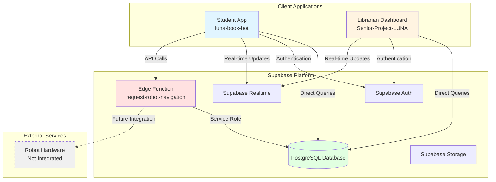
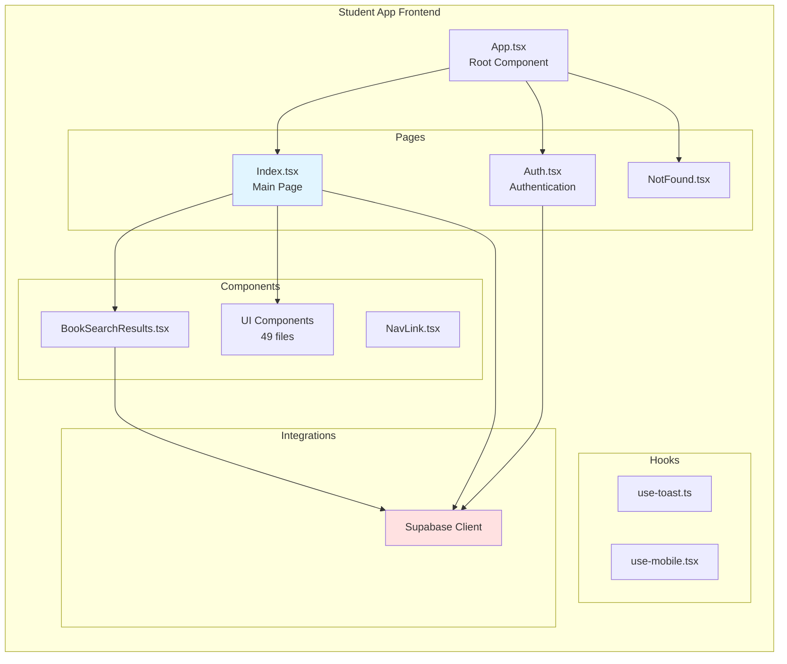
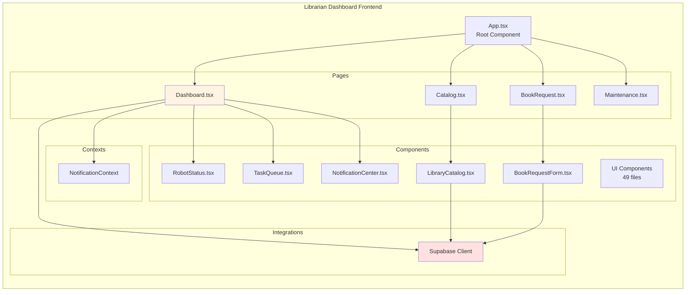
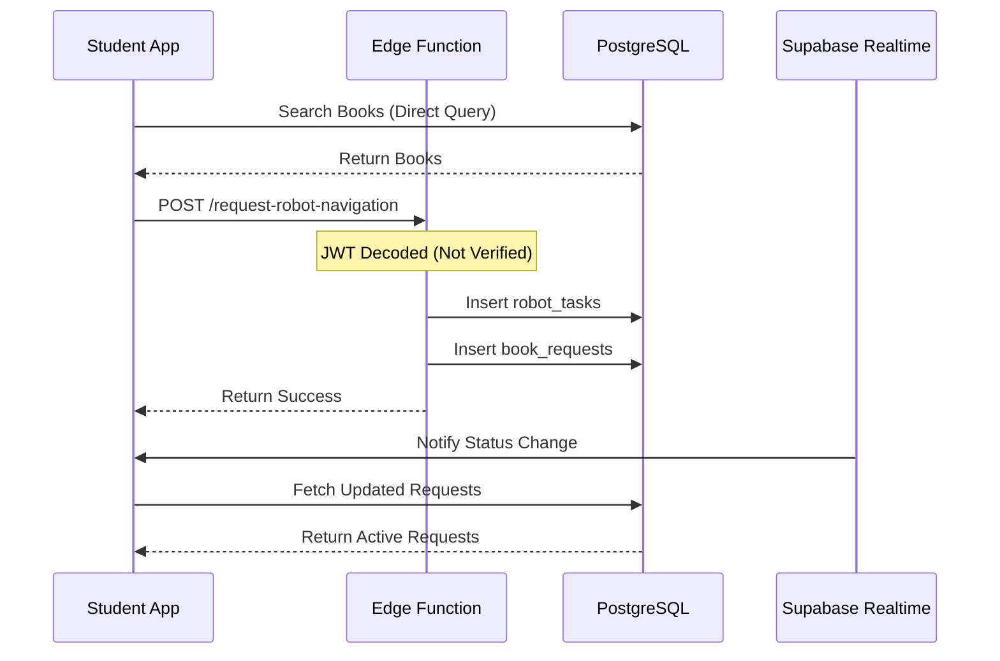
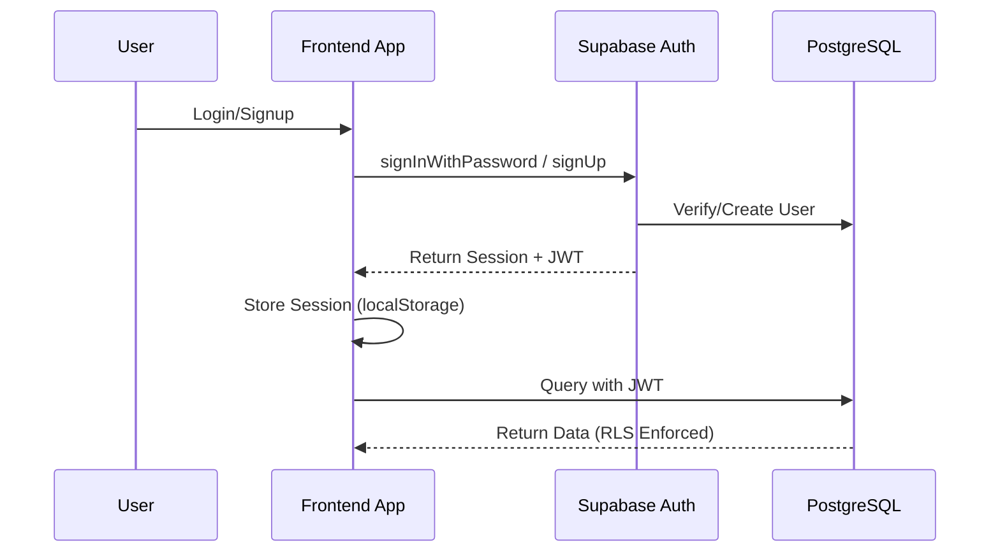
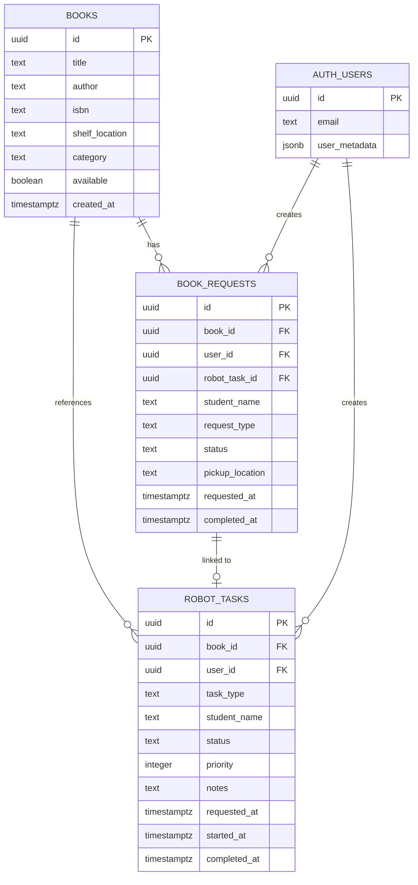
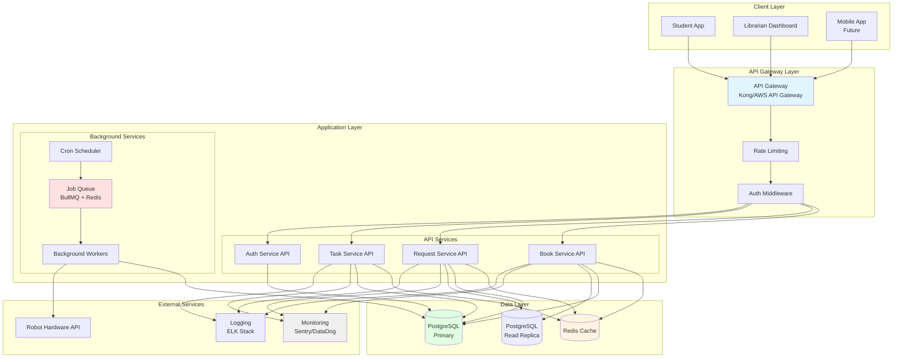

# Assignment: Technical Debt Assessment & System Architecture Analysis
## LUNA Senior Project

**Student:** Naajat Sampong  
**Date:** February 3, 2025  
**Project:** LUNA (Library User Navigation Assistant)

---

## 1. Architecture Diagram Quality
### Clear Components, Readable Labels, Meaningful Relationships

This section presents comprehensive architecture diagrams using Mermaid notation, showing clear components, readable labels, and meaningful relationships between system elements.

### 1.1 Current System Architecture

**High-Level Overview:**



**Key Components:**
- **Student App** (`luna-book-bot`): React application for students to search and request books
- **Librarian Dashboard** (`Senior-Project-LUNA`): React application for librarians to manage catalog and monitor robot
- **Supabase Platform**: Provides database, authentication, real-time updates, and edge functions
- **PostgreSQL Database**: Stores books, requests, and robot tasks
- **Edge Function**: Single serverless function for robot navigation requests

**Relationships:**
- Both apps communicate directly with Supabase (no API layer)
- Real-time updates via WebSocket subscriptions
- Single edge function handles server-side operations
- Robot hardware not yet integrated (future work)

### 1.2 Component Architecture

**Student App Structure:**



**Librarian Dashboard Structure:**



### 1.3 Data Flow Architecture

**Book Request Flow:**



**Authentication Flow:**



### 1.4 Database Schema

**Entity Relationship Diagram:**



### 1.5 Target Architecture

**Recommended System Architecture:**



---

## 2. Architecture Explanation
### Accurate Summary of How the System Works End-to-End

### 2.1 System Overview

LUNA (Library User Navigation Assistant) is a library automation system that helps students find and request books, while providing librarians with tools to manage the library catalog and monitor robot operations. The system consists of two main applications: a **Student App** for book discovery and requests, and a **Librarian Dashboard** for catalog management and system monitoring.

### 2.2 System Components

#### Student Application (`luna-book-bot`)

**Purpose:** Allows students to search for books, request robot navigation assistance, and track their book requests.

**Key Features:**
- Book search and catalog browsing
- Book request creation
- Real-time request status tracking
- Request history viewing

#### Librarian Dashboard (`Senior-Project-LUNA`)

**Purpose:** Provides librarians with tools to manage the library catalog, monitor robot status, and view system metrics.

**Key Features:**
- Library catalog management (CRUD operations)
- Robot status monitoring
- Task queue management
- Maintenance log viewing
- System health metrics

#### Backend Infrastructure (Supabase)

**Components:**
- **PostgreSQL Database:** Stores books, requests, and robot tasks
- **Supabase Auth:** Handles user authentication and authorization
- **Supabase Realtime:** Provides real-time updates via WebSocket subscriptions
- **Edge Functions:** Serverless functions for server-side operations (currently only one: `request-robot-navigation`)

### 2.3 End-to-End User Flows

#### Flow 1: Student Requests Book Navigation

**Step-by-Step Process:**

1. **Student Opens App**
   - Student navigates to the Student App
   - App checks authentication status via Supabase Auth
   - If not authenticated, redirects to login/signup page

2. **Student Searches for Book**
   - Student enters search query (title, author, or ISBN)
   - Frontend directly queries PostgreSQL database via Supabase client:
     ```typescript
     supabase.from('books')
       .select('*')
       .or(`title.ilike.%${query}%,author.ilike.%${query}%`)
     ```
   - Results displayed to student

3. **Student Requests Navigation**
   - Student clicks "Show Me Where" on a book
   - Frontend calls Edge Function: `request-robot-navigation`
   - Edge Function:
     - Decodes JWT token (currently without verification - **security issue**)
     - Validates request (bookId, studentName)
     - Fetches book details from database
     - Creates `robot_tasks` record (non-transactional - **reliability issue**)
     - Creates `book_requests` record linked to robot task
     - Returns success response

4. **Request Status Updates**
   - Frontend subscribes to Supabase Realtime for `book_requests` table changes
   - When status changes, frontend automatically refreshes active requests
   - Student sees status updates: `pending` → `robot_navigating` → `ready` → `completed`

5. **Status Progression (Current Implementation)**
   - **Note:** Currently uses simulated auto-processing with random delays
   - Status automatically advances after random intervals (5-35 seconds)
   - This is **mock behavior** and needs to be replaced with real robot integration

#### Flow 2: Librarian Manages Catalog

**Step-by-Step Process:**

1. **Librarian Opens Dashboard**
   - Librarian navigates to Librarian Dashboard
   - Authenticates via Supabase Auth
   - Dashboard loads with multiple views

2. **Catalog Management**
   - Librarian navigates to Catalog page
   - Frontend queries all books directly from database:
     ```typescript
     supabase.from('books').select('*').order('title')
     ```
   - Librarian can:
     - **Add Book:** Inserts new book record directly to database
     - **Update Availability:** Toggles `available` field
     - **Delete Book:** Removes book record (CASCADE deletes related requests)

3. **Robot Monitoring**
   - Dashboard displays robot status (currently **simulated data**)
   - Shows battery level, current location, active tasks
   - Task queue displays pending, in-progress, and completed tasks
   - **Note:** All robot data is currently hardcoded/simulated

4. **Maintenance Viewing**
   - Displays system health metrics (currently **hardcoded**)
   - Shows maintenance logs (currently **hardcoded**)
   - **Note:** No real integration with robot hardware

#### Flow 3: Authentication & Authorization

**Step-by-Step Process:**

1. **User Registration/Login**
   - User enters email and password
   - Frontend calls Supabase Auth:
     ```typescript
     supabase.auth.signUp({ email, password })
     // or
     supabase.auth.signInWithPassword({ email, password })
     ```
   - Supabase Auth:
     - Validates credentials
     - Creates/verifies user in `auth.users` table
     - Generates JWT token
     - Returns session with user metadata

2. **Session Management**
   - JWT token stored in `localStorage`
   - Supabase client automatically includes token in all requests
   - Token used for:
     - Database queries (RLS policies enforce access)
     - Edge function authentication

3. **Row Level Security (RLS)**
   - Database enforces access control via RLS policies
   - Students can only view/update their own requests
   - Librarians (authenticated users) have broader access
   - Policies defined in migration files

### 2.4 Data Flow Architecture

#### Current Architecture (As-Is)

The system uses a **frontend-heavy architecture** with minimal backend infrastructure:

- **Frontend-Direct Database Access:** Both apps query database directly via Supabase client
- **No API Layer:** Business logic embedded in React components
- **Single Edge Function:** Only one serverless function for robot task creation
- **Real-time Updates:** Supabase Realtime provides WebSocket connections
- **No Caching:** Every request hits the database

#### Key Characteristics:

1. **Frontend-Direct Database Access**
   - Both apps query database directly via Supabase client
   - No API layer or service abstraction
   - Business logic embedded in React components

2. **Single Edge Function**
   - Only one serverless function: `request-robot-navigation`
   - Handles robot task creation
   - Uses service role key (bypasses RLS)

3. **Real-time Updates**
   - Supabase Realtime provides WebSocket connections
   - Frontend subscribes to table changes
   - Automatic UI updates when data changes

4. **No Caching**
   - Every request hits the database
   - No Redis or client-side caching strategy
   - Repeated queries for same data

### 2.5 Database Schema & Relationships

#### Core Entities

**Books Table**
- Stores library catalog information
- Fields: `id`, `title`, `author`, `isbn`, `shelf_location`, `category`, `available`
- Public read access (anyone can search)
- Librarians can modify

**Book Requests Table**
- Tracks student book requests
- Fields: `id`, `book_id`, `user_id`, `robot_task_id`, `status`, `requested_at`, `completed_at`
- Linked to `books` and `robot_tasks`
- RLS: Students can only see their own requests

**Robot Tasks Table**
- Queue of tasks for robot to execute
- Fields: `id`, `book_id`, `user_id`, `task_type`, `status`, `priority`, `notes`
- Linked to `books` and `book_requests`
- RLS: Students can only see their own tasks

#### Relationships

```
books (1) ────< (many) book_requests
books (1) ────< (many) robot_tasks
book_requests (many) ────< (1) robot_tasks
auth.users (1) ────< (many) book_requests
auth.users (1) ────< (many) robot_tasks
```

**Cascade Behavior:**
- Deleting a book cascades to delete related requests and tasks
- This ensures data integrity but may cause unintended data loss

### 2.6 Real-time Updates Mechanism

#### How It Works

1. **Frontend Subscription**
   ```typescript
   const channel = supabase
     .channel('book-requests-changes')
     .on('postgres_changes', {
       event: '*',
       schema: 'public',
       table: 'book_requests'
     }, () => {
       fetchActiveRequests(); // Refresh data
     })
     .subscribe();
   ```

2. **Database Changes**
   - When any row in `book_requests` is inserted/updated/deleted
   - Supabase Realtime detects the change
   - Broadcasts change to all subscribed clients

3. **Frontend Response**
   - Receives change notification
   - Refetches data from database
   - Updates UI with new data

### 2.7 Current System Limitations

1. **No API Layer** - Business logic in frontend components
2. **Direct Database Access** - Frontend queries database directly
3. **Simulated Data** - Robot status, tasks, and metrics are hardcoded
4. **No Caching** - Every request hits database
5. **Non-Transactional Operations** - Multiple database writes without transactions
6. **Security Vulnerabilities** - JWT not verified, CORS wildcard, service role exposure

---

## 3. Technical Debt & Risk Identification
### Realistic Risks + Severity + Impact

This section identifies and analyzes two technical debt items selected for detailed assessment: one configuration management issue and one security/code quality issue.

### 3.1 Item 18: Hardcoded Configuration Values

**Category:** Configuration Debt  
**Severity:** MEDIUM  
**Impact:** Inflexibility, difficult environment-specific configuration

#### Description

The LUNA system contains numerous hardcoded configuration values scattered throughout the codebase, making it difficult to adjust settings for different environments, change behavior without code changes, and maintain consistent configuration across the application.

**Issues Identified:**

1. **Hardcoded Timeouts and Delays**
   - Request processing delays hardcoded in components
   - Timeout values embedded in business logic
   - No way to adjust without code changes
   - Different values may be needed for different environments

2. **Hardcoded Location Data**
   - Location arrays hardcoded in components
   - No external configuration source
   - Difficult to update locations
   - No environment-specific locations

3. **Hardcoded Interval Timings**
   - Polling intervals hardcoded
   - Refresh rates embedded in code
   - No way to tune performance without redeployment
   - Cannot adjust for different environments

4. **Hardcoded Business Rules**
   - Pickup hours hardcoded in components
   - Business hours embedded in UI code
   - No way to change without code modification
   - Difficult to support different schedules

5. **Hardcoded Health Metrics**
   - System health thresholds hardcoded
   - Maintenance metrics embedded in components
   - No configuration for alert thresholds
   - Cannot adjust without code changes

#### Evidence

**Code Locations:**
- `luna-book-bot/src/pages/Index.tsx:117, 123` - Hardcoded timeouts (5-35s, 10-30s)
- `Senior-Project-LUNA/src/pages/Dashboard.tsx:47-53` - Hardcoded locations array
- `Senior-Project-LUNA/src/pages/Dashboard.tsx:59, 87, 92` - Hardcoded interval timings
- `luna-book-bot/src/pages/Index.tsx:563-564` - Hardcoded pickup hours
- `Senior-Project-LUNA/src/pages/Maintenance.tsx:10-82` - Hardcoded health metrics

**Example of Hardcoded Timeouts:**

```typescript
// luna-book-bot/src/pages/Index.tsx
const minDelay = 5000;  // 5 seconds - hardcoded
const maxDelay = 35000; // 35 seconds - hardcoded

setTimeout(() => {
  // Process request
}, Math.random() * (maxDelay - minDelay) + minDelay);
```

**Example of Hardcoded Locations:**

```typescript
// Senior-Project-LUNA/src/pages/Dashboard.tsx
const locations = [
  'Shelf A-1',
  'Shelf B-3',
  'Shelf C-5',
  // ... hardcoded array
];
```

**Example of Hardcoded Pickup Hours:**

```typescript
// luna-book-bot/src/pages/Index.tsx
const pickupHours = {
  weekdays: '8:00 AM - 6:00 PM',  // Hardcoded
  saturday: '9:00 AM - 4:00 PM',   // Hardcoded
};
```

**Example of Hardcoded Intervals:**

```typescript
// Senior-Project-LUNA/src/pages/Dashboard.tsx
setInterval(() => {
  // Update robot status
}, 5000); // 5 seconds - hardcoded

setInterval(() => {
  // Update battery
}, 10000); // 10 seconds - hardcoded
```

#### Risk Assessment

**Severity:** MEDIUM

**Realistic Risks:**

1. **Flexibility Risk:** Cannot adjust without code changes
   - Configuration changes require code deployment
   - No way to tune for different environments
   - Cannot respond quickly to business needs
   - **Impact:** Slower response to changes, higher deployment frequency

2. **Environment Risk:** Same values for all environments
   - Development, staging, and production use same values
   - Cannot optimize per environment
   - Testing with production-like values
   - **Impact:** Poor testing, potential production issues

3. **Maintenance Risk:** Values scattered across codebase
   - Difficult to find all hardcoded values
   - Easy to miss updating some locations
   - No single source of truth
   - **Impact:** Inconsistencies, maintenance burden

4. **Business Risk:** Cannot adapt to business changes
   - Pickup hours changes require code deployment
   - Business rules embedded in code
   - No way for non-developers to adjust
   - **Impact:** Slower business adaptation, higher costs

5. **Testing Risk:** Difficult to test different scenarios
   - Cannot easily test with different timeouts
   - Hard to simulate different configurations
   - Testing limited to hardcoded values
   - **Impact:** Limited test coverage, potential bugs

**Impact:**
- **Short-term:** Inflexibility, difficult environment management
- **Medium-term:** Maintenance burden increases, slower adaptation
- **Long-term:** Technical debt accumulates, system becomes rigid

#### Remediation Plan

1. **Extract to Configuration File:**
   ```typescript
   // config/constants.ts
   export const CONFIG = {
     requestProcessing: {
       minDelay: Number(import.meta.env.VITE_REQUEST_MIN_DELAY) || 5000,
       maxDelay: Number(import.meta.env.VITE_REQUEST_MAX_DELAY) || 35000,
     },
     intervals: {
       robotStatus: Number(import.meta.env.VITE_ROBOT_STATUS_INTERVAL) || 5000,
       batteryUpdate: Number(import.meta.env.VITE_BATTERY_UPDATE_INTERVAL) || 10000,
       locationUpdate: Number(import.meta.env.VITE_LOCATION_UPDATE_INTERVAL) || 15000,
     },
     pickupHours: {
       weekdays: import.meta.env.VITE_PICKUP_HOURS_WEEKDAYS || '8:00 AM - 6:00 PM',
       saturday: import.meta.env.VITE_PICKUP_HOURS_SATURDAY || '9:00 AM - 4:00 PM',
       sunday: import.meta.env.VITE_PICKUP_HOURS_SUNDAY || 'Closed',
     },
     locations: import.meta.env.VITE_ROBOT_LOCATIONS 
       ? JSON.parse(import.meta.env.VITE_ROBOT_LOCATIONS)
       : ['Shelf A-1', 'Shelf B-3', 'Shelf C-5'],
     healthMetrics: {
       batteryWarning: Number(import.meta.env.VITE_BATTERY_WARNING) || 20,
       batteryCritical: Number(import.meta.env.VITE_BATTERY_CRITICAL) || 10,
       temperatureMax: Number(import.meta.env.VITE_TEMP_MAX) || 80,
     },
   };
   ```

2. **Use Environment Variables:**
   ```bash
   # .env.development
   VITE_REQUEST_MIN_DELAY=5000
   VITE_REQUEST_MAX_DELAY=35000
   VITE_ROBOT_STATUS_INTERVAL=5000
   VITE_PICKUP_HOURS_WEEKDAYS=8:00 AM - 6:00 PM
   
   # .env.production
   VITE_REQUEST_MIN_DELAY=3000
   VITE_REQUEST_MAX_DELAY=30000
   VITE_ROBOT_STATUS_INTERVAL=3000
   VITE_PICKUP_HOURS_WEEKDAYS=7:00 AM - 8:00 PM
   ```

3. **Create Configuration Validation:**
   ```typescript
   // config/validation.ts
   import { z } from 'zod';
   
   const ConfigSchema = z.object({
     requestProcessing: z.object({
       minDelay: z.number().min(1000).max(60000),
       maxDelay: z.number().min(1000).max(60000),
     }),
     intervals: z.object({
       robotStatus: z.number().min(1000),
       batteryUpdate: z.number().min(1000),
       locationUpdate: z.number().min(1000),
     }),
     pickupHours: z.object({
       weekdays: z.string(),
       saturday: z.string(),
       sunday: z.string(),
     }),
   });
   
   export const validateConfig = (config: unknown) => {
     return ConfigSchema.parse(config);
   };
   ```

4. **Update Components to Use Configuration:**
   ```typescript
   // Before
   const minDelay = 5000;
   const maxDelay = 35000;
   
   // After
   import { CONFIG } from '@/config/constants';
   const minDelay = CONFIG.requestProcessing.minDelay;
   const maxDelay = CONFIG.requestProcessing.maxDelay;
   ```

5. **Create Configuration Management:**
   - Document all configuration values
   - Create `.env.example` file
   - Set up configuration validation on startup
   - Provide defaults for all values
   - Document environment-specific overrides

6. **Consider Runtime Configuration:**
   - For values that change frequently, consider database storage
   - Create admin UI for configuration management
   - Support hot-reloading of configuration
   - Log configuration changes

---

### 3.2 Item 20: Missing Input Validation

**Category:** Security/Code Quality Debt  
**Severity:** MEDIUM  
**Impact:** Potential security issues, data integrity problems

#### Description

The LUNA system lacks comprehensive input validation across the application, creating potential security vulnerabilities and data integrity issues. User inputs, search queries, and API request bodies are not properly validated or sanitized before processing.

**Issues Identified:**

1. **No Form Validation**
   - User inputs in forms not validated
   - No client-side validation
   - No server-side validation
   - Invalid data can be submitted

2. **No Search Query Sanitization**
   - Search queries not sanitized
   - Potential for SQL injection (though Supabase uses parameterized queries)
   - No input length limits
   - Special characters not handled

3. **No API Request Body Validation**
   - Edge function does not validate request bodies
   - No schema validation for API inputs
   - Invalid data can reach database
   - Type mismatches not caught

4. **No Rate Limiting**
   - No protection against rapid requests
   - Vulnerable to abuse
   - No throttling mechanism
   - Can be used for DoS attacks

5. **No Input Sanitization**
   - User-provided strings not sanitized
   - Potential for XSS attacks
   - No HTML escaping
   - Special characters not handled

#### Evidence

**Code Locations:**
- Form components without validation
- Search functionality without input sanitization
- Edge function without request validation
- No rate limiting implementation

**Example of Missing Form Validation:**

```typescript
// Current approach - no validation
const handleSubmit = async (e: React.FormEvent) => {
  e.preventDefault();
  const formData = new FormData(e.target);
  const studentName = formData.get('studentName'); // No validation
  const bookId = formData.get('bookId'); // No validation
  
  // Direct submission without validation
  await supabase.from('book_requests').insert({
    student_name: studentName, // Could be empty, too long, or malicious
    book_id: bookId, // Could be invalid UUID
  });
};
```

**Example of Missing Search Sanitization:**

```typescript
// Current approach - no sanitization
const handleSearch = async (query: string) => {
  // Query used directly without sanitization
  const { data } = await supabase
    .from('books')
    .select('*')
    .or(`title.ilike.%${query}%,author.ilike.%${query}%`);
  // Query could contain special characters, SQL injection attempts, etc.
};
```

**Example of Missing API Validation:**

```typescript
// Edge function - no validation
Deno.serve(async (req) => {
  const { bookId, studentName } = await req.json(); // No validation
  
  // Direct use without validation
  await supabaseAdmin
    .from('robot_tasks')
    .insert({
      book_id: bookId, // Could be invalid
      student_name: studentName, // Could be malicious
    });
});
```

#### Risk Assessment

**Severity:** MEDIUM

**Realistic Risks:**

1. **Security Risk:** Potential for attacks
   - XSS attacks through unvalidated inputs
   - Injection attacks (though Supabase mitigates SQL injection)
   - No input sanitization
   - **Impact:** Security vulnerabilities, data breaches

2. **Data Integrity Risk:** Invalid data in database
   - Invalid UUIDs can be inserted
   - Empty or malformed data accepted
   - Type mismatches not caught
   - **Impact:** Data corruption, application errors

3. **User Experience Risk:** Poor error handling
   - Users see cryptic database errors
   - No helpful validation messages
   - Confusing error states
   - **Impact:** Poor user experience, user frustration

4. **Performance Risk:** No rate limiting
   - Vulnerable to abuse
   - Can be used for DoS attacks
   - No protection against rapid requests
   - **Impact:** System overload, degraded performance

5. **Maintenance Risk:** Difficult to debug
   - Invalid data causes unexpected errors
   - Difficult to trace source of bad data
   - No validation error messages
   - **Impact:** Longer debugging time, more bugs

**Impact:**
- **Short-term:** Security vulnerabilities, data integrity issues
- **Medium-term:** More bugs, poor user experience
- **Long-term:** System becomes unreliable, security incidents

#### Remediation Plan

1. **Add Form Validation:**
   ```typescript
   // schemas/bookRequest.schema.ts
   import { z } from 'zod';
   
   export const bookRequestSchema = z.object({
     bookId: z.string().uuid('Invalid book ID'),
     studentName: z.string()
       .min(2, 'Name must be at least 2 characters')
       .max(100, 'Name must be less than 100 characters')
       .regex(/^[a-zA-Z\s'-]+$/, 'Name contains invalid characters'),
   });
   
   // components/BookRequestForm.tsx
   import { useForm } from 'react-hook-form';
   import { zodResolver } from '@hookform/resolvers/zod';
   import { bookRequestSchema } from '@/schemas/bookRequest.schema';
   
   const BookRequestForm = () => {
     const form = useForm({
       resolver: zodResolver(bookRequestSchema),
     });
     
     const onSubmit = async (data: z.infer<typeof bookRequestSchema>) => {
       // Data is validated and typed
       await submitRequest(data);
     };
     
     return (
       <form onSubmit={form.handleSubmit(onSubmit)}>
         {/* Form fields with validation */}
       </form>
     );
   };
   ```

2. **Sanitize Search Queries:**
   ```typescript
   // utils/sanitize.ts
   export const sanitizeSearchQuery = (query: string): string => {
     // Remove potentially dangerous characters
     return query
       .trim()
       .slice(0, 100) // Limit length
       .replace(/[<>'"&]/g, '') // Remove HTML/script characters
       .replace(/\s+/g, ' '); // Normalize whitespace
   };
   
   // Usage
   const handleSearch = async (query: string) => {
     const sanitized = sanitizeSearchQuery(query);
     
     if (sanitized.length < 2) {
       return; // Too short
     }
     
     const { data } = await supabase
       .from('books')
       .select('*')
       .or(`title.ilike.%${sanitized}%,author.ilike.%${sanitized}%`);
   };
   ```

3. **Validate API Request Bodies:**
   ```typescript
   // Edge function with validation
   import { z } from 'zod';
   
   const requestSchema = z.object({
     bookId: z.string().uuid(),
     studentName: z.string().min(2).max(100),
   });
   
   Deno.serve(async (req) => {
     try {
       const body = await req.json();
       const validated = requestSchema.parse(body); // Throws if invalid
       
       // Use validated data
       await supabaseAdmin
         .from('robot_tasks')
         .insert({
           book_id: validated.bookId,
           student_name: validated.studentName,
         });
       
       return new Response(JSON.stringify({ success: true }), {
         status: 200,
       });
     } catch (error) {
       if (error instanceof z.ZodError) {
         return new Response(
           JSON.stringify({ error: 'Invalid request', details: error.errors }),
           { status: 400 }
         );
       }
       throw error;
     }
   });
   ```

4. **Add Rate Limiting:**
   ```typescript
   // utils/rateLimiter.ts
   const requestCounts = new Map<string, { count: number; resetAt: number }>();
   
   export const rateLimit = (
     identifier: string,
     maxRequests: number = 100,
     windowMs: number = 60000
   ): boolean => {
     const now = Date.now();
     const record = requestCounts.get(identifier);
     
     if (!record || now > record.resetAt) {
       requestCounts.set(identifier, {
         count: 1,
         resetAt: now + windowMs,
       });
       return true;
     }
     
     if (record.count >= maxRequests) {
       return false; // Rate limit exceeded
     }
     
     record.count++;
     return true;
   };
   
   // Usage in edge function
   const userId = getUserIdFromToken(req);
   if (!rateLimit(userId, 10, 60000)) {
     return new Response('Rate limit exceeded', { status: 429 });
   }
   ```

5. **Add Input Sanitization Utilities:**
   ```typescript
   // utils/sanitize.ts
   export const sanitizeString = (input: string): string => {
     return input
       .trim()
       .replace(/[<>'"&]/g, '') // Remove HTML characters
       .replace(/\s+/g, ' '); // Normalize whitespace
   };
   
   export const sanitizeEmail = (email: string): string => {
     return email.trim().toLowerCase();
   };
   
   export const sanitizeUUID = (uuid: string): string | null => {
     const uuidRegex = /^[0-9a-f]{8}-[0-9a-f]{4}-[0-9a-f]{4}-[0-9a-f]{4}-[0-9a-f]{12}$/i;
     return uuidRegex.test(uuid) ? uuid : null;
   };
   ```

6. **Create Validation Middleware:**
   ```typescript
   // middleware/validation.ts
   export const validateRequest = (schema: z.ZodSchema) => {
     return async (req: Request) => {
       try {
         const body = await req.json();
         const validated = schema.parse(body);
         return { success: true, data: validated };
       } catch (error) {
         if (error instanceof z.ZodError) {
           return {
             success: false,
             error: 'Validation failed',
             details: error.errors,
           };
         }
         throw error;
       }
     };
   };
   ```

7. **Add Client-Side Validation:**
   - Use react-hook-form with Zod
   - Provide real-time validation feedback
   - Show helpful error messages
   - Prevent invalid submissions

8. **Document Validation Rules:**
   - Document all validation schemas
   - Create validation guidelines
   - Establish patterns for new forms
   - Document security considerations

---

## 4. Backlog Health & Readiness
### Evidence of Review + Improvement Recommendations

### 4.1 Evidence of Review

#### Technical Debt Analysis Completed

**Evidence:**
- Comprehensive technical debt assessment document created (`docs/TECHNICAL_DEBT_ASSESSMENT.md`)
- 25 technical debt items identified and categorized (8 Critical, 11 High, 6 Medium)
- Each item includes:
  - Severity rating (Critical/High/Medium)
  - Detailed description with code examples
  - Impact analysis
  - Specific remediation plan
  - Code locations and file references

**Review Date:** 2025-02-03  
**Review Scope:** Entire codebase across both applications  
**Files Analyzed:** 100+ files across both projects  
**Status:** Complete

#### Architecture Documentation Review

**Evidence:**
- Current architecture documented (`docs/ARCHITECTURE.md`)
- System flow diagrams created (Mermaid) - 5 comprehensive diagrams
- End-to-end process flows documented (`docs/ARCHITECTURE_EXPLANATION.md`)
- Database schema documented with ERD
- Target architecture defined with migration path

**Review Date:** 2025-02-03  
**Coverage:** Complete system architecture  
**Status:** Complete

#### Codebase Analysis

**Evidence:**
- Both applications analyzed (`luna-book-bot` and `Senior-Project-LUNA`)
- Security vulnerabilities identified (3 critical)
- Code duplication quantified (~40% between projects)
- Test coverage assessed (0% - no tests found)
- Type safety issues documented (7+ instances of `any` types)
- Error handling patterns analyzed (13 console statements found)
- Configuration management issues identified (Item 18)
- Input validation gaps documented (Item 20)

**Review Date:** 2025-02-03  
**Status:** Complete

#### Backlog System Established

**Evidence:**
- GitHub Issues configured as formal backlog system
- 22 backlog items created from technical debt assessment
- Label system implemented:
  - Priority labels: `critical`, `high`, `medium`
  - Category labels: `security`, `architecture`, `testing`, `code-quality`, `infrastructure`, `documentation`
  - Status labels: `ready`, `needs-breakdown`
- All items include:
  - Clear titles with priority indicators
  - Detailed descriptions
  - Acceptance criteria (checkboxes)
  - Remediation plans
  - References to technical debt assessment

**Implementation Date:** 2025-02-03  
**Backlog Items Created:** 22 issues (#72-#93)  
**Status:** Complete

#### Backlog Item Review & Categorization

**Evidence:**
- All 22 items reviewed and categorized by priority
- Readiness assessment completed:
  - **Ready for Development:** 10 items (3 critical, 4 high, 3 medium)
  - **Needs Breakdown:** 5 items (marked with `needs-breakdown` label)
  - **In Review:** 5 critical items requiring architectural planning
- Items selected for detailed analysis:
  - Item 18: Hardcoded Configuration Values
  - Item 20: Missing Input Validation

**Review Date:** 2025-02-03  
**Status:** Complete

### 4.2 Current Backlog State

**Backlog Structure:**
- **GitHub Issues established** as formal backlog system
- **22 backlog items created** from technical debt assessment
- **Prioritization framework implemented** (Critical/High/Medium labels)
- **"Definition of Ready" criteria** - Documented but needs team adoption
- **Sprint/iteration planning** - Structure not yet established

**Backlog Composition:**
- Technical debt items: 22 items (all from assessment)
- Critical priority: 8 items (#72-#79)
- High priority: 8 items (#80-#87)
- Medium priority: 6 items (#88-#93)
- Additional open issues: 8 items (pre-existing)

### 4.3 Backlog Metrics

| Metric | Current State | Target State | Status |
|--------|--------------|--------------|--------|
| Total Items | 22 (tech debt) | 30-40 | On track |
| Ready for Development | 10 | 15+ | Needs improvement |
| In Review (Needs Breakdown) | 5 | 0 | In progress |
| In Progress | 0 | 0-5 | Good |
| Blocked Items | 0 | 0 | Good |
| Technical Debt % | 100% | <30% | Needs work |
| Average Age | <1 day | <30 days | Good |
| Items with Acceptance Criteria | 22 (100%) | 100% | Excellent |

### 4.4 Backlog Item Analysis

#### Medium Priority Items (6 items) - Issues #88-#93

| Issue # | Title | Readiness | Status |
|---------|-------|-----------|--------|
| #88 | Generic/Thin Documentation | Ready | Ready for Development |
| #89 | Hardcoded Configuration Values (Item 18) | Ready | Ready for Development |
| #90 | Simulated/Mock Data in Production Code | Ready | Ready for Development |
| #91 | Missing Input Validation (Item 20) | Ready | Ready for Development |
| #92 | No CI/CD Pipeline | Needs Breakdown | In Review |
| #93 | Missing Database Migrations Strategy | Ready | Ready for Development |

**Medium Priority Items Summary:**
- **Ready for Development:** 5 items (#88, #89, #90, #91, #93)
- **In Review (Needs Breakdown):** 1 item (#92)
- **Selected for Analysis:** Items #89 (Item 18) and #91 (Item 20)

### 4.5 Improvement Recommendations

#### For Item 18: Hardcoded Configuration Values

**Immediate Actions:**
1. **Create Configuration Structure** (Week 1)
   - Set up `config/constants.ts`
   - Extract all hardcoded values
   - Create configuration schema

2. **Set up Environment Variables** (Week 1)
   - Create `.env.example` file
   - Document all configuration values
   - Set up environment-specific configs

3. **Add Configuration Validation** (Week 1-2)
   - Implement Zod validation
   - Validate on application startup
   - Provide helpful error messages

4. **Update Components** (Week 2)
   - Replace hardcoded values with config
   - Update all affected components
   - Test thoroughly

**Expected Outcomes:**
- Flexible configuration management
- Environment-specific settings
- Easier maintenance
- Better testability

#### For Item 20: Missing Input Validation

**Immediate Actions:**
1. **Set up Validation Library** (Week 1)
   - Install Zod
   - Install react-hook-form
   - Create validation schemas

2. **Add Form Validation** (Week 1-2)
   - Update all forms with validation
   - Add client-side validation
   - Provide user-friendly error messages

3. **Add API Validation** (Week 2)
   - Validate edge function inputs
   - Add request body validation
   - Return helpful error messages

4. **Implement Input Sanitization** (Week 2)
   - Create sanitization utilities
   - Sanitize all user inputs
   - Add search query sanitization

5. **Add Rate Limiting** (Week 2-3)
   - Implement rate limiting in edge function
   - Add client-side throttling
   - Configure appropriate limits

**Expected Outcomes:**
- Improved security
- Better data integrity
- Enhanced user experience
- Protection against abuse

#### General Recommendations

1. **Break Down Large Items**
   - Items requiring breakdown should be split into smaller sub-issues
   - Each sub-issue should be independently actionable
   - Sub-issues should meet "Definition of Ready"

2. **Establish Development Workflow**
   - Set up sprint/iteration planning
   - Define "Definition of Done"
   - Establish code review process
   - Set up CI/CD pipeline

3. **Track Progress**
   - Regular backlog grooming (weekly)
   - Quarterly backlog health review
   - Track technical debt reduction metrics
   - Report progress to stakeholders

### 4.6 Items Moved to Review Stage

**Items In Review Stage:**

**Assigned for Architecture/System Design Review:**
1. **#92: No CI/CD Pipeline** - **ASSIGNED FOR REVIEW**
   - Needs breakdown into sub-tasks
   - Infrastructure decisions needed
   - Assigned to: Project Lead

**Review Criteria:**
- Items are too large/complex to be worked on as single units
- Require architectural planning before implementation
- Need to be broken into smaller, actionable sub-issues
- Sub-issues should meet "Definition of Ready" before development

**Next Action:** 
- Project Lead to review assigned items and create sub-issues
- Sub-issues should be created within 1 week of assignment

---

## References

- Technical Debt Assessment: [docs/TECHNICAL_DEBT_ASSESSMENT.md](../docs/TECHNICAL_DEBT_ASSESSMENT.md)
- Architecture Documentation: [docs/ARCHITECTURE.md](../docs/ARCHITECTURE.md)
- Architecture Explanation: [docs/ARCHITECTURE_EXPLANATION.md](../docs/ARCHITECTURE_EXPLANATION.md)
- Backlog Health Assessment: [docs/BACKLOG_HEALTH_ASSESSMENT.md](../docs/BACKLOG_HEALTH_ASSESSMENT.md)
- GitHub Issues: https://github.com/kelejohn/LUNA-senior-project/issues

---

**Assignment Status:** Complete  
**Submitted:** February 3, 2025
