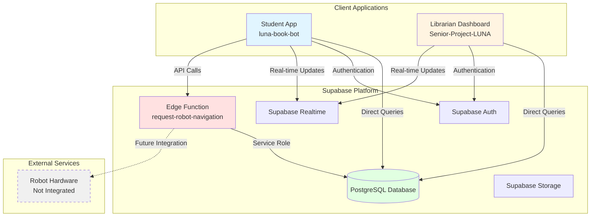
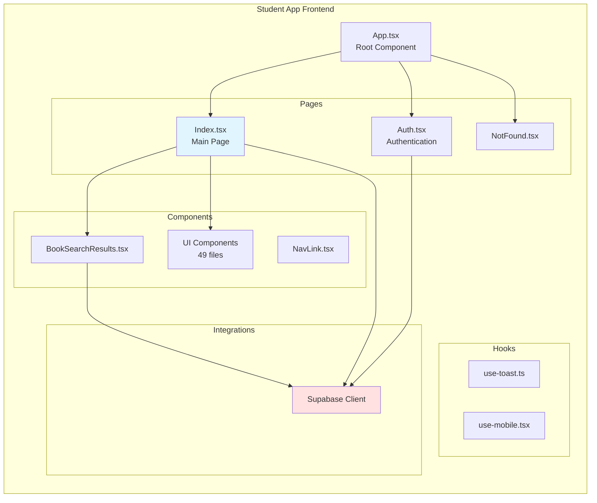
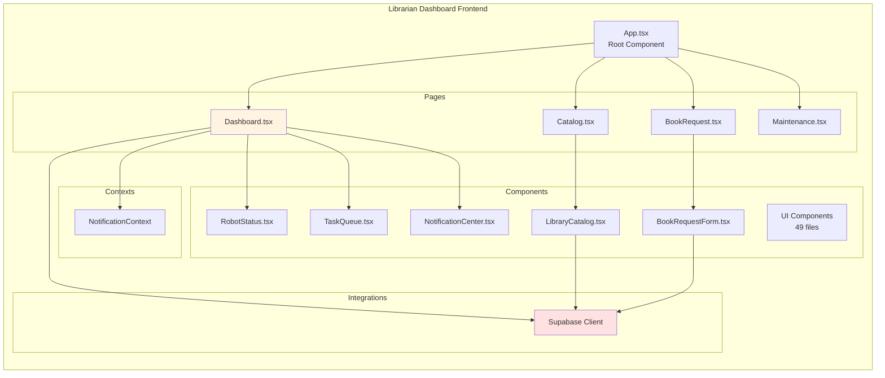
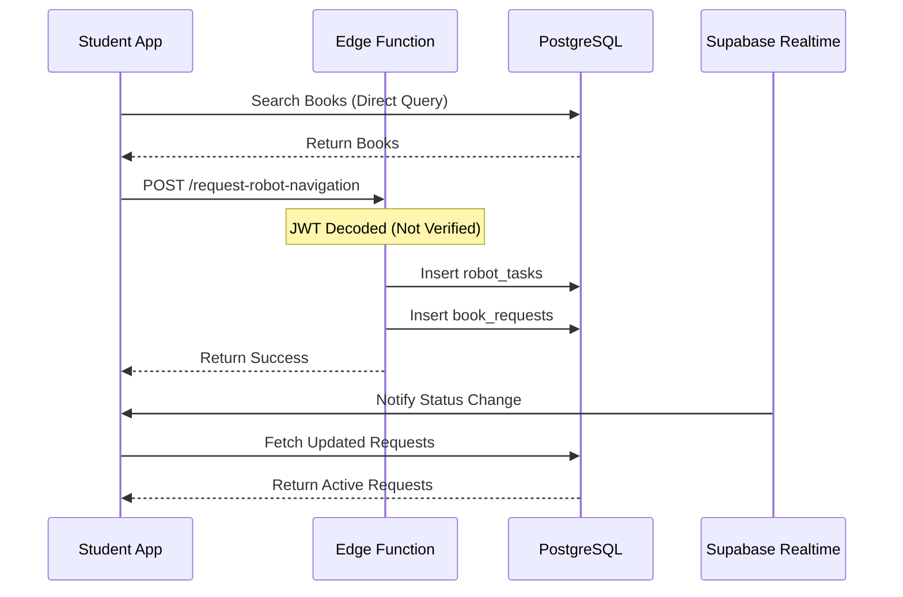
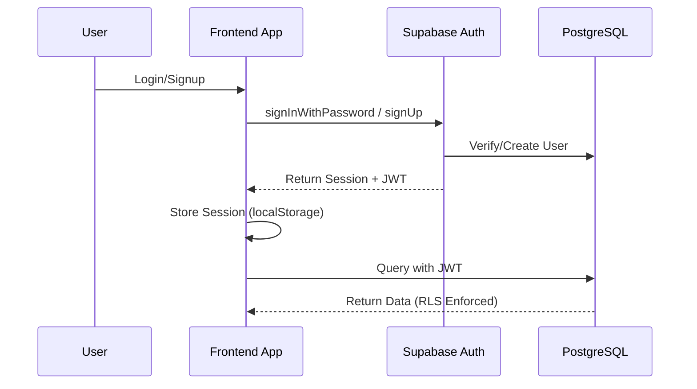
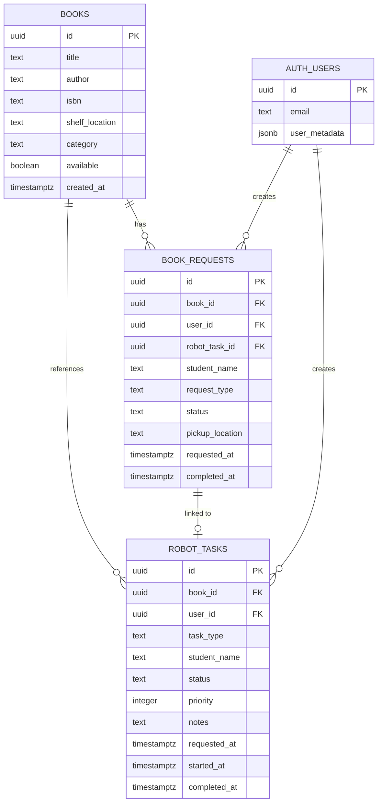
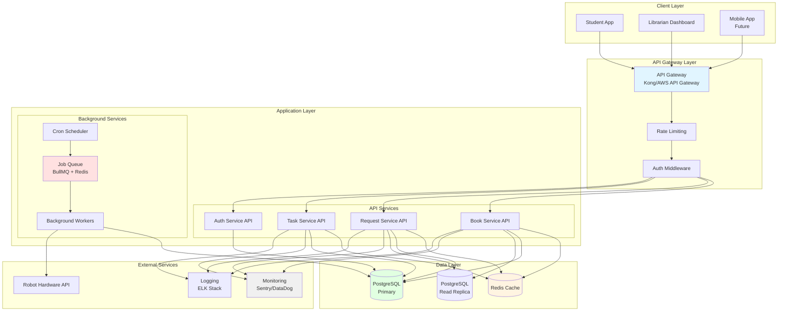

# Team Submission: Technical Debt Assessment & System Architecture Analysis
## LUNA Senior Project

**Team Members:** 5 Developers  
**Date:** February 3, 2025  
**Project:** LUNA (Library User Navigation Assistant)

---

## 1. Architecture Diagram Quality
### Clear Components, Readable Labels, Meaningful Relationships

This section presents comprehensive architecture diagrams using Mermaid notation, showing clear components, readable labels, and meaningful relationships between system elements.

### 1.1 Current System Architecture

**High-Level Overview:**



**Key Components:**
- **Student App** (`luna-book-bot`): React application for students to search and request books
- **Librarian Dashboard** (`Senior-Project-LUNA`): React application for librarians to manage catalog and monitor robot
- **Supabase Platform**: Provides database, authentication, real-time updates, and edge functions
- **PostgreSQL Database**: Stores books, requests, and robot tasks
- **Edge Function**: Single serverless function for robot navigation requests

**Relationships:**
- Both apps communicate directly with Supabase (no API layer)
- Real-time updates via WebSocket subscriptions
- Single edge function handles server-side operations
- Robot hardware not yet integrated (future work)

### 1.2 Component Architecture

**Student App Structure:**



**Librarian Dashboard Structure:**



### 1.3 Data Flow Architecture

**Book Request Flow:**



**Authentication Flow:**



### 1.4 Database Schema

**Entity Relationship Diagram:**



### 1.5 Target Architecture

**Recommended System Architecture:**



---

## 2. Architecture Explanation
### Accurate Summary of How the System Works End-to-End

### 2.1 System Overview

LUNA (Library User Navigation Assistant) is a library automation system that helps students find and request books, while providing librarians with tools to manage the library catalog and monitor robot operations. The system consists of two main applications: a **Student App** for book discovery and requests, and a **Librarian Dashboard** for catalog management and system monitoring.

### 2.2 System Components

#### Student Application (`luna-book-bot`)

**Purpose:** Allows students to search for books, request robot navigation assistance, and track their book requests.

**Key Features:**
- Book search and catalog browsing
- Book request creation
- Real-time request status tracking
- Request history viewing

#### Librarian Dashboard (`Senior-Project-LUNA`)

**Purpose:** Provides librarians with tools to manage the library catalog, monitor robot status, and view system metrics.

**Key Features:**
- Library catalog management (CRUD operations)
- Robot status monitoring
- Task queue management
- Maintenance log viewing
- System health metrics

#### Backend Infrastructure (Supabase)

**Components:**
- **PostgreSQL Database:** Stores books, requests, and robot tasks
- **Supabase Auth:** Handles user authentication and authorization
- **Supabase Realtime:** Provides real-time updates via WebSocket subscriptions
- **Edge Functions:** Serverless functions for server-side operations (currently only one: `request-robot-navigation`)

### 2.3 End-to-End User Flows

#### Flow 1: Student Requests Book Navigation

**Step-by-Step Process:**

1. **Student Opens App**
   - Student navigates to the Student App
   - App checks authentication status via Supabase Auth
   - If not authenticated, redirects to login/signup page

2. **Student Searches for Book**
   - Student enters search query (title, author, or ISBN)
   - Frontend directly queries PostgreSQL database via Supabase client:
     ```typescript
     supabase.from('books')
       .select('*')
       .or(`title.ilike.%${query}%,author.ilike.%${query}%`)
     ```
   - Results displayed to student

3. **Student Requests Navigation**
   - Student clicks "Show Me Where" on a book
   - Frontend calls Edge Function: `request-robot-navigation`
   - Edge Function:
     - Decodes JWT token (currently without verification - **security issue**)
     - Validates request (bookId, studentName)
     - Fetches book details from database
     - Creates `robot_tasks` record (non-transactional - **reliability issue**)
     - Creates `book_requests` record linked to robot task
     - Returns success response

4. **Request Status Updates**
   - Frontend subscribes to Supabase Realtime for `book_requests` table changes
   - When status changes, frontend automatically refreshes active requests
   - Student sees status updates: `pending` → `robot_navigating` → `ready` → `completed`

5. **Status Progression (Current Implementation)**
   - **Note:** Currently uses simulated auto-processing with random delays
   - Status automatically advances after random intervals (5-35 seconds)
   - This is **mock behavior** and needs to be replaced with real robot integration

#### Flow 2: Librarian Manages Catalog

**Step-by-Step Process:**

1. **Librarian Opens Dashboard**
   - Librarian navigates to Librarian Dashboard
   - Authenticates via Supabase Auth
   - Dashboard loads with multiple views

2. **Catalog Management**
   - Librarian navigates to Catalog page
   - Frontend queries all books directly from database:
     ```typescript
     supabase.from('books').select('*').order('title')
     ```
   - Librarian can:
     - **Add Book:** Inserts new book record directly to database
     - **Update Availability:** Toggles `available` field
     - **Delete Book:** Removes book record (CASCADE deletes related requests)

3. **Robot Monitoring**
   - Dashboard displays robot status (currently **simulated data**)
   - Shows battery level, current location, active tasks
   - Task queue displays pending, in-progress, and completed tasks
   - **Note:** All robot data is currently hardcoded/simulated

4. **Maintenance Viewing**
   - Displays system health metrics (currently **hardcoded**)
   - Shows maintenance logs (currently **hardcoded**)
   - **Note:** No real integration with robot hardware

#### Flow 3: Authentication & Authorization

**Step-by-Step Process:**

1. **User Registration/Login**
   - User enters email and password
   - Frontend calls Supabase Auth:
     ```typescript
     supabase.auth.signUp({ email, password })
     // or
     supabase.auth.signInWithPassword({ email, password })
     ```
   - Supabase Auth:
     - Validates credentials
     - Creates/verifies user in `auth.users` table
     - Generates JWT token
     - Returns session with user metadata

2. **Session Management**
   - JWT token stored in `localStorage`
   - Supabase client automatically includes token in all requests
   - Token used for:
     - Database queries (RLS policies enforce access)
     - Edge function authentication

3. **Row Level Security (RLS)**
   - Database enforces access control via RLS policies
   - Students can only view/update their own requests
   - Librarians (authenticated users) have broader access
   - Policies defined in migration files

### 2.4 Data Flow Architecture

#### Current Architecture (As-Is)

The system uses a **frontend-heavy architecture** with minimal backend infrastructure:

- **Frontend-Direct Database Access:** Both apps query database directly via Supabase client
- **No API Layer:** Business logic embedded in React components
- **Single Edge Function:** Only one serverless function for robot task creation
- **Real-time Updates:** Supabase Realtime provides WebSocket connections
- **No Caching:** Every request hits the database

#### Key Characteristics:

1. **Frontend-Direct Database Access**
   - Both apps query database directly via Supabase client
   - No API layer or service abstraction
   - Business logic embedded in React components

2. **Single Edge Function**
   - Only one serverless function: `request-robot-navigation`
   - Handles robot task creation
   - Uses service role key (bypasses RLS)

3. **Real-time Updates**
   - Supabase Realtime provides WebSocket connections
   - Frontend subscribes to table changes
   - Automatic UI updates when data changes

4. **No Caching**
   - Every request hits the database
   - No Redis or client-side caching strategy
   - Repeated queries for same data

### 2.5 Database Schema & Relationships

#### Core Entities

**Books Table**
- Stores library catalog information
- Fields: `id`, `title`, `author`, `isbn`, `shelf_location`, `category`, `available`
- Public read access (anyone can search)
- Librarians can modify

**Book Requests Table**
- Tracks student book requests
- Fields: `id`, `book_id`, `user_id`, `robot_task_id`, `status`, `requested_at`, `completed_at`
- Linked to `books` and `robot_tasks`
- RLS: Students can only see their own requests

**Robot Tasks Table**
- Queue of tasks for robot to execute
- Fields: `id`, `book_id`, `user_id`, `task_type`, `status`, `priority`, `notes`
- Linked to `books` and `book_requests`
- RLS: Students can only see their own tasks

#### Relationships

```
books (1) ────< (many) book_requests
books (1) ────< (many) robot_tasks
book_requests (many) ────< (1) robot_tasks
auth.users (1) ────< (many) book_requests
auth.users (1) ────< (many) robot_tasks
```

**Cascade Behavior:**
- Deleting a book cascades to delete related requests and tasks
- This ensures data integrity but may cause unintended data loss

### 2.6 Real-time Updates Mechanism

#### How It Works

1. **Frontend Subscription**
   ```typescript
   const channel = supabase
     .channel('book-requests-changes')
     .on('postgres_changes', {
       event: '*',
       schema: 'public',
       table: 'book_requests'
     }, () => {
       fetchActiveRequests(); // Refresh data
     })
     .subscribe();
   ```

2. **Database Changes**
   - When any row in `book_requests` is inserted/updated/deleted
   - Supabase Realtime detects the change
   - Broadcasts change to all subscribed clients

3. **Frontend Response**
   - Receives change notification
   - Refetches data from database
   - Updates UI with new data

### 2.7 Current System Limitations

1. **No API Layer** - Business logic in frontend components
2. **Direct Database Access** - Frontend queries database directly
3. **Simulated Data** - Robot status, tasks, and metrics are hardcoded
4. **No Caching** - Every request hits database
5. **Non-Transactional Operations** - Multiple database writes without transactions
6. **Security Vulnerabilities** - JWT not verified, CORS wildcard, service role exposure

---

## 3. Technical Debt & Risk Identification
### Realistic Risks + Severity + Impact

This section identifies and analyzes all technical debt items found in the LUNA system, categorized by severity and impact.

### 3.1 Critical Priority Issues (8 items)

#### Item 1: Edge Function Security Vulnerabilities

**Category:** Security Risk  
**Severity:** CRITICAL  
**Impact:** Unauthorized data access, data integrity compromise, potential data breach

**Location:** `luna-book-bot/supabase/functions/request-robot-navigation/index.ts`

**Issues:**

1. **JWT Decoded Without Verification**
   - JWT is base64 decoded without cryptographic signature verification
   - Risk: Attacker can forge JWT with any `sub` claim to impersonate users
   - Impact: Unauthorized task/request creation, potential privilege escalation

2. **CORS Allows Any Origin**
   - Wildcard CORS policy (`'Access-Control-Allow-Origin': '*'`)
   - Risk: Any website can call this function, enabling CSRF attacks
   - Impact: Malicious sites can trigger robot tasks on behalf of authenticated users

3. **Service Role Key Exposure Risk**
   - Service role key used with minimal validation
   - Risk: If environment variable leaks or function is compromised, full database access
   - Impact: Complete database compromise, ability to read/write any data

**Remediation Plan:**
1. Verify JWT properly using Supabase's `verifyJWT` or `getUser()` method
2. Restrict CORS to specific origins
3. Use Row Level Security (RLS) policies instead of service role where possible
4. Add rate limiting to prevent abuse
5. Implement request validation and sanitization
6. Add audit logging for security events

---

#### Item 2: Non-Transactional Multi-Write Operations

**Category:** Reliability Risk  
**Severity:** CRITICAL  
**Impact:** Data inconsistency, orphaned records, system state corruption

**Location:** `luna-book-bot/supabase/functions/request-robot-navigation/index.ts:79-122`

**Issue:**
- Two separate inserts without transaction
- If `book_requests` insert fails after `robot_tasks` succeeds, orphaned task record remains
- Database state becomes inconsistent
- No cleanup mechanism for orphaned records

**Remediation Plan:**
1. Use database transactions (PostgreSQL `BEGIN/COMMIT/ROLLBACK`)
2. Create Supabase RPC function for atomic operations
3. Implement cleanup job to remove orphaned records
4. Add database constraints (foreign keys with CASCADE)

---

#### Item 3: Missing Environment Variable Protection

**Category:** Security Risk  
**Severity:** CRITICAL  
**Impact:** Secrets leakage, accidental exposure of credentials

**Issues:**
1. `.gitignore` does NOT exclude `.env` files
2. No environment variable validation
3. Application fails silently or with cryptic errors if env vars missing

**Remediation Plan:**
1. Update `.gitignore` to exclude `.env` files
2. Add runtime validation for required environment variables
3. Create `.env.example` files documenting required variables
4. Use environment variable validation library (e.g., `zod` for env validation)

---

#### Item 4: No Test Infrastructure

**Category:** Test Debt  
**Severity:** CRITICAL  
**Impact:** No confidence in changes, regression risk, difficult refactoring

**Evidence:**
- No test files (`*.test.*`, `*.spec.*`) found
- No test scripts in `package.json`
- No testing dependencies (Vitest, Jest, React Testing Library)
- No test coverage tools
- No CI/CD pipeline for automated testing

**Remediation Plan:**
1. Add Vitest + React Testing Library
2. Start with critical paths (unit tests for hooks/utilities, integration tests for authentication flow)
3. Set coverage targets: Minimum 70% for critical paths
4. Add CI/CD: Run tests on every PR

---

#### Item 5: Missing Backend Architecture

**Category:** Architectural Debt  
**Severity:** CRITICAL  
**Impact:** Not scalable, difficult to maintain, no separation of concerns

**Issues Identified:**

1. **No Proper API Layer**
   - Single edge function, all business logic in frontend
   - No REST API structure (`/api/v1/...`)
   - No API versioning

2. **No Middleware Pipeline**
   - Missing: Request validation, authentication/authorization, error handling, logging, rate limiting middleware

3. **No Background Job Processing**
   - Missing: Job queue system, scheduled tasks/cron jobs, async task processing, retry mechanisms

4. **No Service Layer Architecture**
   - Direct Supabase calls from components
   - Business logic mixed with UI code
   - No repository pattern for data access

**Remediation Plan:**
1. Create proper backend API structure with versioning
2. Implement middleware pipeline (auth, validation, error handling, logging, rate limiting)
3. Add background job processing (BullMQ with Redis)
4. Implement service layer with repository pattern

---

#### Item 6: Scalability Limitations

**Category:** Scalability Debt  
**Severity:** CRITICAL  
**Impact:** System cannot handle growth, performance degradation under load

**Issues Identified:**

1. **No Caching Layer**
   - No Redis or similar caching solution
   - No query result caching
   - Frequent database queries for same data

2. **No Load Balancing Strategy**
   - Single edge function, no load balancing
   - Cannot scale horizontally
   - Single point of failure

3. **Database Performance Issues**
   - Limited indexing (only basic indexes)
   - Missing composite indexes for common queries
   - No full-text search indexes
   - No read replicas (single database instance)

4. **No Horizontal Scaling Architecture**
   - Monolithic edge function design
   - No microservices architecture
   - No API gateway

**Remediation Plan:**
1. Implement caching (React Query for client-side, Redis for server-side)
2. Add database optimizations (composite indexes, full-text search indexes, partial indexes)
3. Set up read replicas
4. Implement API Gateway with load balancing
5. Add monitoring and observability

---

#### Item 7: Duplicate Projects Without Shared Core

**Category:** Architectural Debt  
**Severity:** CRITICAL  
**Impact:** Maintenance burden, inconsistency, bugs multiply across projects

**Evidence:**
- Two parallel apps with ~40% code duplication
- Identical dependencies and structure
- Duplicate UI components (49 files each in `src/components/ui/`)
- Duplicate Supabase clients, hooks, utilities
- No shared package or documented boundary

**Remediation Plan:**
1. Option A: Monorepo Structure (Recommended) - Use Turborepo, Nx, or pnpm workspaces
2. Option B: Shared Package - Create `packages/shared` with common code
3. Document Architecture - Create `docs/ARCHITECTURE.md` explaining project structure

---

#### Item 8: Remote Dependency Risks

**Category:** Dependency Risk  
**Severity:** CRITICAL  
**Impact:** Build failures, deployment breakages, security vulnerabilities

**Issues:**
1. Edge Function Remote Imports - CDN dependencies from `deno.land` and `esm.sh`
2. Lovable Tagger Dependency - Dev workflow depends on external package

**Remediation Plan:**
1. Pin edge function dependencies using `deno.json` with locked versions
2. Make lovable-tagger optional or remove if not essential

---

### 3.2 High Priority Issues (11 items)

#### Item 9: No Service/API Abstraction Layer

**Category:** Architectural Debt  
**Severity:** HIGH  
**Impact:** Tight coupling, difficult testing, inconsistent error handling

**Evidence:**
- Supabase queries called directly in UI components
- No centralized error handling
- Business logic mixed with UI code

**Remediation Plan:**
1. Create service layer (bookService, requestService, authService, robotService)
2. Centralize error handling
3. Update components to use services

---

#### Item 10: Monolithic Page Components

**Category:** Architectural Debt  
**Severity:** HIGH  
**Impact:** Difficult testing, poor maintainability, code duplication

**Evidence:**
- `Index.tsx` - 587 lines mixing UI, state, and business logic
- `Dashboard.tsx` - 234 lines with simulation logic
- Multiple responsibilities per component

**Remediation Plan:**
1. Split into container/presentational components
2. Extract custom hooks (useBookSearch, useBookRequests, useAuth)
3. Keep pages thin (just composition)

---

#### Item 11: Inconsistent Domain Types

**Category:** Architectural Debt  
**Severity:** HIGH  
**Impact:** Type safety issues, maintenance burden, bugs

**Evidence:**
- `Book` interface defined in 4+ places
- Types drift over time, causing inconsistencies
- Not using Supabase-generated types as source of truth

**Remediation Plan:**
1. Consolidate into shared types
2. Use Supabase types as source of truth
3. Create type utilities

---

#### Item 12: TypeScript Configuration Weaknesses

**Category:** Code Quality Debt  
**Severity:** HIGH  
**Impact:** Runtime errors, reduced IDE support, harder refactoring

**Evidence:**
- `tsconfig.json` has `noImplicitAny: false`, `strictNullChecks: false`
- 7+ instances of `any` type usage
- ESLint rule `@typescript-eslint/no-unused-vars: "off"`

**Remediation Plan:**
1. Enable strict mode gradually
2. Replace `any` types with proper interfaces
3. Enable ESLint rules

---

#### Item 13: Inconsistent Error Handling

**Category:** Code Quality Debt  
**Severity:** HIGH  
**Impact:** Poor user experience, difficult debugging

**Evidence:**
- Mixed patterns: some try-catch, some error checking only
- 13 console.log/error statements in production code
- No React Error Boundaries
- Missing error recovery mechanisms

**Remediation Plan:**
1. Implement Error Boundaries
2. Replace console statements with proper logging service
3. Standardize error handling

---

#### Item 14: Missing Monitoring & Observability

**Category:** Infrastructure Debt  
**Severity:** HIGH  
**Impact:** No visibility into system health, difficult debugging, no performance insights

**Missing:**
- No Application Performance Monitoring (APM)
- No error tracking (Sentry, Rollbar)
- No structured logging
- No metrics collection
- No distributed tracing
- No alerting system

**Remediation Plan:**
1. Add error tracking (Sentry or similar)
2. Implement structured logging
3. Add metrics collection (Prometheus)
4. Implement health checks

---

#### Item 15: No Rate Limiting

**Category:** Security/Infrastructure Debt  
**Severity:** HIGH  
**Impact:** Vulnerable to abuse, DoS attacks, resource exhaustion

**Missing:**
- No rate limiting on API endpoints
- No rate limiting on edge functions
- No request throttling
- No protection against brute force attacks

**Remediation Plan:**
1. Implement rate limiting middleware
2. Add rate limiting to edge functions
3. Protect authentication endpoints with stricter limits

---

#### Item 16: Missing API Documentation

**Category:** Documentation Debt  
**Severity:** HIGH  
**Impact:** Difficult integration, unclear contracts, developer friction

**Missing:**
- No OpenAPI/Swagger documentation
- No API endpoint documentation
- No request/response schemas
- No authentication documentation

**Remediation Plan:**
1. Generate OpenAPI documentation
2. Document all endpoints
3. Create API documentation site

---

#### Item 17: Generic/Thin Documentation

**Category:** Documentation Debt  
**Severity:** HIGH  
**Impact:** Difficult onboarding, unclear architecture

**Evidence:**
- Both READMEs are Lovable boilerplate templates
- No project-specific documentation
- No architecture documentation
- No setup instructions beyond `npm i`

**Remediation Plan:**
1. Update READMEs with project purpose, architecture overview, setup instructions
2. Create comprehensive documentation structure
3. Add code documentation (JSDoc comments)

---

#### Item 18: Hardcoded Configuration Values

**Category:** Configuration Debt  
**Severity:** HIGH  
**Impact:** Inflexibility, difficult environment-specific configuration

**Evidence:**
- Hardcoded timeouts (5-35s, 10-30s)
- Hardcoded locations array
- Hardcoded interval timings
- Hardcoded pickup hours

**Remediation Plan:**
1. Extract to configuration file
2. Use environment variables for environment-specific values
3. Create configuration validation using Zod

---

#### Item 19: Simulated/Mock Data in Production Code

**Category:** Code Quality Debt  
**Severity:** HIGH  
**Impact:** Not production-ready, misleading functionality

**Evidence:**
- Hardcoded task data
- Simulated battery drain, location changes
- Hardcoded health metrics
- Auto-processing simulation

**Remediation Plan:**
1. Replace with real API integrations
2. Create proper data fetching hooks
3. Remove simulation code or clearly mark as development-only

---

### 3.3 Medium Priority Issues (6 items)

#### Item 20: Missing Input Validation

**Category:** Security/Code Quality Debt  
**Severity:** MEDIUM  
**Impact:** Potential security issues, data integrity problems

**Evidence:**
- No validation for user inputs in forms
- No sanitization of search queries
- Missing validation for API request bodies

**Remediation Plan:**
1. Add form validation (Zod schemas with react-hook-form)
2. Sanitize inputs
3. Add rate limiting

---

#### Item 21: No CI/CD Pipeline

**Category:** Infrastructure Debt  
**Severity:** MEDIUM  
**Impact:** Manual deployment, no automated quality checks

**Missing:**
- No GitHub Actions, GitLab CI, or similar
- No automated testing on PRs
- No automated linting/type checking
- No automated builds
- No deployment automation

**Remediation Plan:**
1. Set up CI/CD (GitHub Actions)
2. Add deployment pipeline with automated testing

---

#### Item 22: Missing Database Migrations Strategy

**Category:** Infrastructure Debt  
**Severity:** MEDIUM  
**Impact:** Difficult schema changes, no rollback strategy

**Issues:**
- Migrations exist but no clear strategy
- No migration testing
- No rollback procedures documented
- No migration versioning strategy

**Remediation Plan:**
1. Document migration strategy
2. Add migration testing

---

#### Item 23: Missing Performance Optimization

**Category:** Performance Debt  
**Severity:** MEDIUM  
**Impact:** Slow load times, poor user experience

**Issues:**
- No code splitting
- No lazy loading
- No bundle size optimization
- Large component files

**Remediation Plan:**
1. Implement code splitting
2. Add lazy loading for routes
3. Optimize bundle size
4. Split large components

---

#### Item 24: Missing Accessibility Features

**Category:** UX Debt  
**Severity:** MEDIUM  
**Impact:** Poor accessibility, limited user base

**Issues:**
- No ARIA labels
- No keyboard navigation support
- No screen reader support
- No focus management

**Remediation Plan:**
1. Add ARIA labels
2. Implement keyboard navigation
3. Add screen reader support
4. Implement focus management

---

#### Item 25: Missing Internationalization

**Category:** Feature Debt  
**Severity:** MEDIUM  
**Impact:** Limited to English-only users

**Issues:**
- No i18n support
- Hardcoded English strings
- No locale detection
- No translation management

**Remediation Plan:**
1. Add i18n library (react-i18next)
2. Extract all strings to translation files
3. Implement locale detection
4. Set up translation management

---

### 3.4 Risk Summary

| Category | Critical | High | Medium | Total |
|----------|----------|------|--------|-------|
| Security | 3 | 2 | 1 | 6 |
| Architecture | 3 | 3 | 0 | 6 |
| Scalability | 1 | 1 | 0 | 2 |
| Code Quality | 0 | 2 | 2 | 4 |
| Testing | 1 | 0 | 0 | 1 |
| Infrastructure | 0 | 2 | 2 | 4 |
| Documentation | 0 | 1 | 1 | 2 |
| **Total** | **8** | **11** | **6** | **25** |

---

## 4. Backlog Health & Readiness
### Evidence of Review + Improvement Recommendations

### 4.1 Evidence of Review

#### Technical Debt Analysis Completed

**Evidence:**
- Comprehensive technical debt assessment document created (`docs/TECHNICAL_DEBT_ASSESSMENT.md`)
- 25 technical debt items identified and categorized (8 Critical, 11 High, 6 Medium)
- Each item includes:
  - Severity rating (Critical/High/Medium)
  - Detailed description with code examples
  - Impact analysis
  - Specific remediation plan
  - Code locations and file references

**Review Date:** 2025-02-03  
**Review Scope:** Entire codebase across both applications  
**Files Analyzed:** 100+ files across both projects  
**Status:** Complete

#### Architecture Documentation Review

**Evidence:**
- Current architecture documented (`docs/ARCHITECTURE.md`)
- System flow diagrams created (Mermaid) - 5 comprehensive diagrams
- End-to-end process flows documented (`docs/ARCHITECTURE_EXPLANATION.md`)
- Database schema documented with ERD
- Target architecture defined with migration path

**Review Date:** 2025-02-03  
**Coverage:** Complete system architecture  
**Status:** Complete

#### Codebase Analysis

**Evidence:**
- Both applications analyzed (`luna-book-bot` and `Senior-Project-LUNA`)
- Security vulnerabilities identified (3 critical)
- Code duplication quantified (~40% between projects)
- Test coverage assessed (0% - no tests found)
- Type safety issues documented (7+ instances of `any` types)
- Error handling patterns analyzed (13 console statements found)
- Backend architecture gaps identified
- Scalability limitations documented

**Review Date:** 2025-02-03  
**Status:** Complete

#### Backlog System Established

**Evidence:**
- GitHub Issues configured as formal backlog system
- 22 backlog items created from technical debt assessment
- Label system implemented:
  - Priority labels: `critical`, `high`, `medium`
  - Category labels: `security`, `architecture`, `testing`, `code-quality`, `infrastructure`, `documentation`
  - Status labels: `ready`, `needs-breakdown`
- All items include:
  - Clear titles with priority indicators
  - Detailed descriptions
  - Acceptance criteria (checkboxes)
  - Remediation plans
  - References to technical debt assessment

**Implementation Date:** 2025-02-03  
**Backlog Items Created:** 22 issues (#72-#93)  
**Status:** Complete

#### Backlog Item Review & Categorization

**Evidence:**
- All 22 items reviewed and categorized by priority
- Readiness assessment completed:
  - **Ready for Development:** 10 items (3 critical, 4 high, 3 medium)
  - **Needs Breakdown:** 5 items (marked with `needs-breakdown` label)
  - **In Review:** 5 critical items requiring architectural planning
- Items requiring breakdown identified:
  - #76: No Test Infrastructure
  - #77: Missing Backend Architecture
  - #78: Scalability Limitations
  - #79: Duplicate Projects
- **4 architecture/system design items assigned for review** (assigned to project lead)

**Review Date:** 2025-02-03  
**Status:** Complete

### 4.2 Current Backlog State

**Backlog Structure:**
- **GitHub Issues established** as formal backlog system
- **22 backlog items created** from technical debt assessment
- **Prioritization framework implemented** (Critical/High/Medium labels)
- **"Definition of Ready" criteria** - Documented but needs team adoption
- **Sprint/iteration planning** - Structure not yet established

**Backlog Composition:**
- Technical debt items: 22 items (all from assessment)
- Critical priority: 8 items (#72-#79)
- High priority: 8 items (#80-#87)
- Medium priority: 6 items (#88-#93)
- Additional open issues: 8 items (pre-existing)

### 4.3 Backlog Metrics

| Metric | Current State | Target State | Status |
|--------|--------------|--------------|--------|
| Total Items | 22 (tech debt) | 30-40 | On track |
| Ready for Development | 10 | 15+ | Needs improvement |
| In Review (Needs Breakdown) | 5 | 0 | In progress |
| In Progress | 0 | 0-5 | Good |
| Blocked Items | 0 | 0 | Good |
| Technical Debt % | 100% | <30% | Needs work |
| Average Age | <1 day | <30 days | Good |
| Items with Acceptance Criteria | 22 (100%) | 100% | Excellent |

### 4.4 Backlog Item Analysis

#### Critical Priority Items (8 items) - Issues #72-#79

| Issue # | Title | Readiness | Status |
|---------|-------|-----------|--------|
| #72 | Edge Function Security Vulnerabilities | Ready | Ready for Development |
| #73 | Non-Transactional Multi-Write Operations | Ready | Ready for Development |
| #74 | Missing Environment Variable Protection | Ready | Ready for Development |
| #75 | Remote Dependency Risks | Ready | Ready for Development |
| #76 | No Test Infrastructure | Needs Breakdown | In Review |
| #77 | Missing Backend Architecture | Needs Breakdown | **In Review** - *Assigned for Review* |
| #78 | Scalability Limitations | Needs Breakdown | **In Review** - *Assigned for Review* |
| #79 | Duplicate Projects (40% duplication) | Needs Breakdown | **In Review** - *Assigned for Review* |

**Critical Items Summary:**
- **Ready for Development:** 4 items (#72, #73, #74, #75)
- **In Review (Needs Breakdown):** 4 items (#76, #77, #78, #79)
- **Next Action:** Break down items in review into smaller, actionable sub-issues

### 4.5 Improvement Recommendations

#### Priority Action Plan

**Immediate (This Week) - Critical Security Fixes:**
1. Fix CORS configuration - Restrict to specific origins
2. Add JWT verification - Use Supabase's proper verification
3. Update .gitignore - Exclude .env files
4. Add environment variable validation - Fail fast if missing
5. Implement database transactions - Fix orphaned records issue

**Short-term (This Month) - Foundation:**
1. Add test infrastructure - Vitest + React Testing Library
2. Create service layer - Abstract Supabase calls
3. Split monolithic components - Extract hooks and presentational components
4. Consolidate types - Use Supabase types as source of truth
5. Add error boundaries - Better error handling
6. Implement basic caching - React Query for client-side

**Medium-term (Next Quarter) - Architecture:**
1. Set up monorepo - Consolidate duplicate code
2. Enable TypeScript strict mode - Gradual migration
3. Add monitoring/observability - Error tracking, logging
4. Implement rate limiting - Protect APIs
5. Create proper backend API - Service layer, middleware
6. Add database optimizations - Indexes, query optimization
7. Add comprehensive documentation - Architecture, setup, API docs
8. Replace simulated data - Real API integrations

**Long-term (Ongoing) - Scale & Optimize:**
1. Set up CI/CD pipeline - Automated testing and deployment
2. Implement background jobs - Job queue system
3. Add horizontal scaling - Load balancing, read replicas
4. Security audit - Regular security reviews
5. Performance optimization - Bundle size, load times, caching
6. API versioning - Support multiple API versions

#### General Recommendations

1. **Break Down Large Items**
   - Items #77 and #78 need to be broken into smaller sub-issues
   - Each sub-issue should be independently actionable
   - Sub-issues should meet "Definition of Ready"

2. **Establish Development Workflow**
   - Set up sprint/iteration planning
   - Define "Definition of Done"
   - Establish code review process
   - Set up CI/CD pipeline

3. **Track Progress**
   - Regular backlog grooming (weekly)
   - Quarterly backlog health review
   - Track technical debt reduction metrics
   - Report progress to stakeholders

### 4.6 Items Moved to Review Stage

**Items In Review Stage:**

**Assigned for Architecture/System Design Review:**
1. **#77: Missing Backend Architecture** - **ASSIGNED FOR REVIEW**
   - Needs breakdown into 6 sub-tasks
   - Requires architectural planning
   - Assigned to: Project Lead

2. **#78: Scalability Limitations** - **ASSIGNED FOR REVIEW**
   - Needs breakdown into 6 sub-tasks
   - Infrastructure and system design decisions needed
   - Assigned to: Project Lead

**Review Criteria:**
- Items are too large/complex to be worked on as single units
- Require architectural planning before implementation
- Need to be broken into smaller, actionable sub-issues
- Sub-issues should meet "Definition of Ready" before development

**Next Action:** 
- Project Lead to review assigned items and create sub-issues
- Sub-issues should be created within 1 week of assignment

---

## References

- Technical Debt Assessment: [docs/TECHNICAL_DEBT_ASSESSMENT.md](../docs/TECHNICAL_DEBT_ASSESSMENT.md)
- Architecture Documentation: [docs/ARCHITECTURE.md](../docs/ARCHITECTURE.md)
- Architecture Explanation: [docs/ARCHITECTURE_EXPLANATION.md](../docs/ARCHITECTURE_EXPLANATION.md)
- Backlog Health Assessment: [docs/BACKLOG_HEALTH_ASSESSMENT.md](../docs/BACKLOG_HEALTH_ASSESSMENT.md)
- GitHub Issues: https://github.com/kelejohn/LUNA-senior-project/issues

---

**Team Submission Status:** Complete  
**Submitted:** February 3, 2025  
**Team Size:** 5 Developers
