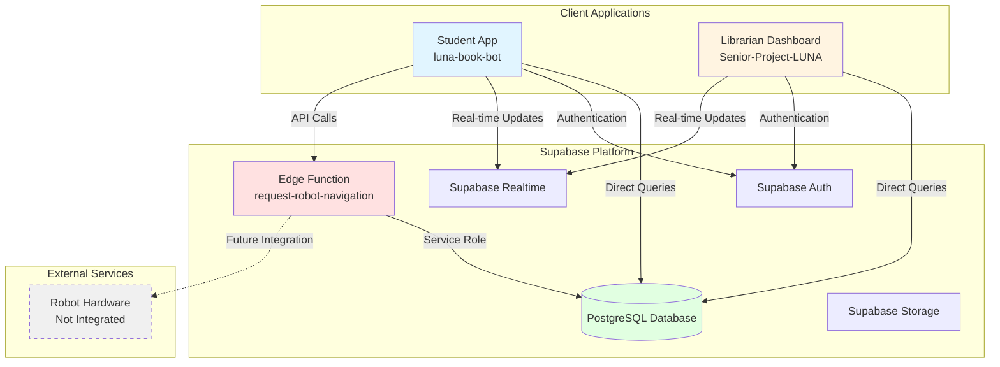
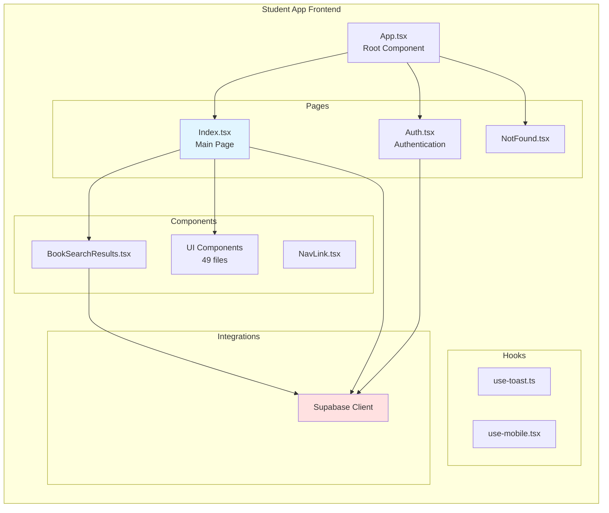
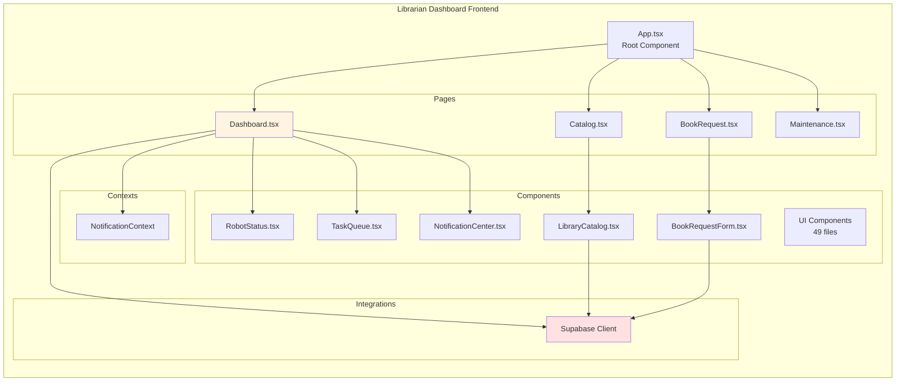
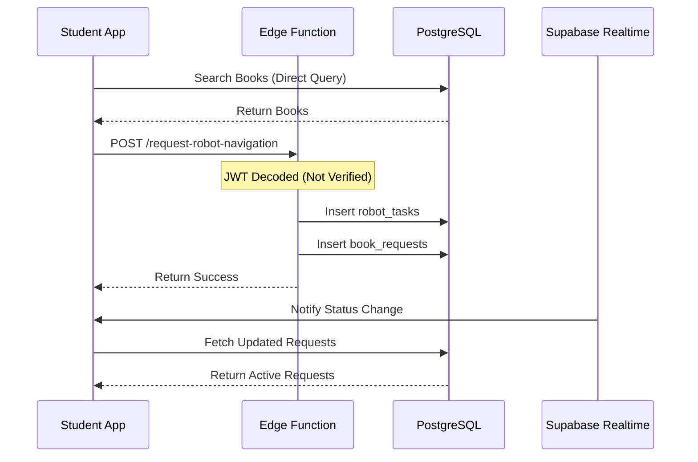
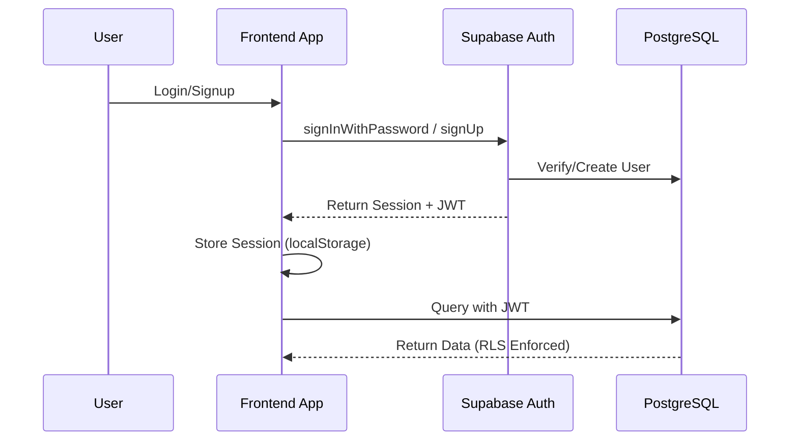
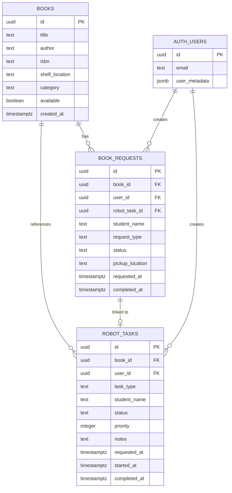
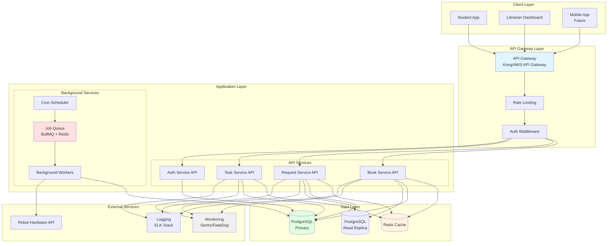
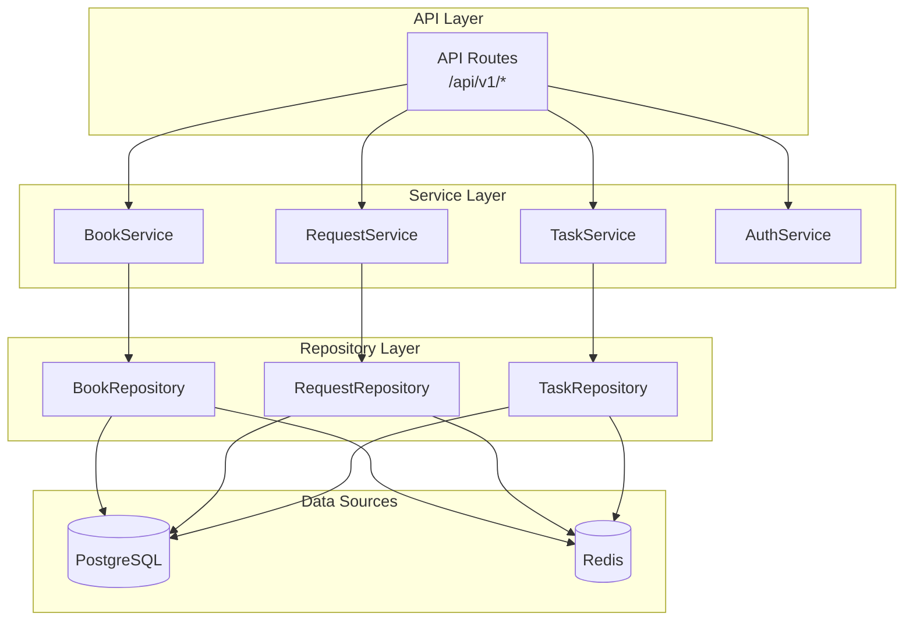
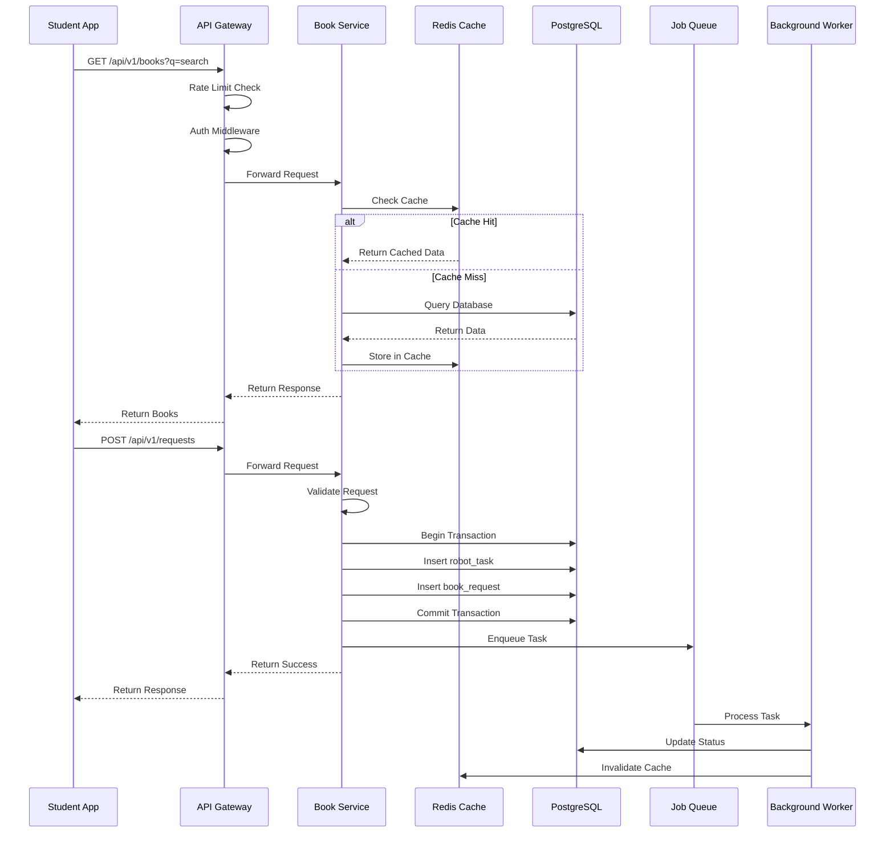

# LUNA System Architecture

**Last Updated:** 2025-02-03  
**Status:** Current State Documentation

---

## Table of Contents

1. [Current System Architecture](#current-system-architecture)
2. [Component Architecture](#component-architecture)
3. [Data Flow Diagrams](#data-flow-diagrams)
4. [Database Schema](#database-schema)
5. [Target Architecture](#target-architecture)

---

## Current System Architecture

### High-Level Overview

### Current Architecture Issues

- ❌ **No API Gateway** - Direct database access from frontend
- ❌ **No Service Layer** - Business logic in components
- ❌ **No Caching** - Every request hits database
- ❌ **Single Edge Function** - Limited backend capabilities
- ❌ **No Background Jobs** - No async task processing
- ❌ **No Load Balancing** - Single point of failure

---

## Component Architecture

### Student App (luna-book-bot)

### Librarian Dashboard (Senior-Project-LUNA)

---

## Data Flow Diagrams

### Book Request Flow (Current)

### Authentication Flow

### Current Issues in Data Flow

- ⚠️ **No Request Validation** - Direct database queries
- ⚠️ **No Caching** - Repeated queries for same data
- ⚠️ **No Rate Limiting** - Vulnerable to abuse
- ⚠️ **No Transaction Management** - Risk of orphaned records
- ⚠️ **No Error Recovery** - Failures not handled gracefully

---

## Database Schema

### Entity Relationship Diagram

### Database Indexes (Current)

- `idx_books_title` - On `books.title`
- `idx_books_author` - On `books.author`
- `idx_robot_tasks_status` - On `robot_tasks.status`
- `idx_book_requests_status` - On `book_requests.status`

**Missing Indexes:**
- ❌ Composite index on `book_requests(user_id, status)`
- ❌ Full-text search index on `books(title, author)`
- ❌ Index on `robot_tasks(user_id, status)`

---

## Target Architecture

### Recommended System Architecture

### Target Architecture Benefits

- ✅ **API Gateway** - Centralized routing, rate limiting, authentication
- ✅ **Service Layer** - Separation of concerns, testable business logic
- ✅ **Caching Layer** - Reduced database load, improved performance
- ✅ **Read Replicas** - Scalable read operations
- ✅ **Background Jobs** - Async task processing, scheduled tasks
- ✅ **Monitoring** - Observability, error tracking, performance metrics
- ✅ **Horizontal Scaling** - Can scale services independently

### Service Layer Architecture

### Improved Data Flow (Target)

---

## Migration Path

### Phase 1: Foundation (Weeks 1-2)
1. Set up API Gateway
2. Create service layer structure
3. Implement basic caching
4. Add monitoring/logging

### Phase 2: Refactoring (Weeks 3-6)
1. Migrate direct DB calls to services
2. Implement repository pattern
3. Add background job processing
4. Set up read replicas

### Phase 3: Optimization (Weeks 7-10)
1. Database optimization (indexes, queries)
2. Performance tuning
3. Horizontal scaling setup
4. Load testing and optimization

### Phase 4: Enhancement (Ongoing)
1. API versioning
2. Advanced caching strategies
3. Microservices extraction (if needed)
4. Continuous monitoring and improvement

---

## Technology Stack

### Current Stack
- **Frontend:** React 18, TypeScript, Vite, Tailwind CSS
- **Backend:** Supabase Edge Functions (Deno)
- **Database:** PostgreSQL (Supabase)
- **Auth:** Supabase Auth
- **State Management:** React Query (TanStack Query)
- **UI Components:** Radix UI, shadcn/ui

### Target Stack Additions
- **API Gateway:** Kong / AWS API Gateway
- **Caching:** Redis
- **Job Queue:** BullMQ
- **Monitoring:** Sentry / DataDog
- **Logging:** ELK Stack / CloudWatch
- **API Documentation:** OpenAPI/Swagger

---

## Notes

- This architecture document should be updated as the system evolves
- All diagrams use Mermaid syntax and render automatically on GitHub
- For detailed technical debt items, see [TECHNICAL_DEBT_ASSESSMENT.md](./TECHNICAL_DEBT_ASSESSMENT.md)
